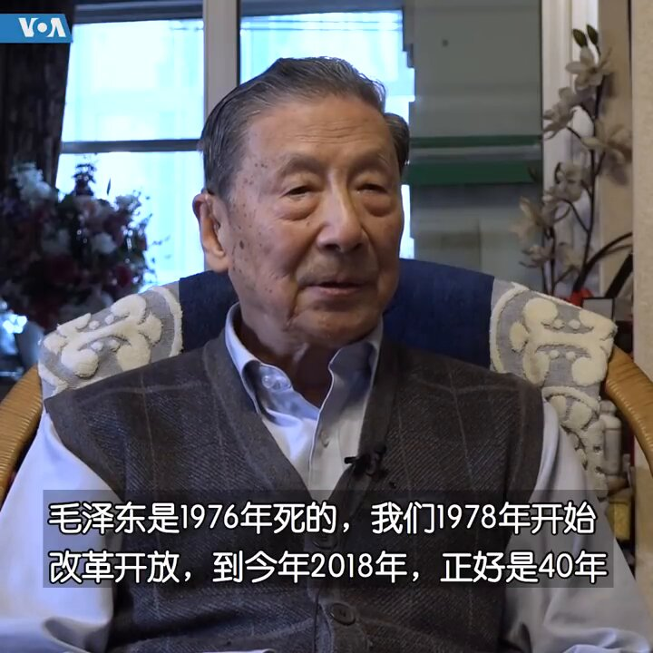
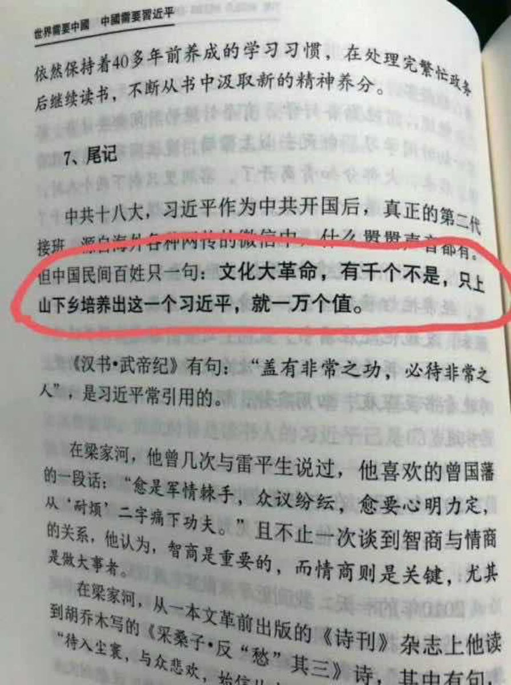

Ivy未央 北京时间 2024-02-07T11:30:35Z 1755071532752150969 茅于轼：中国的究法里写的实行人民民主专政，，这个是天大的笑话。一个实行民主的国家是不可能同时又实行专政的，实行专政的国家也不可能实行民主.

茅于轼谈改开四十年：中国市场化主要的障碍来自权力的干预 https://t.co/cXFsnekmIm   Ivy未央 北京时间 2024-02-07T10:03:53Z 1755049712988606916 在《世界需要中国，中国需要习近平》一书中说：文化大革命，有千个不是，只上山下乡培养出这一个习近平，就一万个值。这是为了培养人才不惜代价么？
这种愚昧文人再过一百年能进化到文明世界里吗？ https://t.co/OpUmRgKkMa   Ivy未央 北京时间 2024-02-07T08:18:26Z 1755023177598620014 中国的土壤诞生袁立很珍奇。其她女明星不是在依傍大款，就是在结交权贵，她却在做慈善公益，结交一群被社会遗弃的穷苦病人。别人打扮得美美哒在聚光灯下搔首弄姿，她却在穷乡僻壤、矿井深处展现灰头士脸的自己。她的高尚在她的血液里、骨髓中… https://t.co/OEhKdPaGpx   