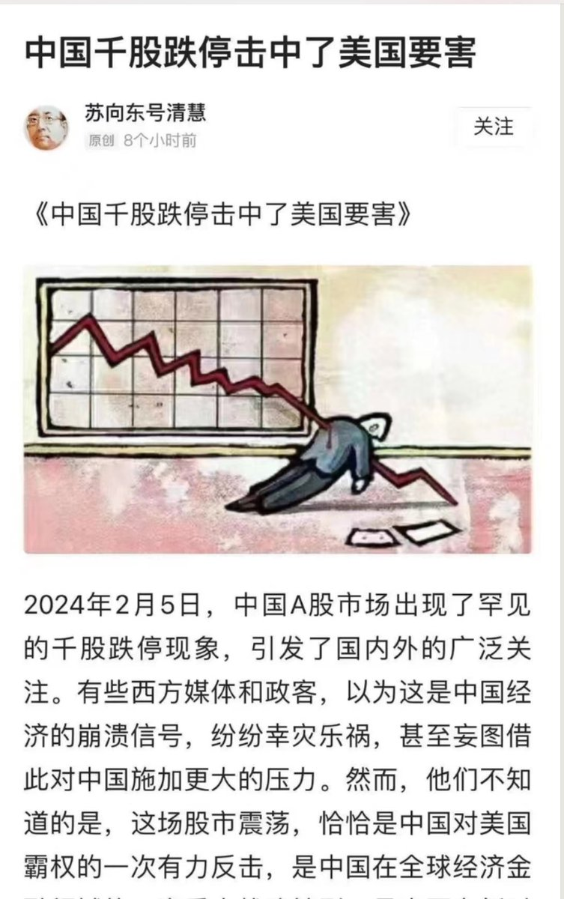
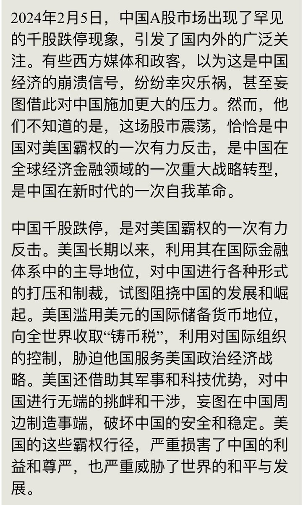
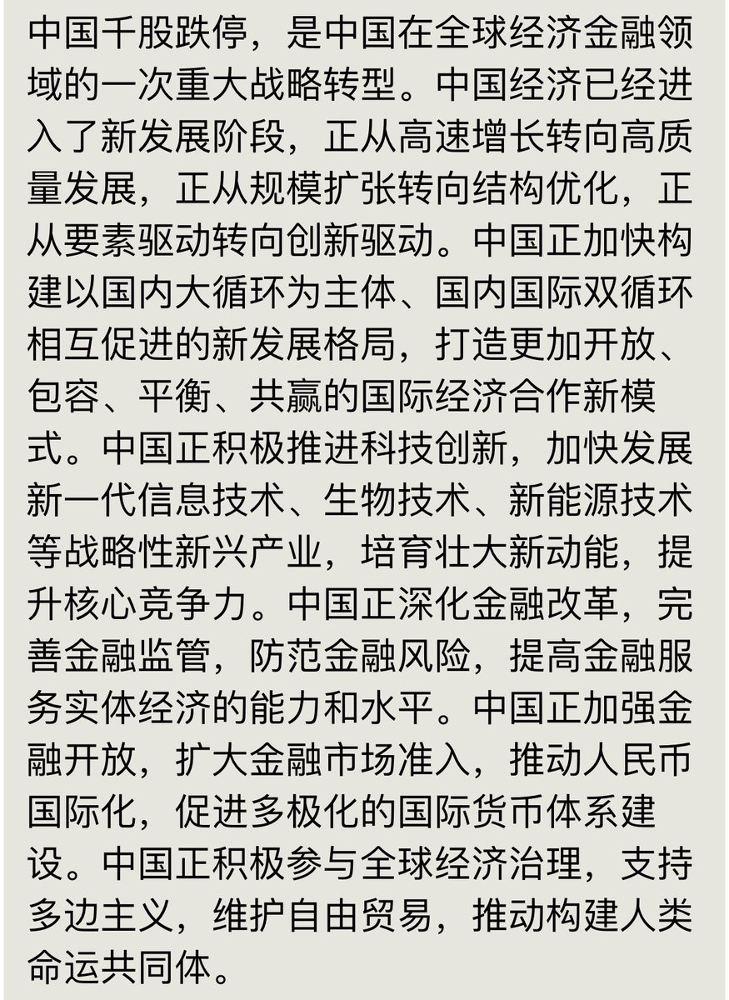
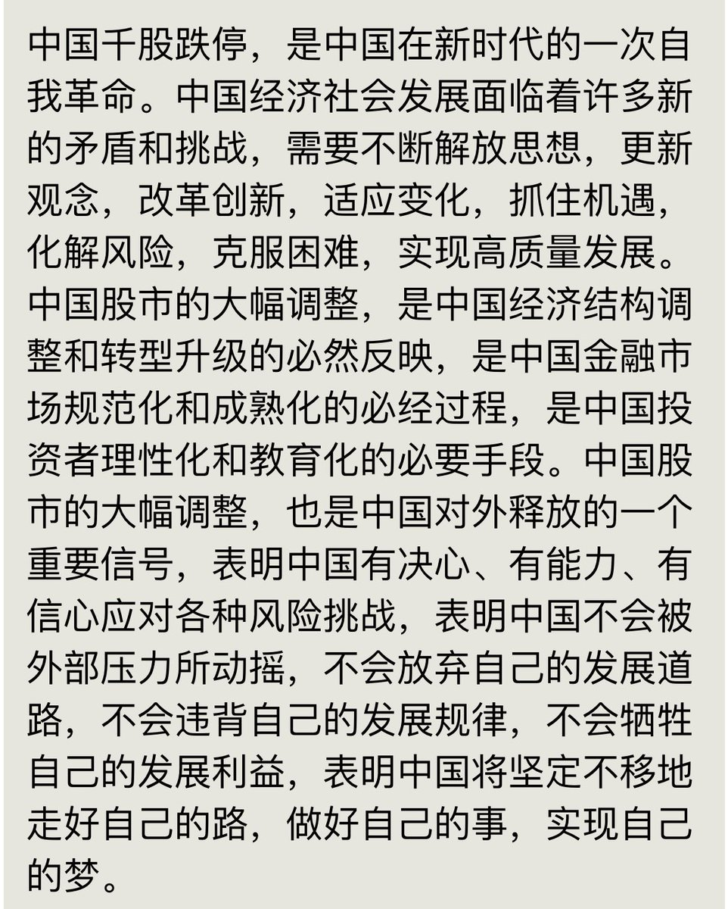

Petrichor 北京时间 2024-02-07T10:10:32Z 1755051387749011484 美国《探索》杂志于2000年左右发表的爱因斯坦一生的23个错误：
1905年：基于狭义相对论，爱因斯坦在时钟同步计算上出错；
1905年：错误估计迈尔尔森－摩尔利实验；
1905年：错误估计高速粒子的横向质量；
1905年：爱因斯坦在对他推论出的分子进行液体黏性计算时，出现数学和物理学的多样性错误；
1905年：在理解热辐射和光量子之间关系上出现错误；
1905年：计算质能守恒定律（E = mc2）时出现第一次错误；
1906年：出现第二次、第三次和第四次质能守恒定律（E = mc2）计算错误；
1907年：对于加速时钟的同步计算上出现错误；
1907年：引力和加速度对等法则的计算错误；
1911年：首次计算光线偏差的错误；
1913年：相对论首次论证错误；
1914年：计算质能守恒定律（E = mc2）时出现第五次错误；
1915年：爱因斯坦德哈斯实验（Einstein-de Haas experiment）错误；
1915年：相对论第七次论证错误；
1916年：马赫原理的解释错误；
1917年：爱因斯坦引入宇宙常数的错误（这是他一生中最大的错误）；
1919年：两次尝试修正相对论出现的错误；
1925年：规划统一理论的多次错误；
1927年：波尔和量子变化性讨论的错误；
1933年：解释量子力学的错误；
1934年：计算质能守恒定律（E = mc2）时出现第六次错误；
1939年：史瓦西奇点和黑洞引力坍缩，解释出现的错误；
1946年：计算质能守恒定律（E = mc2）时出现第七次错误。   Petrichor 北京时间 2024-02-07T10:13:30Z 1755052134393884833 【一个伟人得到的尊重越多，他就越容易看不清现实。这是一个极具讽刺意义味的场景：在物理学界之外，爱因斯坦作为科学和智慧的象征广受关注。但在物理学界内部，一些活跃的后辈对于爱因斯坦的高论并不以为然，这以泡利、朗道等人的态度最为经典。与波尔身边聚集了众多的青年才俊相反，爱因斯坦孤寂的生活在普林斯顿，随着年龄见长，固执的性情使他的处境开始恶化。作为爱因斯坦思想的坚定支持者，薛定谔本来是愿意也有可能加盟普林斯顿高等研究院的，但由于种种原因而未成行。当然人无完人、金无足赤，我们没有必要苛求爱因斯坦，毕竟我们今天在许多地方都受惠于他，一个也犯错的爱因斯坦形象，会让我觉的他更真实，因而也更伟大。】   Petrichor 北京时间 2024-02-07T10:29:33Z 1755056174104285256 哈尔滨采用高科技方法给电车输点线除冰，厉害了我的国。 https://t.co/XNwrbzO09b   Petrichor 北京时间 2024-02-07T10:47:16Z 1755060630082515229 奇文供赏。中国千股跌停，美帝倒霉。“我能死给你看，要把美帝吓到死”。 https://t.co/g8D2EkW5qj   Petrichor 北京时间 2024-02-07T11:22:46Z 1755069566487535675 冰雨造成树枝表层裹冰、增重，树劈开坠地。

明显是他们缺少工具和机械，处理起来效率特低

 https://t.co/EbP4g9uJ78   Petrichor 北京时间 2024-02-07T11:37:37Z 1755073302748361189 钻到黑人堆里，才显出自己白？ https://t.co/dI1JXQfqWe   Petrichor 北京时间 2024-02-07T11:44:46Z 1755075100007674121 有人用这句警告那人，你们都知道我说的那个谁谁谁。 https://t.co/aJWX2OsEJb   Petrichor 北京时间 2024-02-07T07:40:24Z 1755013602296078392 2024年2月4日，作家谌容在北京病逝，享年88岁， 她最著名的作品是《人到中年》。她丈夫范荣康，曾任《人民日报》副总编辑。他們生了2个儿子一个女儿，分别是梁左、梁天和粱欢。三人都是作家或导演。粱欢的丈夫是英达。

2001年5月19日凌晨，梁左因突发性心肌梗塞在北京家中去世，年仅44岁。 https://t.co/Xwr9WPxWce   Petrichor 北京时间 2024-02-07T07:57:52Z 1755018000288120863 这个国家的教育是扭曲的、变形的、有毒的，有害的。她不爱自己的亲弟弟，能爱国家。
真实的历史也不是那样的，国家的概念也不像她被灌输的那样。这个国家不能去了，已经成为极为危险的地方。你可能因为说了一段真实的历史，被周围人大义凛然地打死，而他们认为做的完全正确，为国家除了害。 https://t.co/17jzJWyn44   Petrichor 北京时间 2024-02-07T08:01:07Z 1755018819578294568 自称世界第二，目中无第一。
其对付自然灾害的能力，世界第200，不堪一击。
天塌下来用嘴顶着。
牛逼世界第一。 https://t.co/3mZFdpf09N   Petrichor 北京时间 2024-02-07T08:19:26Z 1755023428246032582 看了这个就知道中国为什么没有牛市？
证监会自己有公司融劵，内部情报来得快。普通股民不死定了吗。 https://t.co/AAlmRzkOYH   Petrichor 北京时间 2024-02-07T08:25:40Z 1755024993971212713 一个德性，都喜欢往黑人堆里钻。
与他们在一起，才能找回失去的自信。 https://t.co/lEWXJN4gB4   