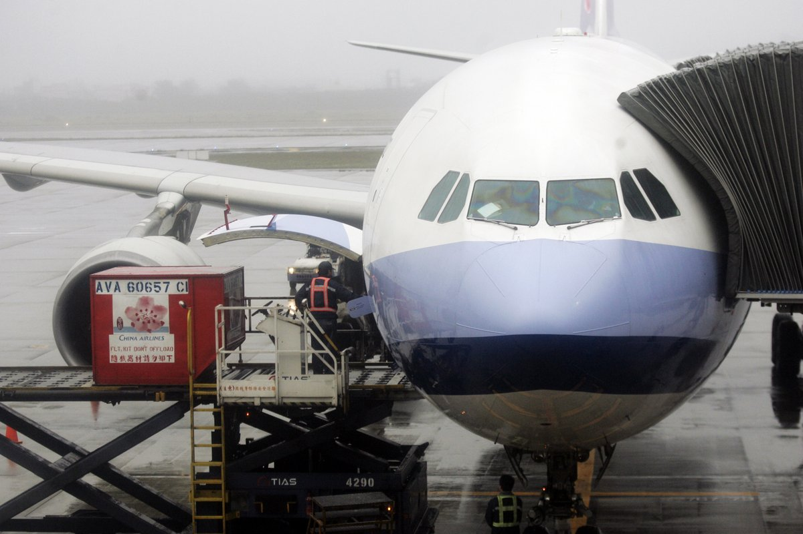
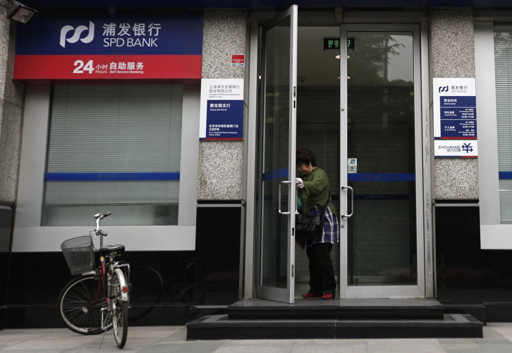
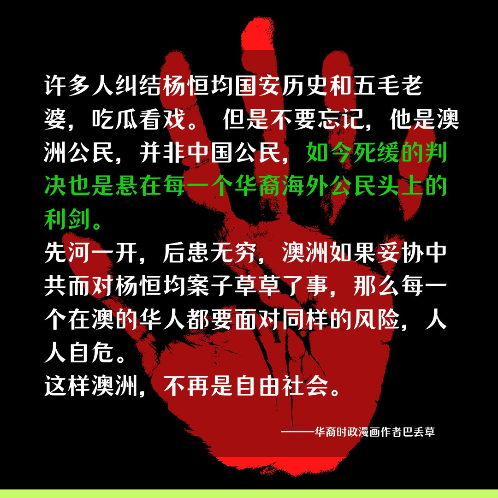
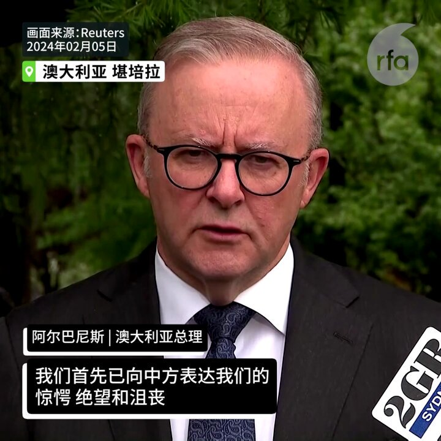
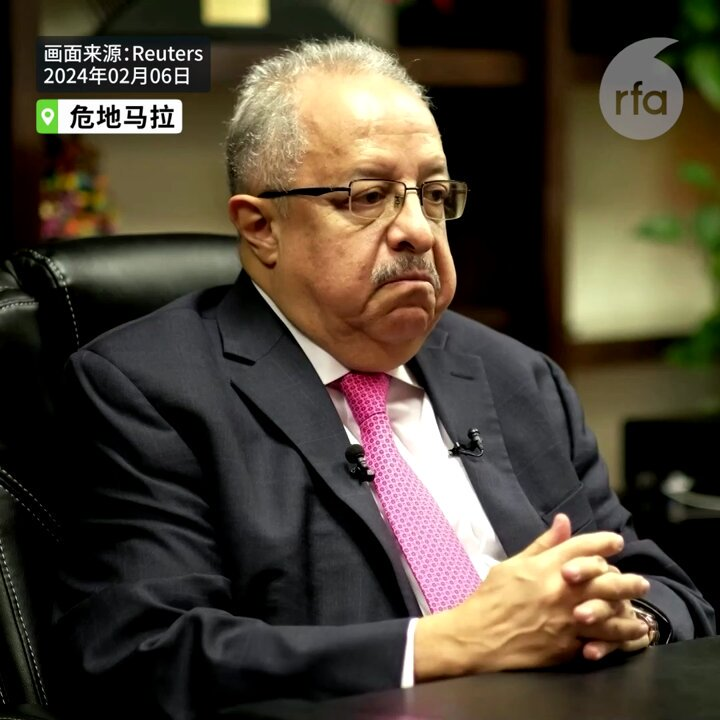

自由亚洲电台 北京时间 2024-02-07T17:02:44Z 1755155121691045921 【中国未开放陆客团来台 片面改变M503航路】
【台湾叫停旅行团赴陆】
台湾的交通部观光署7日发布新闻稿指出，为循序推动恢复两岸团体旅游，台湾政府已完成相关准备，并原规划于今年春节后恢复台湾人赴陆团体旅游。然因中国迄今未就陆客旅行团来台进行安排，日前又片面宣布改变M503等航路运行方式，冲击飞航安全。考量情势变更及旅运安全等因素，原规划作业将不再进行，请台湾旅行业即日起停止招揽前往中国大陆之旅行团。https://t.co/MVnduQazU1   自由亚洲电台 北京时间 2024-02-07T12:42:10Z 1755089547195789691 【上海海关罚没旅客物品不再“私分”】
【沪穗两地银行员工抱怨被扣减福利】
近期，上海浦发银行一批员工在网上抱怨年终奖被停发，而广州银行员工则称他们被拖欠预留的职级工资等。一位知情人士说，上述情况在银行业内极其普遍，员工被削减福利情况早已出现。据接近上海海关的人士披露，罚没旅客的物品不再私分作为福利发给员工，改为拍卖。详细报道：https://t.co/K3jAanZ37w   自由亚洲电台 北京时间 2024-02-07T11:44:05Z 1755074929341419967 RT @RFA_Chinese: 欢迎收听和订阅播客【＃亚太报道】 https://t.co/MjLNSvVMqc
“国家队”出手 #股市翻红；中国警方严查 #有损政府形象言论；春节前夕 #猪肉价格 波动；台湾通报25架次 #中方军机扰台；关注 #中国留学生入境美国 受阻。 h…   自由亚洲电台 北京时间 2024-02-07T11:44:22Z 1755075002041266589 RT @RFA_Chinese: 澳籍华裔作家杨恒均2月5日因间谍罪在北京被判死缓，旅居澳大利亚的华裔时政漫画作者巴丢草6日在其社交平台X账号上这样说：
您对此项判决的看法是什么？ https://t.co/NK24zzIMxH   自由亚洲电台 北京时间 2024-02-07T06:22:03Z 1754993888635298095 【#李文亮去世四周年】  你还记得吗？
每天都有人去他被禁“按热度”排列的微博下面留言，纪念他，也说自己的心事。https://t.co/CWvEWfw681
“是0206不是0207，第四年了，还有多少人记得”
“又一年了，李医生过年好，您是好人，保佑我们！”
“您走了 这个世界没有变得更好”
“好像很多后来发生的事都能从李医生的经历看出端倪，初闻不知曲中意，再闻已是曲中人。”
“:湖北大雪了，又是多灾多难的一年”
......   自由亚洲电台 北京时间 2024-02-07T08:00:10Z 1755018578678698090 欢迎收听和订阅播客【＃亚太报道】 https://t.co/MjLNSvVMqc
“国家队”出手 #股市翻红；中国警方严查 #有损政府形象言论；春节前夕 #猪肉价格 波动；台湾通报25架次 #中方军机扰台；关注 #中国留学生入境美国 受阻。 https://t.co/TxnjqNmNnu   自由亚洲电台 北京时间 2024-02-07T09:15:42Z 1755037588648333790 RT @RFA_Chinese: 【#李文亮去世四周年】  你还记得吗？
每天都有人去他被禁“按热度”排列的微博下面留言，纪念他，也说自己的心事。https://t.co/9akiiplJe4
“是0206不是0207，第四年了，还有多少人记得”
“又一年了，李医生过年好，您是…   自由亚洲电台 北京时间 2024-02-07T04:46:36Z 1754969867269161355 据英国金融时报周二报道，尽管美国和盟国对中国先进半导体技术和设备出口严加限制，#中芯国际 仍在上海成功设立新的半导体生产线。金融时报援引2名消息人士透露，中芯国际（SMIC）的目标是利用现有的美国与荷兰制造设备来生产 #5纳米芯片，并将用于新版智能手机。 https://t.co/Ic2u8OheJk   自由亚洲电台 北京时间 2024-02-07T05:01:04Z 1754973504829640796 中国股市在政府祭出多项刺激政策以及"国家队"出手救市后，本周二有所反弹。有消息显示，中共领导人习近平将再次"#亲自指挥"，以稳定股价和投资者信心。
#习近平 要下场指挥释放什么信号？您相信他"亲自指挥" 能扭转经济颓势吗？  https://t.co/Xhlebr6MOz   自由亚洲电台 北京时间 2024-02-07T05:23:55Z 1754979259016483274 澳籍华裔作家杨恒均2月5日因间谍罪在北京被判死缓，旅居澳大利亚的华裔时政漫画作者巴丢草6日在其社交平台X账号上这样说：
您对此项判决的看法是什么？ https://t.co/NK24zzIMxH   自由亚洲电台 北京时间 2024-02-07T05:59:13Z 1754988139612143728 【杨恒均被中国判死缓  澳大利亚震怒】
惊愕，绝望，沮丧，愤怒，澳大利亚总理安东尼·阿尔巴尼斯誓言将继续努力争取 #杨恒均 获释。 https://t.co/wmjBVz6lpK   自由亚洲电台 北京时间 2024-02-07T06:05:05Z 1754989618855018782 【危地马拉欲与中国建立贸易关系】
中美洲国家危地马拉外交部长2月5日告诉路透社，危地马拉正在考虑与中国建立正式贸易关系，但计划维持与台湾的现有关系。这个中美洲国家是台湾仅存的少数盟友之一。 https://t.co/fUl89qEVYV   自由亚洲电台 北京时间 2024-02-07T06:16:11Z 1754992411112095947 美国财长 #耶伦 周二表示，拜登政府目前不寻求 #世界银行 增资，并反对中国继续从 #多边开发银行（MDB）获得贷款 。 https://t.co/3ciihm8rSM   自由亚洲电台 北京时间 2024-02-07T03:18:38Z 1754947726561685868 被控涉嫌违反国安法的前香港众志成员 #周庭 出狱后赴加拿大学习，未按期回港向警方报到，警方确认已正式 #通缉 她。
 https://t.co/L7HNV69z5n   自由亚洲电台 北京时间 2024-02-07T03:20:21Z 1754948158600380670 被控涉嫌违反国安法的前香港众志成员 #周庭 出狱后赴加拿大学习，未按期回港向警方报到，警方确认已正式 #通缉 她。
 https://t.co/5azHeANkBk https://t.co/d4CE4iZSZp   自由亚洲电台 北京时间 2024-02-07T04:15:39Z 1754962077397995893 9名军方将领“涉嫌严重违纪违法"被罢免全国人大代表.
9人之中，至少4人曾在负责装备的部门工作，5人曾经任职火箭军，李玉超是首名被官方确认涉嫌严重违纪违法的中共二十届中央委员。 https://t.co/EfNQErwgxh   自由亚洲电台 北京时间 2024-02-07T04:17:06Z 1754962443972092269 9名军方将领“涉嫌严重违纪违法"被罢免全国人大代表.
9人之中，至少4人曾在负责装备的部门工作，5人曾经任职火箭军，李玉超是首名被官方确认涉嫌严重违纪违法的中共二十届中央委员。 https://t.co/rK9sHisEgp https://t.co/ZIIsSG6BPs   自由亚洲电台 北京时间 2024-02-07T01:23:37Z 1754918782428922222 在农历年前，#中国军机扰台 不断。据台湾的国防部本周二通报，在侦获的25架次中国军机中，最近距离台湾北部的基隆仅43海浬。与此同时，#台湾 的总统 #蔡英文 视察战备部队。
https://t.co/RLiXzsRnMg   自由亚洲电台 北京时间 2024-02-07T02:09:06Z 1754930229255053558 据共同社6日消息，全球最大半导体代工企业“台湾积体电路制造”（TSMC）6日正式宣布将在日本熊本县建设第二座工厂，力争2024年底开始兴建，2027年开始营运。加上第一工厂，投资总额超过200亿美元，丰田汽车公司也出资2%。
#台积电 的 #熊本第一工厂 计划2月24日举行开业典礼，熊本作为半导体生产基地的存在感提升，日本政府推进的半导体生产基础强化似乎也乘势而上。
第二工厂预计选址在第一工厂（熊本县菊阳町）附近。台积电董事长刘德音1月在财报说明会上透露，第二工厂将生产较第一工厂更尖端的产品。   自由亚洲电台 北京时间 2024-02-07T00:03:57Z 1754898734473712011 RT @asiafactcheckcn: 【事实查核】
【拜登穿军装讨论攻打中东？ 】

近日在微博、X流传一张美国总统拜登着军装与军人开会的照片，发文者称拜登将授权在中东采取军事行动，另有网友说这是拜登在与美军研究德州边境问题。

❌经查，此图为AI生成的可能性高。

#美国…   自由亚洲电台 北京时间 2024-02-07T00:17:48Z 1754902222453014776 江西景德镇网民卢先生说，官方所谓的网络严打行动已经持续多年，但是网民发帖批评政府的言论并未因此减少：“我们平时该怎么说怎么干，还是继续做。他们所谓的负面言论，肯定是打击不完的。因为，你做得不好，想捂住别人的嘴巴，那不太现实。”
#损害政府形象 #清朗行动  https://t.co/E3W8vbH3eI   自由亚洲电台 北京时间 2024-02-07T00:18:19Z 1754902350668677353 江西景德镇网民卢先生说，官方所谓的网络严打行动已经持续多年，但是网民发帖批评政府的言论并未因此减少：“我们平时该怎么说怎么干，还是继续做。他们所谓的负面言论，肯定是打击不完的。因为，你做得不好，想捂住别人的嘴巴，那不太现实。”
#损害政府形象 #清朗行动  https://t.co/E3W8vbH3eI https://t.co/4MlyVh7bIc   自由亚洲电台 北京时间 2024-02-07T00:19:51Z 1754902737211297901 RT @RFA_Chinese: 【龙年心愿大征集】
春节将近，本台祝您新春大吉，龙年好运！
新的一年您有什么愿望？梦想和现实之间相距多远？您将如何努力来实现愿望？
请在评论区回帖或电邮 fankui@rfa.org，截止日期：2月8日。谢谢大家！ https://t.co/m…   