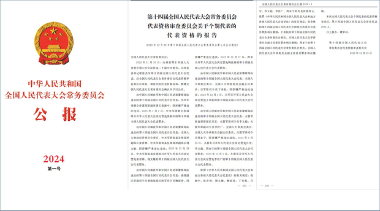
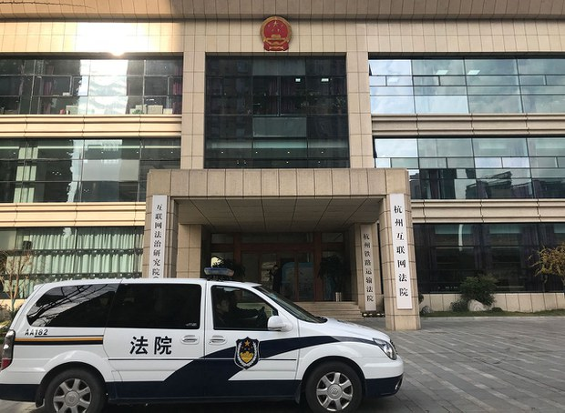

自由亚洲电台 北京时间 2024-02-07T03:18:38Z 1754947726561685868 被控涉嫌违反国安法的前香港众志成员 #周庭 出狱后赴加拿大学习，未按期回港向警方报到，警方确认已正式 #通缉 她。
 https://t.co/L7HNV69z5n   自由亚洲电台 北京时间 2024-02-07T03:20:21Z 1754948158600380670 被控涉嫌违反国安法的前香港众志成员 #周庭 出狱后赴加拿大学习，未按期回港向警方报到，警方确认已正式 #通缉 她。
 https://t.co/5azHeANkBk https://t.co/d4CE4iZSZp   自由亚洲电台 北京时间 2024-02-07T04:15:39Z 1754962077397995893 9名军方将领“涉嫌严重违纪违法"被罢免全国人大代表.
9人之中，至少4人曾在负责装备的部门工作，5人曾经任职火箭军，李玉超是首名被官方确认涉嫌严重违纪违法的中共二十届中央委员。 https://t.co/EfNQErwgxh   自由亚洲电台 北京时间 2024-02-07T04:17:06Z 1754962443972092269 9名军方将领“涉嫌严重违纪违法"被罢免全国人大代表.
9人之中，至少4人曾在负责装备的部门工作，5人曾经任职火箭军，李玉超是首名被官方确认涉嫌严重违纪违法的中共二十届中央委员。 https://t.co/rK9sHisEgp https://t.co/ZIIsSG6BPs   自由亚洲电台 北京时间 2024-02-07T01:23:37Z 1754918782428922222 在农历年前，#中国军机扰台 不断。据台湾的国防部本周二通报，在侦获的25架次中国军机中，最近距离台湾北部的基隆仅43海浬。与此同时，#台湾 的总统 #蔡英文 视察战备部队。
https://t.co/RLiXzsRnMg   自由亚洲电台 北京时间 2024-02-07T02:09:06Z 1754930229255053558 据共同社6日消息，全球最大半导体代工企业“台湾积体电路制造”（TSMC）6日正式宣布将在日本熊本县建设第二座工厂，力争2024年底开始兴建，2027年开始营运。加上第一工厂，投资总额超过200亿美元，丰田汽车公司也出资2%。
#台积电 的 #熊本第一工厂 计划2月24日举行开业典礼，熊本作为半导体生产基地的存在感提升，日本政府推进的半导体生产基础强化似乎也乘势而上。
第二工厂预计选址在第一工厂（熊本县菊阳町）附近。台积电董事长刘德音1月在财报说明会上透露，第二工厂将生产较第一工厂更尖端的产品。   自由亚洲电台 北京时间 2024-02-07T00:03:57Z 1754898734473712011 RT @asiafactcheckcn: 【事实查核】
【拜登穿军装讨论攻打中东？ 】

近日在微博、X流传一张美国总统拜登着军装与军人开会的照片，发文者称拜登将授权在中东采取军事行动，另有网友说这是拜登在与美军研究德州边境问题。

❌经查，此图为AI生成的可能性高。

#美国…   自由亚洲电台 北京时间 2024-02-07T00:17:48Z 1754902222453014776 江西景德镇网民卢先生说，官方所谓的网络严打行动已经持续多年，但是网民发帖批评政府的言论并未因此减少：“我们平时该怎么说怎么干，还是继续做。他们所谓的负面言论，肯定是打击不完的。因为，你做得不好，想捂住别人的嘴巴，那不太现实。”
#损害政府形象 #清朗行动  https://t.co/E3W8vbH3eI   自由亚洲电台 北京时间 2024-02-07T00:18:19Z 1754902350668677353 江西景德镇网民卢先生说，官方所谓的网络严打行动已经持续多年，但是网民发帖批评政府的言论并未因此减少：“我们平时该怎么说怎么干，还是继续做。他们所谓的负面言论，肯定是打击不完的。因为，你做得不好，想捂住别人的嘴巴，那不太现实。”
#损害政府形象 #清朗行动  https://t.co/E3W8vbH3eI https://t.co/4MlyVh7bIc   自由亚洲电台 北京时间 2024-02-07T00:19:51Z 1754902737211297901 RT @RFA_Chinese: 【龙年心愿大征集】
春节将近，本台祝您新春大吉，龙年好运！
新的一年您有什么愿望？梦想和现实之间相距多远？您将如何努力来实现愿望？
请在评论区回帖或电邮 fankui@rfa.org，截止日期：2月8日。谢谢大家！ https://t.co/m…   