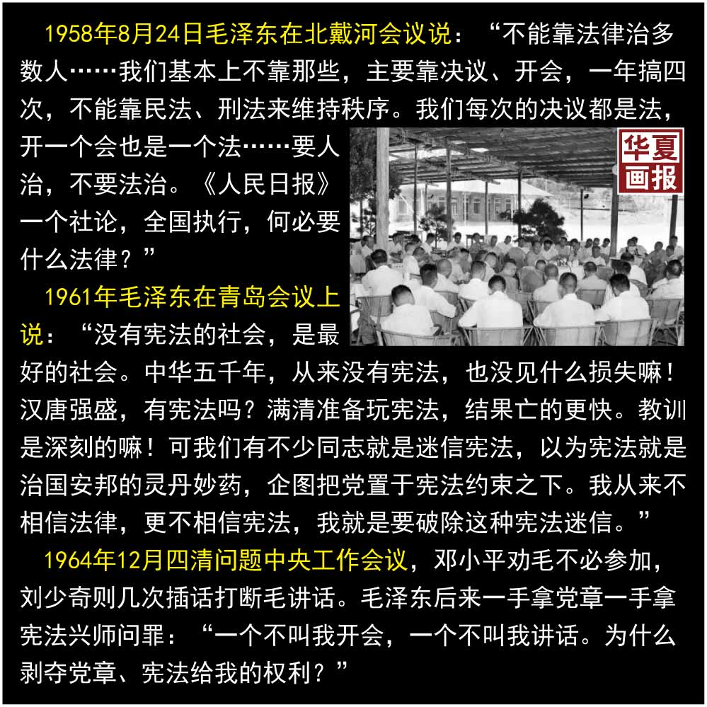
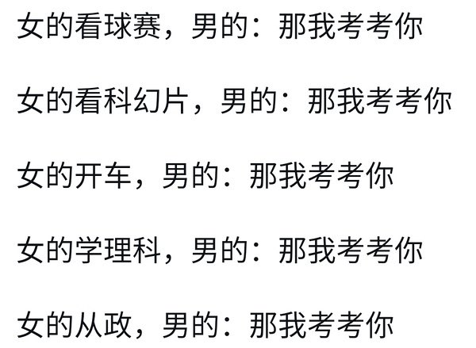
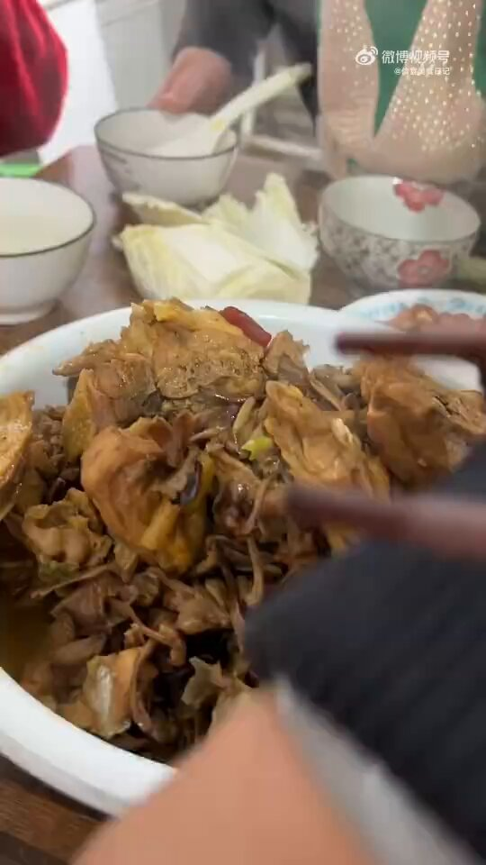
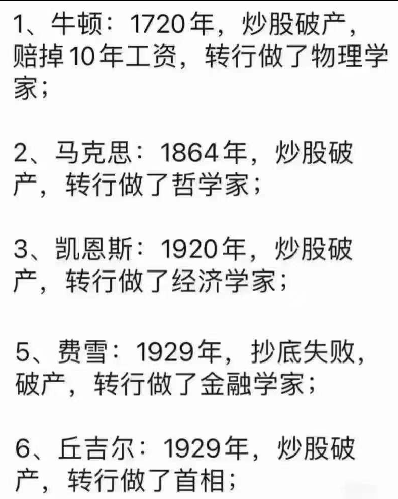

谁将十万横扫三江 北京时间 2024-02-07T19:24:08Z 1755190703423119571 要人治，不要法治。《人民日报》一篇社论，全国执行，何必要什么法律。 https://t.co/zOHRda9gsr   谁将十万横扫三江 北京时间 2024-02-07T19:51:14Z 1755197525781291391 RT @LauraHarth: Ucraina, ormai sappiamo da che parte sta Pechino. 

L’insieme di dichiarazioni ed azioni cinesi parlano chiaro: il regime c…   谁将十万横扫三江 北京时间 2024-02-07T20:20:10Z 1755204807223345359 RT @CDTChinese: 这次网约车事件对郑秀利而言是次挫败，但笔者相信，以郑总的实力和手段，定能换个花样、卷土重来。毕竟，浦东机场禁止网约车事件成为网络热点这么多天了，却还没有任何媒体报道透露郑总究竟是怎样的一位大佬，由此可见一斑。 https://t.co/xJLzJ…   谁将十万横扫三江 北京时间 2024-02-07T12:55:30Z 1755092903062630823 RT @boiledwater: 女性：存在。

国男：让我来考考你。 https://t.co/Hyn7qYvfh0   谁将十万横扫三江 北京时间 2024-02-07T13:01:51Z 1755094498231869870 “好孩子”“懂事”“白瞎”“横行霸道”“好闺女”

【网评】我的童年就是这样的，再小的东西不争就永远无法得到。

【网评】女儿吃了个鸡腿，整顿饭都在被念叨，“给她吃白瞎了” https://t.co/Tq70TunY1j   谁将十万横扫三江 北京时间 2024-02-07T10:35:14Z 1755057603322028045 唉，地方
中国政府的社会治理模式是基于户籍制度，这么多人回老家过年，在过节期间不给武汉政府创造任何价值，他们没动力去救啊。就算是本地人，他们都不会救，大冬天的，鸡圈里的鸡一只就死一只，反正过两天该吃肉了。只要还有户口制度，这种事就不会是最后一次，指望一个强力中央对下面办事的表格摊派，那就是本末倒置   谁将十万横扫三江 北京时间 2024-02-07T10:59:13Z 1755063638065590337 辟谣，马克思炒股赚钱了，破产是因为花钱大手大脚

1864年，马克思利用朋友威廉·沃尔弗给自己的600英镑捐赠进行股票投资，在一个月的时间内盈利400英镑（当时黄金价格约为5英镑）

马克思在给恩格斯的信中写道：“假如你能在10天内办妥遗产交接手续的话，我就可以用这笔钱在股票交易所狠赚它一把，现在伦敦已到了可以凭机智和少量资金赚钱的时候了。”

赚了钱之后他写信给恩格斯：“医生不许我从事紧张和长时间的脑力劳动，所以我就做起股票投机生意来了，不过效果还不错。我用那600英镑赚取了400多英镑。这下我暂时不用你和朋友们的资助了，这段经历也为我的研究工作提供了有益帮助。”
此后，有朋友劝马克思不妨再继续把股票投资做下去。但马克思说：“老朋友威廉·沃尔弗赠送我的遗产确实是雪中送炭。我也小试牛刀赚了一把，但我觉得适可而止就行了，再继续做下去，如果万一赔了钱，我怎能对得起九泉之下的老朋友呢。”   谁将十万横扫三江 北京时间 2024-02-07T11:41:10Z 1755074195095220358 “孩子懂事” https://t.co/LKab1Ifsrg   谁将十万横扫三江 北京时间 2024-02-07T12:13:46Z 1755082400789622906 【悸花译制】所有女人都想法一样吗？ Do all women think the same?

简介：所有女人的想法都一样吗？意见谱节目邀请6位女性，请她们对以下7个有关女性的观点表达同意或反对。我们也很想知道你们的看法，在下面留下评论吧！

1.  我知道怎么换轮胎

2. 男孩跟女孩应该以同样的方式培养吗

3. 每个女人都应该是女权主义者

4. 我相信流产应该合法

5. 我不介意陌生人与我调情

6. 我支持#米兔运动#

7. 我认为 如果世界由女人管理会更美好 (文案：果仔)

原视频链接：网页链接 (https://t.co/Hf9KPEYUAu)

【译制人员】

统筹：果仔

翻译：文刀

校对：摇下车窗 沁沁

时轴：贩卖假日

轴校：迟迟

后期：小卡

更多资源请进悸花论坛搜索

#悸花字幕组# #LGBTQ+# source (https://t.co/WAEpEewdcQ)   谁将十万横扫三江 北京时间 2024-02-07T10:20:21Z 1755053856776675531 RT @YesterdayBigcat: 2月4日，上百名讨薪的建筑工人“攻占”了四川省隆昌市政府。 https://t.co/cZVIgaLOTb   