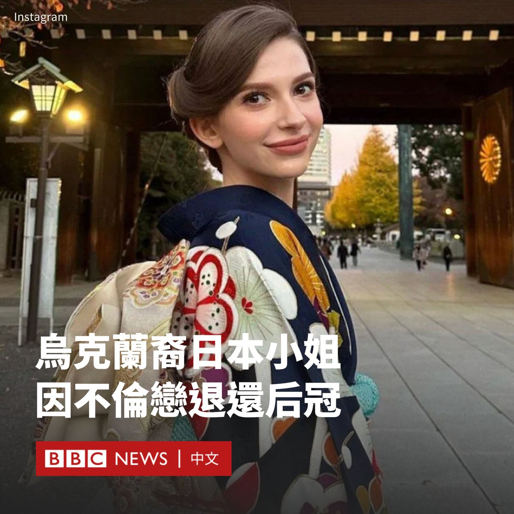

D英国广播公司BBC 北京时间 2024-02-06T17:59:58Z 1754807133894230171 对英国王室来说，这是一个严峻的隆冬。在凯特王妃住院进行手术后，国王查尔斯三世被确诊罹患癌症。威廉、哈里和其他王室亲属将面临个人焦虑与公众压力。https://t.co/5lAbS6qu8A   D英国广播公司BBC 北京时间 2024-02-06T15:46:23Z 1754773518129197484 出生于乌克兰的日本小姐选美冠军椎野卡罗琳娜（Karolina Shiino）在花边媒体披露她与一名已婚男子存在婚外情后，宣布辞去她的称号。

26岁的椎野两周前获得了日本小姐的桂冠，但由于她并没有日本人血统，引发了公众的争论。一些人对这位归化公民的获胜表示欢迎，但另一些人则认为她的长相并不代表日本传统的审美。

在一片哗然声中，日本知名杂志《周刊文春》发表了一篇报道，指控她有外遇。该报道称，椎野与一位已婚知名医生有染。该男子没有发表任何公开评论。

选美主办方在上周对该报道的最初回应中为椎野辩护，称她不知道该男子已婚。但在本周一（2月5日），主办方称她已承认知道该男子的婚姻和家庭情况。

日本小姐协会说，主办方已接受她退还后冠的请求。

在周一的一份声明中，椎野也向她的粉丝和公众道歉。她表示，此前出于恐惧而没有告知真实情况。她说：“我对自己造成的巨大麻烦，以及背叛支持我的人感到非常抱歉。”

椎野是首位获得日本小姐殊荣的欧洲裔女性。她出生在乌克兰，五岁时随母亲移居日本，并用了继父的日本姓氏。她能说写流利的日语，并于2022年入籍。

据报道，日本小姐的头衔将在今年余下的时间里继续空缺。   D英国广播公司BBC 北京时间 2024-02-06T13:34:43Z 1754740381709922801 在北京市中心的一家声音疗愈工作室内，一些疲惫的年轻人正在参加一场“睡眠音乐会”。在水鼓、雨棒、手鼓等演奏的雨声、海浪声和鸟鸣声中，他们终于进入了梦寐以求的深度睡眠。 https://t.co/GDiVhe3Km6   D英国广播公司BBC 北京时间 2024-02-06T11:28:23Z 1754708589531590899 一艘中国科考船计划停靠马尔代夫牵动了印度的紧张神经。印度政界人士担忧，这艘船可能进行数据收集任务。前中国解放军大校周波表示，印度政府不应对此大惊小怪，“印度洋不是印度的海洋”。https://t.co/bWdaYddhL5   D英国广播公司BBC 北京时间 2024-02-06T08:25:36Z 1754662589722677454 白金汉宫表示，英王查尔斯三世（King Charles III）确诊患有某种癌症。癌症的类型并未披露，但根据白金汉宫的声明，查尔斯于周一（2月5日）开始接受“定期治疗”。

75岁的查尔斯将暂停他的公开活动，而王后卡米拉和威廉王子将在他接受治疗期间代替他履行职务。  https://t.co/UxGgmhm0Z3   