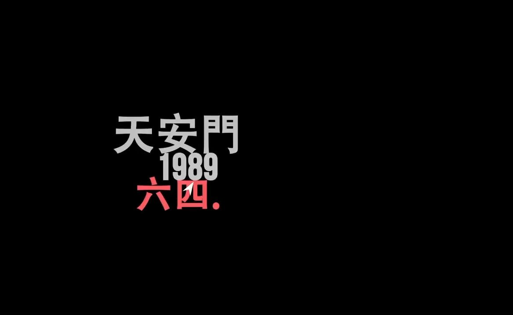

Ivy未央 北京时间 2024-02-06T22:17:09Z 1754871859022123326 罗永浩当年很敢说，听过这个视频的粉红会不会瞬间清醒一点？
三年灾害饿死3000万人，是政治造成的，政治比战争残酷一万倍
有些人自己遭的孽却推给老天，果然是无神论者。
他抽风了，下面的人都得陪着他抽风 https://t.co/dRKzfSn7iT   Ivy未央 北京时间 2024-02-06T08:17:44Z 1754660610950783322 六四事件，天安门广场备忘录
1989年的北京，天安门广场。
中国政府动用军队，向手无寸铁的学生和市民开枪，曾令亿万人充满希望的政治改革戛然而止。
这个震惊世界的事件，
如今在中国仍然是不能公开讨论的话题。
一场学生运动，为什么以武力镇压结局？
当年，到底发生了什么？ https://t.co/pB5Wh2Es8p   Ivy未央 北京时间 2024-02-06T08:27:44Z 1754663128732778521 每次都会哽咽，被六四学生的为民主请愿的热情感染！
同时又愤怒，什么样的政府又下令屠杀和平请愿的学生？什么样的军队会对手无寸铁的学生开枪？什么样的屠夫会下令用坦克碾轧清场？   