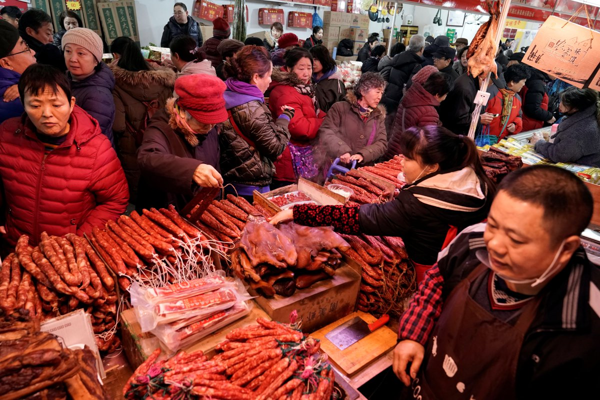
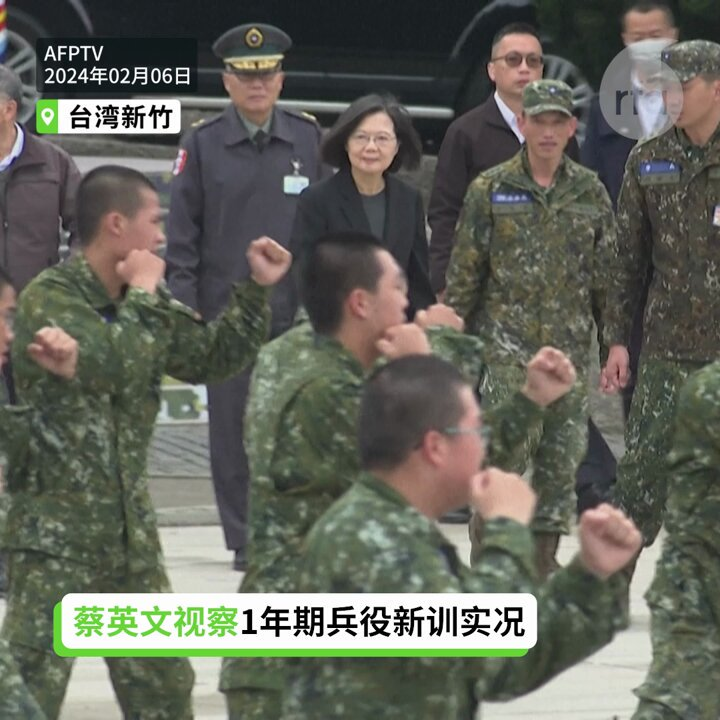
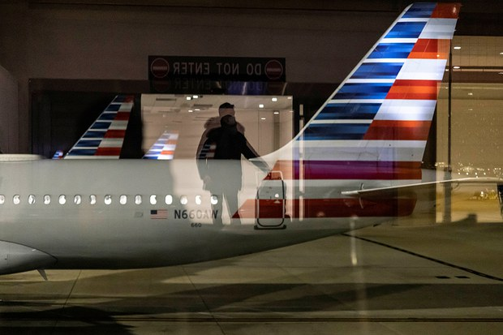
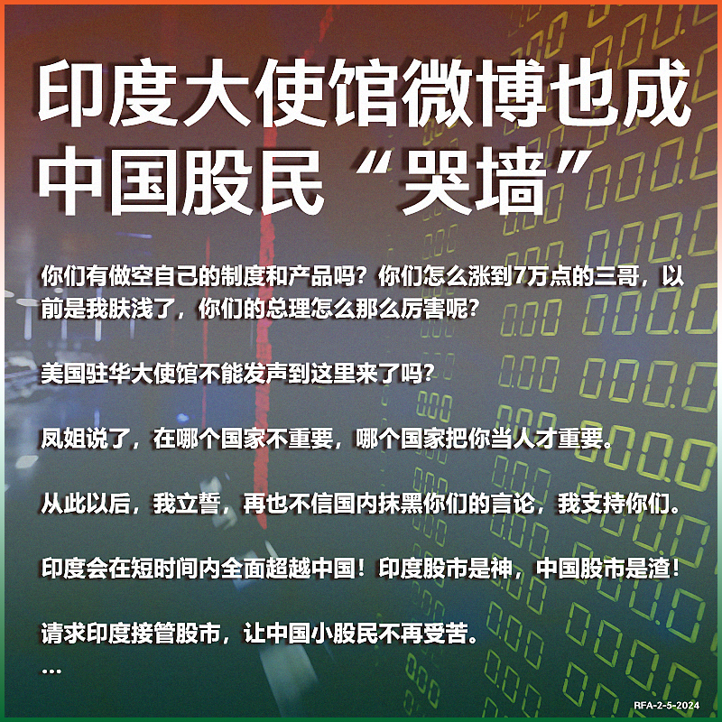
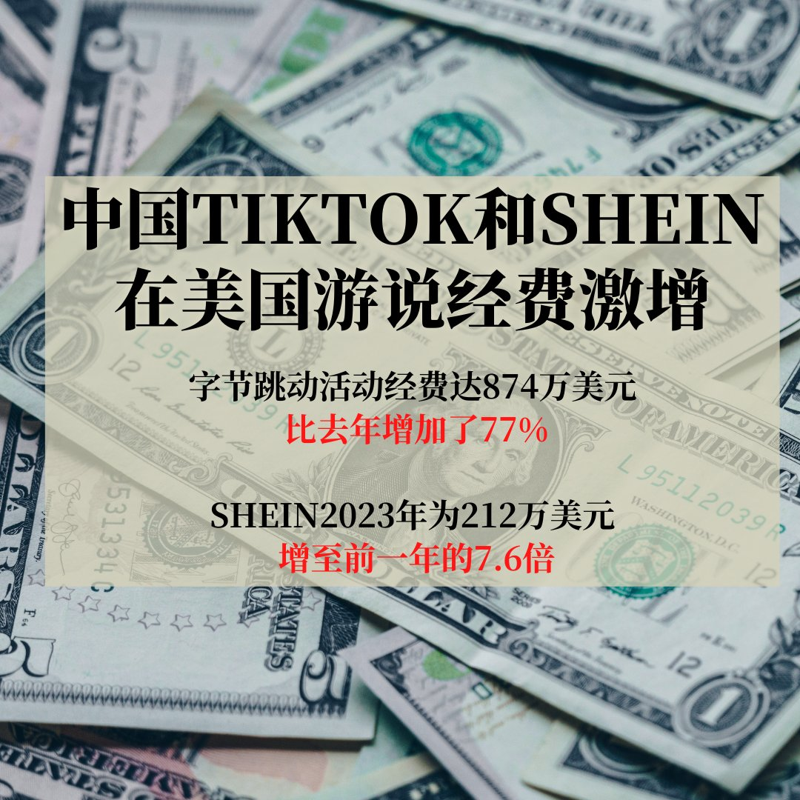
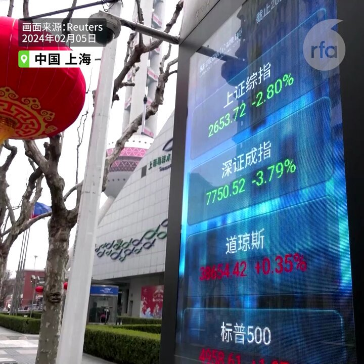
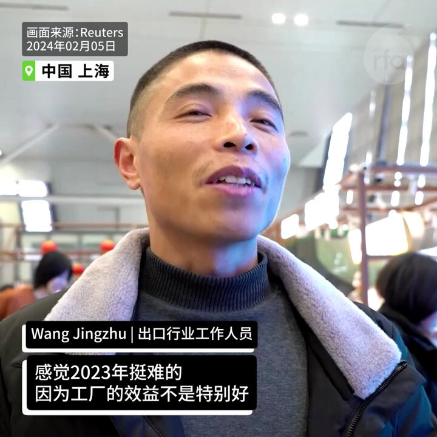
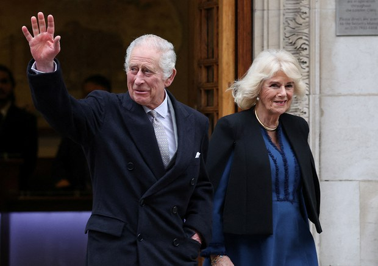
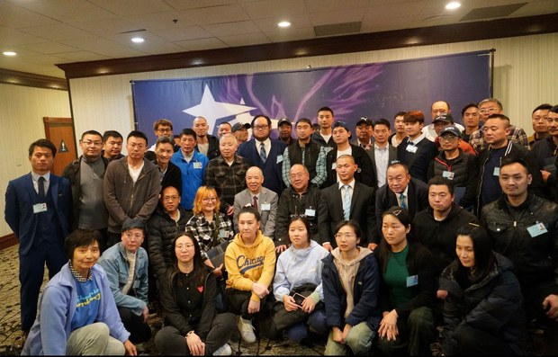
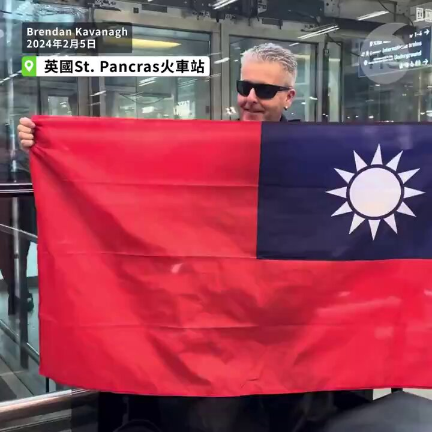

自由亚洲电台 北京时间 2024-02-06T15:01:09Z 1754762135966818445 【春节前夕猪肉价各地涨跌不一】
【民众叹购买力不如去年】
春节来临之际，中国多位受访者告诉本台，受到企业倒闭、失业等多重影响，今年的购买力远不如去年，甚至疫情期间。武汉受访者葛先生说，许多人现在只求“活下去”，微商劳先生则感叹“生意难做”。不过，中国商务部表示，全国网上零售购买力稳居全球第一。详细报道：https://t.co/rQsMzVju4A   #春节   自由亚洲电台 北京时间 2024-02-06T15:54:03Z 1754775445474877857 【春节前夕 蔡英文视察1年期兵役新训实况】
【蔡英文赠加菜金 勖勉官兵守护国家安全】
台湾首梯1年期义务役上个月入伍，春节前夕，蔡英文总统6日前往新竹206旅视导新训实况。蔡英文对官兵强调，守护国家安全，需要每一个人的力量。她并要求国防部落实各项训练，滚动检讨，确保品质及成效。 https://t.co/SrBu2rpac2   自由亚洲电台 北京时间 2024-02-06T10:58:15Z 1754701006162809247 中国国务院2月3日发布有关"#三农"问题的"#一号文件"再度强调要"确保国家 #粮食安全、确保不发生规模性返贫"。文件要求2024年确保粮食产量保持在1.3万亿斤以上。
https://t.co/qfSbI1hApD   自由亚洲电台 北京时间 2024-02-06T10:55:52Z 1754700407803347091 港府高层就《#基本法》二十三条立法透露更多的立法倾向细节，将会与中国看齐，剥夺被拘捕人士见律师的权利，并警告媒体和政评人，如果访问被通缉的海外流亡者，以及批评港府时"添油加醋"，有可能被控协助"教唆"，一同视为犯法。
https://t.co/jYtaCa5Xsl   自由亚洲电台 北京时间 2024-02-06T10:59:44Z 1754701380257030414 上海市道路运输管理局1月29日发布通知，严格 #禁止网约车在浦东机场区域揽客运营。两天后，滴滴出行等多家网约车平台都无法发送从上海浦东机场始发的订单。而一家成立不久的"#空港出行"网约车则独家拥有浦东机场的经营权。对此，舆论恶评如潮，五天后当局收回禁令。
https://t.co/jXBENTAoFT   自由亚洲电台 北京时间 2024-02-06T11:44:09Z 1754712556453937534 RT @RFA_Chinese: 【龙年心愿大征集】
春节将近，本台祝您新春大吉，龙年好运！
新的一年您有什么愿望？梦想和现实之间相距多远？您将如何努力来实现愿望？
请在评论区回帖或电邮 fankui@rfa.org，截止日期：2月8日。谢谢大家！ https://t.co/m…   自由亚洲电台 北京时间 2024-02-06T11:45:30Z 1754712897156964690 RT @RFA_Chinese: 欢迎收听和订阅播客【＃亚太报道】 https://t.co/MjLNSvVMqc

#李翘楚 被以“煽颠罪”判刑；#杨恒均 被以“间谍罪”判处死缓；美、印 #使馆微博 成网民“#哭墙”；中国示警 #粮食安全 和 #规模性返贫；香港“#23条”立…   自由亚洲电台 北京时间 2024-02-06T09:47:00Z 1754683077224276020 RT @RFA_Chinese: 【龙年心愿大征集】
春节将近，本台祝您新春大吉，龙年好运！
新的一年您有什么愿望？梦想和现实之间相距多远？您将如何努力来实现愿望？
请在评论区回帖或电邮 fankui@rfa.org，截止日期：2月8日。谢谢大家！ https://t.co/m…   自由亚洲电台 北京时间 2024-02-06T10:13:11Z 1754689663737229752 中国驻美国大使馆（简称中使馆）1月29日发出警告，指多名中国留学生近期自华盛顿 #杜勒斯国际机场（IAD）入境，遭边境人员无端盘查、滋扰甚至遣返。相关消息在社媒上引发恐慌。那么，中国人员入境美国是否真的如此恐怖？有专家表示，被拒绝入境均为事出有因。
https://t.co/2THn3xTvPl https://t.co/AI9rEDEop8   自由亚洲电台 北京时间 2024-02-06T10:16:25Z 1754690480221155662 RT @RFA_Chinese: 据自由亚洲电台粤语部报道，英国钢琴家卡瓦纳 @brenkav  2月5日在伦敦圣潘克拉斯火车站“快闪”。
他在直播中拿出中华民国国旗，笑说“暂时未有国际纠纷”。他又解释，“因为中国不承认台湾，想侵占台湾”，借镜头“向台湾人展示中华民国国旗在伦敦…   自由亚洲电台 北京时间 2024-02-06T10:19:10Z 1754691169676935270 #杨恒均 2月5日因 #间谍罪 在北京被判死缓；对此，澳大利亚政府召见中国大使抗议。
熟悉外交事务的人士以及中国问题专家都指出，澳大利亚必须进一步调整对中国的外交路线；应该争取集合各个民主国家的力量，以强硬手段制裁中共。
https://t.co/hbl7ZiD4Ho   自由亚洲电台 北京时间 2024-02-06T00:27:25Z 1754542253538996566 长期被浙江当局严密监控的异议人士 #朱虞夫 多年来期盼前往日本，却一波三折，三个月前还确诊患晚期胃癌。但据了解，近期朱虞夫获准离境，而且已在上周顺利踏足日本九州，下一步计划在当地医院接受化疗。
 https://t.co/Z8eaGGvZBM   自由亚洲电台 北京时间 2024-02-06T03:09:26Z 1754583027160953241 在 #美国驻华使馆 的微博留言被维稳后，一些中国股民前往 #印度驻华大使馆 微博哭诉，表达对 #A股 的绝望，并盛赞 #印度股市。相关言论很快也遭“和谐”。
1月22日，印度股市首次超越香港股市，成为全球第四大股市。
您知道中国股民还去哪里上访了？您觉得这样有用吗？
https://t.co/BOqwh8pbhN https://t.co/HUYCocllSl   自由亚洲电台 北京时间 2024-02-06T05:27:27Z 1754617756735930389 中国出现重大 #芯片 科研突破？ 美议员表达竞争立场 https://t.co/N6UBFGcbK3   自由亚洲电台 北京时间 2024-02-06T06:00:08Z 1754625984538808737 据日本经济新闻近日报道称，中国TikTok和SHEIN在美国游说经费激增。报道称。在中美对立的背景下，美国国会等对两家提高了警惕，TikTok与SHEIN正试图减轻这些因素对业务的影响。
您分析，背后原因何在？ https://t.co/PrUwROOEfv   自由亚洲电台 北京时间 2024-02-06T06:30:36Z 1754633650149171313 在中国民众 #春节 返乡高峰之际，中东部多个省份却遭遇十五年来最强 #冰冻雨雪天气，严重影响公路、铁路及航空交通。有大量返乡民众在高速路上受阻，甚至有人被困三天两夜。民众的返乡之路为何如此之难？政府的应急救援机制又在哪里?

https://t.co/b93DEvNfDA   自由亚洲电台 北京时间 2024-02-06T06:45:46Z 1754637466974195861 【#比惨！】
2024年春运，大雪冰雨冻住回家的道路，最惨的是电动车。本来国产新能源汽车的续航里程就存在虚标问题，到了这种极端天气，续航里程能打对折。车主不敢打开暖气取暖，好不容易到达充电站，排队充电时间就占行程占一半以上。
有网友说当下最惨的人，是开 #电动车 堵在 #湖北高速 的 #中国股民。不服的请来比！   自由亚洲电台 北京时间 2024-02-06T07:00:02Z 1754641056082125293 专栏 | #夜话中南海：有多少中委、候补中委及二十大代表中的蠹虫在等待 #三中全会 发落？  https://t.co/7QzfFS1007   自由亚洲电台 北京时间 2024-02-06T07:01:26Z 1754641410467434721 【中国证券监管机构誓言稳定股市 你信吗？】
在 #中国股市 跌至五年低点后，#证券监管机构 誓言要防止市场异常波动，但没有宣布具体措施。 https://t.co/V7owEoFm7b   自由亚洲电台 北京时间 2024-02-06T07:10:38Z 1754643723970093557 【中国经济怎么样？问问"打工人"】
2月5日农历新年假期前，#在外务工人员 赶着乘火车回家过年。关于 #中国经济状况，他们的体感与官方数据并不一致。 https://t.co/sn9Z7vyB5Z   自由亚洲电台 北京时间 2024-02-06T07:18:57Z 1754645819620282713 据美国《纽约时报》报道，#美国财政部 本周将派遣一个代表团到北京进行经济会谈。一名财政部官员透露，这次为期两天的会谈将涉及中国使用政府补贴等非市场经济手段，工业产能过剩导致国际市场充斥廉价产品，以及困扰低收入国家的主权债务负担等问题。
 https://t.co/eZ2DqSn3gz   自由亚洲电台 北京时间 2024-02-06T08:00:09Z 1754656185784189154 欢迎收听和订阅播客【＃亚太报道】 https://t.co/MjLNSvVMqc

#李翘楚 被以“煽颠罪”判刑；#杨恒均 被以“间谍罪”判处死缓；美、印 #使馆微博 成网民“#哭墙”；中国示警 #粮食安全 和 #规模性返贫；香港“#23条”立法内容曝光。 https://t.co/315QGDhxPz   自由亚洲电台 北京时间 2024-02-06T02:39:21Z 1754575454931955891 【白金汉宫：#查尔斯国王 确诊癌症】
据英国广播公司BBC报道，英国王室白金汉宫周一（2月5日）对外表示，英国查尔斯国王近日确诊了一种癌症，是在治疗前列腺肿大期间发现的；具体癌症类型并未透露，但查尔斯从周一已经开始了定期治疗。

白金汉宫称，国王“对治疗保持完全积极的态度，并期待尽快恢复全面的公共职责”。查尔斯国王将继续担任宪法角色，包括文件工作和私人会议。但他将推迟公开活动，预计其他高级皇室成员将在他的治疗期间代替他。

查尔斯国王现年75岁。他一周前在伦敦的私立医院接受了前列腺手术，并公开谈及自己的前列腺治疗，目的是为了鼓励更多男性接受前列腺检查。   自由亚洲电台 北京时间 2024-02-06T03:18:59Z 1754585427032649731 中国女权活动人士 #李翘楚 在遭当局羁押长达三年之后本周一被山东法院以"煽动颠覆国家政权罪"判刑。这一消息引发国际社会高度关切。多位人权活动人士表示，李翘楚的判决结果昭示了中国的司法不公。

https://t.co/EsGoFiWZTY https://t.co/Lpq14PKjRJ   自由亚洲电台 北京时间 2024-02-06T05:29:17Z 1754618217782182228 在中国被扣留五年的澳大利亚籍华裔作家 #杨恒均 2月5日因间谍罪在北京被判死缓。根据判决书，杨恒均曾向台湾提供情报。
有法律界人士表示，因 #间谍罪 被判死缓的案例在中国十分罕见。
澳大利亚政府对判决表示震惊，已传召中国驻澳大使表示反对。

https://t.co/mTymPxWfJV   自由亚洲电台 北京时间 2024-02-06T06:13:36Z 1754629373137723642 1月29日，上海浦东机场的网约车禁令，仅5天后被上海市交通委叫停。
但媒体和网友挖掘发现，在禁令期间，只有 #郑秀利 控制的“#空港出行”平台能下单叫车。“空港出行”所属公司——航空港（上海）汽车服务有限公司于今年1月国内另外两座拥有双国际机场的北京、成都设立了分公司。并且在2023年11月28日至2023年12月8日11天内集中成立重庆、广州、武汉、杭州、贵阳五个城市的分公司。商业版图之大，被网友称为“二号 #张核子”。
全网挖呀挖：郑秀利是谁？TA背后又是谁？   自由亚洲电台 北京时间 2024-02-06T01:49:43Z 1754562963086922156 曾经是中共地下党员、如今旅居加拿大的自由作家 #梁慕娴 出版《觉醒的道路：前中共香港地下党员梁慕娴回忆录》一书。在温哥华的新书发表会上，梁慕娴说中共地下党组织遍布世界各国，尤其在台湾运作更广更深。
https://t.co/gLV3cJxT1C   自由亚洲电台 北京时间 2024-02-06T02:46:31Z 1754577257308598283 【龙年心愿大征集】
春节将近，本台祝您新春大吉，龙年好运！
新的一年您有什么愿望？梦想和现实之间相距多远？您将如何努力来实现愿望？
请在评论区回帖或电邮 fankui@rfa.org，截止日期：2月8日。谢谢大家！ https://t.co/mOdGwJZCI4   自由亚洲电台 北京时间 2024-02-06T03:18:16Z 1754585249168720350 中国女权活动人士 #李翘楚 在遭当局羁押长达三年之后本周一被山东法院以"煽动颠覆国家政权罪"判刑。这一消息引发国际社会高度关切。多位人权活动人士表示，李翘楚的判决结果昭示了中国的司法不公。

https://t.co/4AVHo2mDOu   自由亚洲电台 北京时间 2024-02-06T04:09:18Z 1754598090152247589 海外民运团体 #中国民主党 全国联合总部1月31日至2月1日在洛杉矶尔湾召开了第五次代表大会。本次会上，该团体以差额方式选出了新一届主席和副主席。
https://t.co/q7o745bllZ https://t.co/FlaBAQQQgn   自由亚洲电台 北京时间 2024-02-06T02:03:21Z 1754566394950430745 据自由亚洲电台粤语部报道，英国钢琴家卡瓦纳 @brenkav  2月5日在伦敦圣潘克拉斯火车站“快闪”。
他在直播中拿出中华民国国旗，笑说“暂时未有国际纠纷”。他又解释，“因为中国不承认台湾，想侵占台湾”，借镜头“向台湾人展示中华民国国旗在伦敦的火车站出现”，并笑说“希望中国人看到不要生气”。 https://t.co/V8GGCmYJ9X   