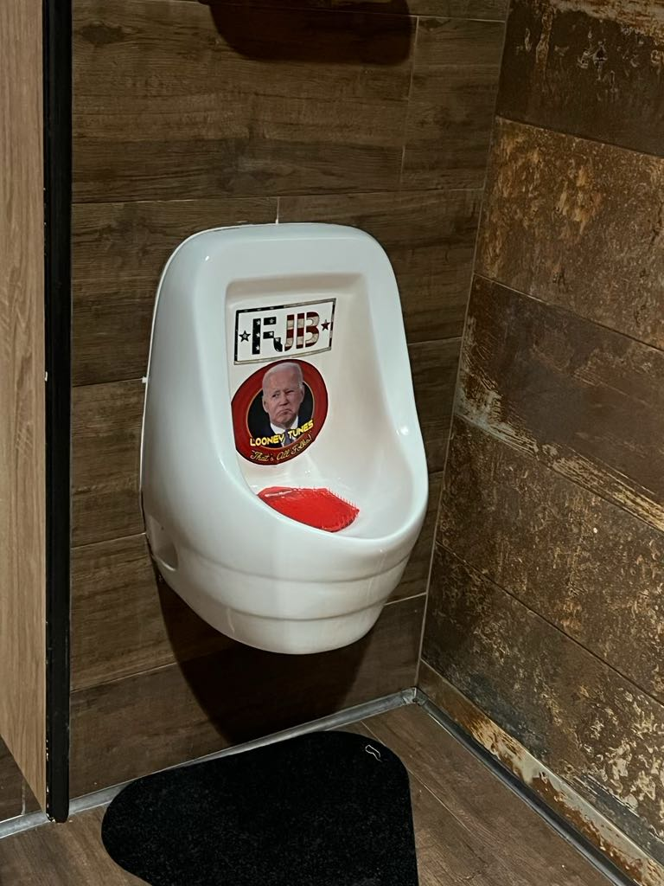
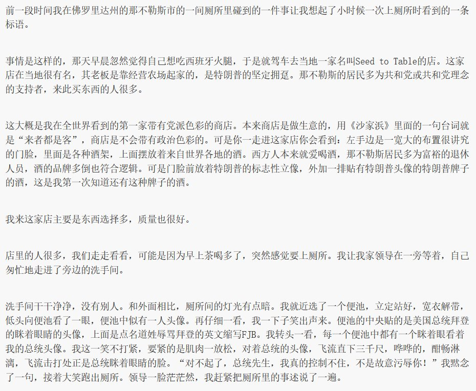
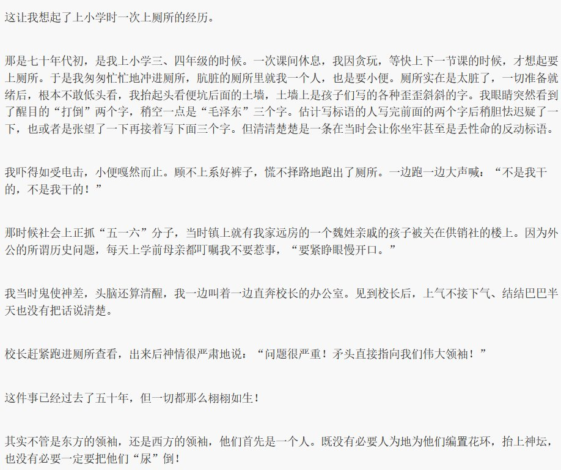
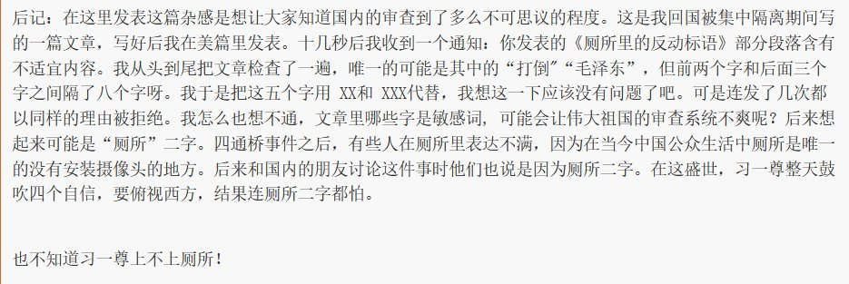
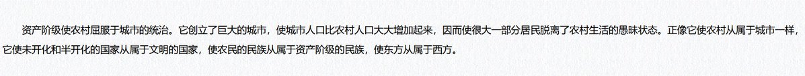
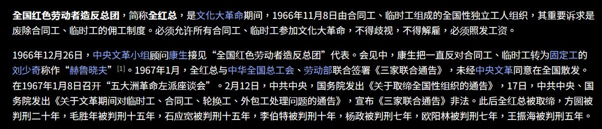
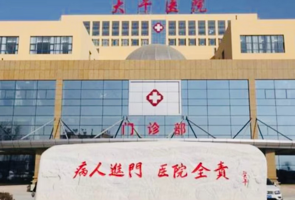
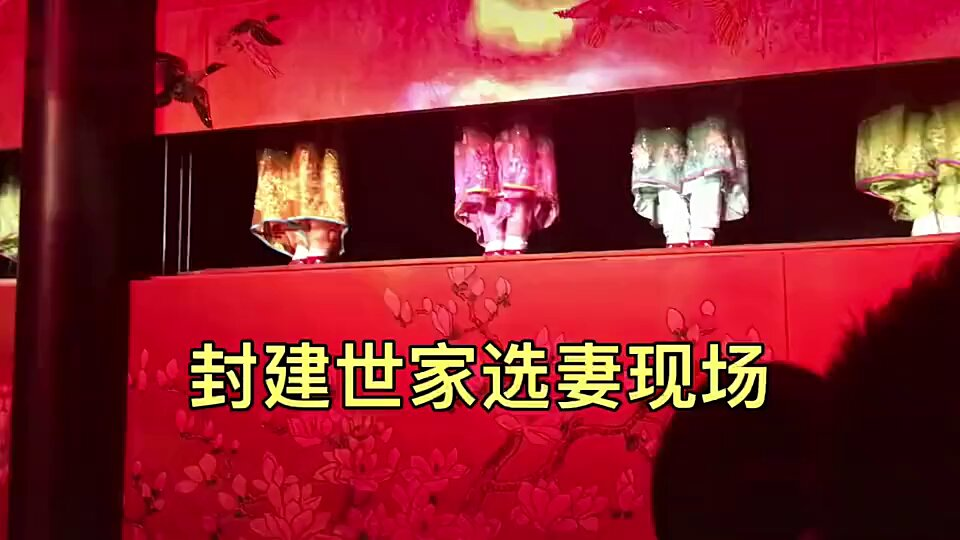

谁将十万横扫三江 北京时间 2024-02-06T16:43:57Z 1754788006270271764 文学城看到的一篇文章：厕所里的反动标语
面对这种人格羞辱，民主政府和专制政府有不同处理方式
（source https://t.co/CFdZjXIwMR） https://t.co/dj2GyM9mFe   谁将十万横扫三江 北京时间 2024-02-06T14:33:17Z 1754755123031704035 这就是毛泽东粉丝的终极方案：去城市化，他们直白地承认了这不是为了效率，也即不是为了生产力发展，但是他们没说的是，这是为了试图弥合专制统治下的央地矛盾，正常进步人士想的是全民参政议政，而我们的毛派给出的方案却是：恢复中央直管郡县两级基层政权。

这和马克思主义城市观背道而驰，在城市聚集生产生活促进了工人阶级的成长，大城市是工人运动的发源地，城市越大，工人阶级在斗争中的作用也就越大。当工人阶级试图掌握政治话语权，毛派将举起他们的屠刀   谁将十万横扫三江 北京时间 2024-02-06T15:47:32Z 1754773809075523758 RT @RFA_Chinese: 据自由亚洲电台粤语部报道，英国钢琴家卡瓦纳 @brenkav  2月5日在伦敦圣潘克拉斯火车站“快闪”。
他在直播中拿出中华民国国旗，笑说“暂时未有国际纠纷”。他又解释，“因为中国不承认台湾，想侵占台湾”，借镜头“向台湾人展示中华民国国旗在伦敦…   谁将十万横扫三江 北京时间 2024-02-06T15:59:43Z 1754776873039810576 佛教在香港有医院，在台湾有医院，在中国没有，那么是哪里的问题？
宗教场所能不能搞社会救济或者进一步提供基础服务，这是危及政权的问题，如果是分权式的社会，不存在什么和党/中央政府抢群众的罪名，那么宗教为了扩大民意基础可以搞教育医疗养老等各种社会兜底措施。但在中央集权的专制政体下，你提供了这些服务，就抢夺了政府的民力，所以严厉打击。私立医院，私立教育，私立养老院，商业保险也是同理   谁将十万横扫三江 北京时间 2024-02-06T16:20:32Z 1754782111205302405 通过几分钟流水线的选拔方式展现封建糟粕，但如果制度留存乃至改良后，有更高的组织能力，在见面前就筛选掉甚至让下级呈上“供奉”，难道是更好的制度吗？新中国给溥仪找妻子，林家给林立果选妃，各文臣武将搞家族联姻，毛家和孔家联姻，不都是封建社会的流毒嘛？ https://t.co/qEzqMmu6ip   谁将十万横扫三江 北京时间 2024-02-06T13:20:33Z 1754736817407217844 RT @Yura8964: 讲点冷知识
至今，《联合国宪章》依然规定中华民国是五个联合国安理会常任理事国之一。
1950年，🇨🇳共和国代表首次出席安理会，以PRC的名义与🇹🇼中华民国(China)代表蒋廷黻产生主权问题对质。

1971年，中华人民共和国取代了中华民国政府的联合…   谁将十万横扫三江 北京时间 2024-02-06T13:51:37Z 1754744637435388099 中国的黑箱政治，不告诉民众真实结果，使其保有希望

众所周知的冻雨，导致汉口火车站昨天只发出了3辆车，由于车站大屏只显示“晚点未定”，而不是直接告诉你“停运”，十几万人就挤在车站苦等，觉得还有希望，等一等车子就可以走。

考虑到最坏的情况，我们往办公室去问了穿军大衣的、领导模样的中年男人，报了车次，他坚定地告诉我：“别等”，没有多余的解释。

中国社会很重要的一项通用技能：任何时候多长一张嘴，张嘴问就有答案。

车站的内部人员实质知道“根本无法发车”，大屏却只会告诉你“晚点请等待”。车站要对所有人负责，停运会大规模退票、人流会慌乱，很多外地旅客无家可去；但你开口问，就只用对你负责。

后续是，那趟车无限期晚点后连续取消了2天的发车计划，没人等到发车，我在车站呆了1小时后就原路返回家里了。   