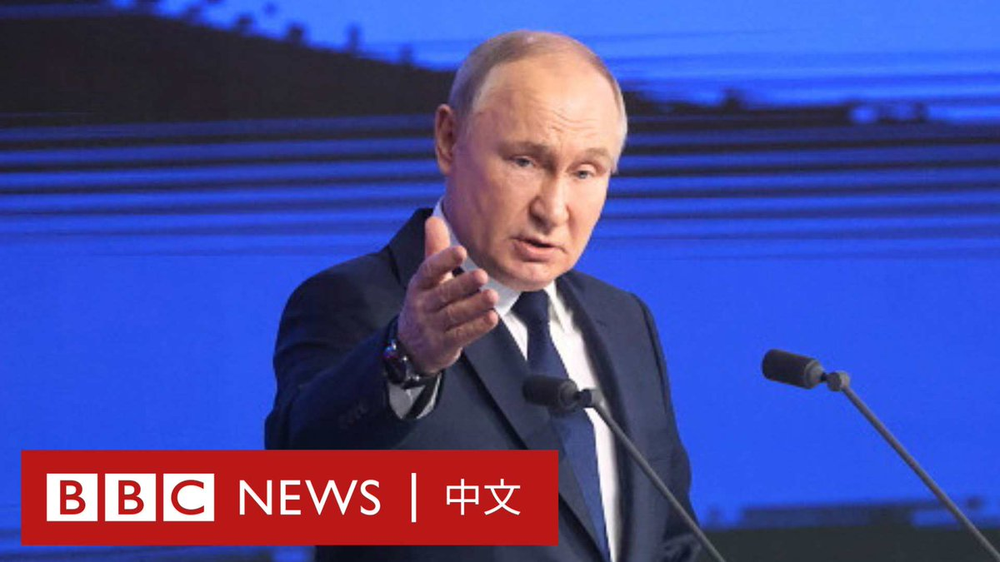

D英国广播公司BBC 北京时间 2024-02-05T08:55:03Z 1754307613624590799 随着俄罗斯3月的大选临近，总统普京开启了他的选前宣传活动。莫斯科的名流们齐聚一堂，支持普京竞逐其第五个任期。

现在，普京的政治反对派或身陷囹圄或流亡海外，克里姆林宫也正严密控制着媒体。对于很多选民来说，普京似乎是唯一的选择：“除了普京，还能有谁？” https://t.co/LG272L10qn   