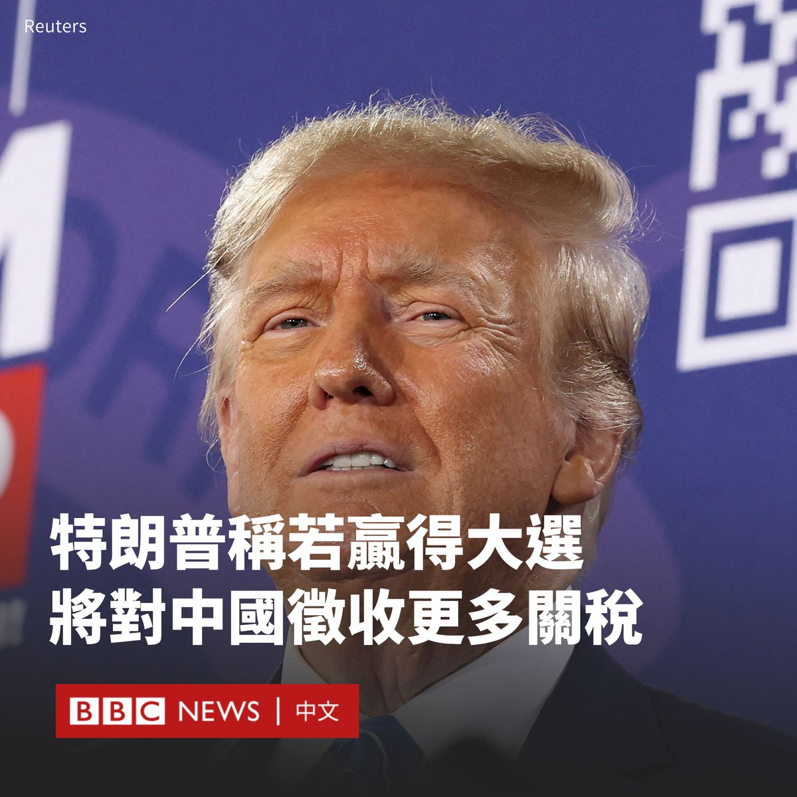

D英国广播公司BBC 北京时间 2024-02-05T17:02:14Z 1754430219057058094 美国前总统特朗普（Donald Trump）表示，如果他在今年11月的美国总统大选中获胜，他将对中国商品征收更多关税。

他在接受Fox News采访时表示，关税可能超过 60%。他对记者说：“我们必须这么做。”

特朗普目前是共和党内的领跑者。但他面临多项刑事指控，包括试图推翻2020年的选举结果。他否认了这些指控。

长期以来，特朗普一直批评中国进行不公平的贸易行为，以及涉嫌知识产权盗窃。

“你知道，显然我不想伤害中国。我想与中国和睦相处。我认为这很好，但他们确实利用了我们的国家。”特朗普说。

在特朗普入主白宫期间，他对价值数千亿美元的中国商品加征关税，引发了世界两大经济体之间激烈的贸易战。

特朗普政府于2018年首次开始对中国商品加征关税，旨在遏制从中国的进口。同年晚些时候，该政策升级为针对从海鲜到化学品等诸多类别。作为回应，北京对大豆、小麦和家禽等美国进口商品征税。

现任总统拜登（Joe Biden）政府基本上维持了该关税，但有人批评该关税推高了产品价格并降低了美国的竞争力。

然而，遏制美中经济关系正在获得一些共和党和民主党议员的支持。众议院委员会最近的一份报告建议对中国进口商品征收更高的关税，并限制中国在美国的投资。   D英国广播公司BBC 北京时间 2024-02-05T16:10:38Z 1754417231004320097 在中国政府对“唱衰”经济的言论加强审查之际，美国驻华大使馆的微博账号意外成为中国网民发泄对该国经济下行和股市暴跌不满情绪的“哭墙”。
https://t.co/wnxa4ngJyj   D英国广播公司BBC 北京时间 2024-02-05T12:28:26Z 1754361314317640171 在香港举行的一场季前友谊赛中，香港愤怒的球迷向美国迈阿密国际队发出嘘声，因为球王梅西（Lionel Messi）未能上场。https://t.co/Ecs5hLOr1w   D英国广播公司BBC 北京时间 2024-02-05T13:58:22Z 1754383946920374397 澳大利亚政府对华裔作家杨恒均被判处死缓表示“震惊”。外长黄英贤（Penny Wong）表示：“（我们）会用最强烈的措辞来表达我们的反应。” https://t.co/faETh84zmd   D英国广播公司BBC 北京时间 2024-02-05T11:22:14Z 1754344655171264962 【最新消息】澳大利亚华裔作家杨恒均因间谍罪被捕五年后，被中国一家法院判处死缓。澳大利亚外交部长黄英贤（Penny Wong）表示，澳大利亚政府对此感到“震惊”，

杨恒均是一位学者和小说家，曾在博客上发表过关于中国事务的文章。他否认了对他的指控。 https://t.co/AEowqMdfFE   D英国广播公司BBC 北京时间 2024-02-05T08:55:03Z 1754307613624590799 随着俄罗斯3月的大选临近，总统普京开启了他的选前宣传活动。莫斯科的名流们齐聚一堂，支持普京竞逐其第五个任期。

现在，普京的政治反对派或身陷囹圄或流亡海外，克里姆林宫也正严密控制着媒体。对于很多选民来说，普京似乎是唯一的选择：“除了普京，还能有谁？” https://t.co/LG272L10qn   