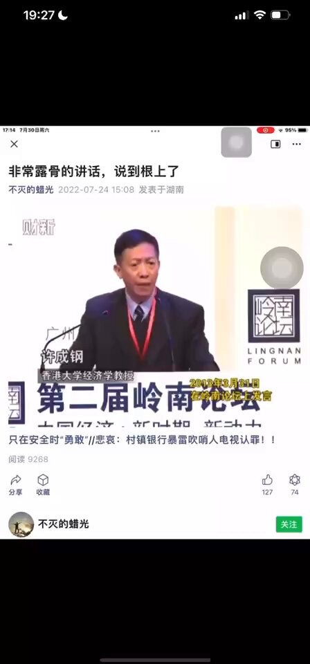
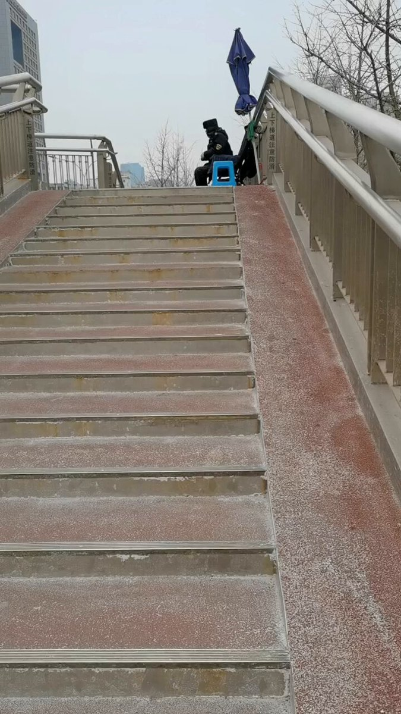
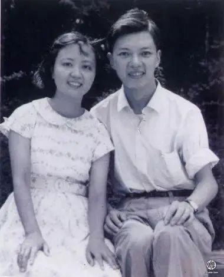
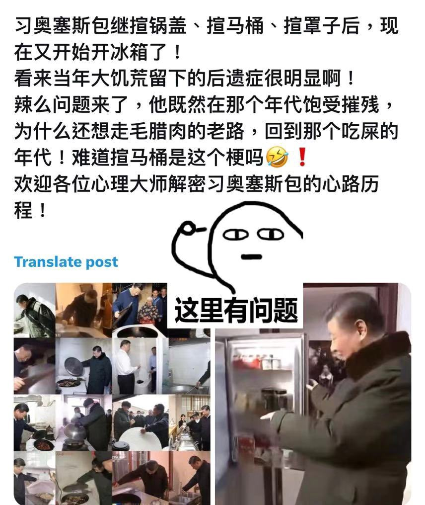
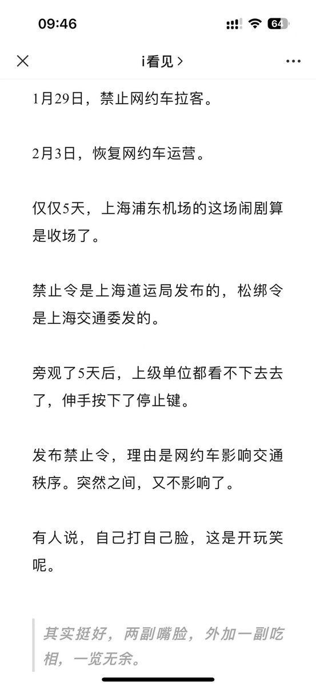
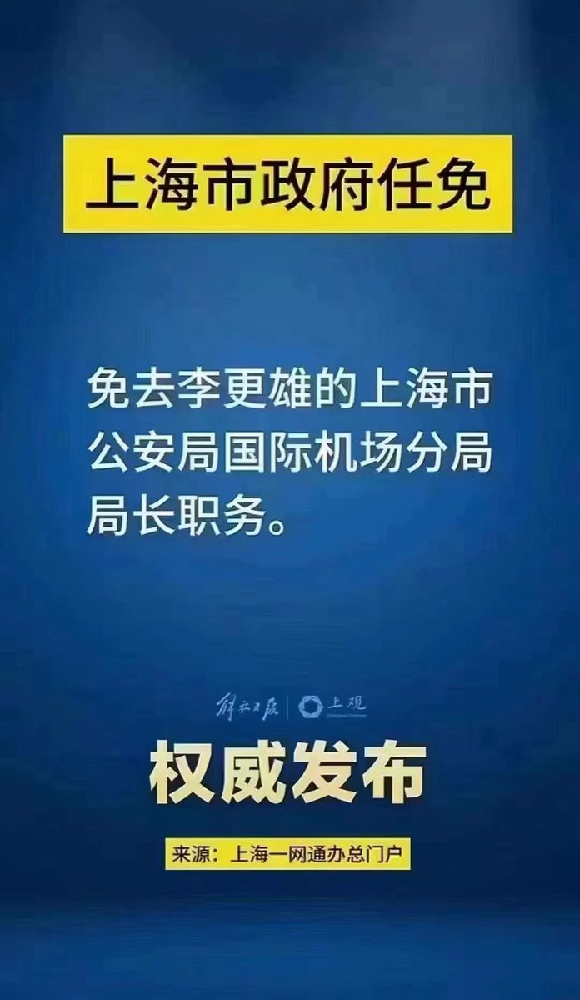

Petrichor 北京时间 2024-02-05T13:23:49Z 1754375250391826930 法律不保护私有制、土地没有私有制的国家注定没有前途，官员肯定腐败，人民肯定贫困、政府肯定欺负人民、国家不会有创造性、社会肯定不稳定。打江山坐江山，反复轮回。 https://t.co/YYWrSQpIQd   Petrichor 北京时间 2024-02-05T13:51:43Z 1754382272269041783 杨恒均与海外大外宣一帮男女在中宣部安排下进行“走遍中国”西藏之旅，原来他们去是给外国收集秘密情报去的。大外宣被外国间谍利用了。哈哈   Petrichor 北京时间 2024-02-05T14:01:22Z 1754384700699783621 独裁统治增加运营成本，花钱雇人看桥，房人挂标语。

民主国家就无需这笔开销，总统随便骂，百姓无需上桥挂横幅骂政府骂执政党骂当权者。 https://t.co/sUvQG5g9VT   Petrichor 北京时间 2024-02-05T05:09:56Z 1754250961780924650 谷超豪，1980年当选为中国科学院院士。
胡和生，1991年当选为中国科学院院士。
两人都是苏步青的研究生。

经过7年的“爱情长跑”，胡和生与谷超豪喜结连理。 https://t.co/oyKi4UDrGP   Petrichor 北京时间 2024-02-05T02:55:53Z 1754217229376270806 他羡慕不是毛时代人民的生活，而是羡慕毛本人极权独裁的地位。为了他能有毛当年的集权地位，他宁愿中国人民过回毛时代的生活。

他脑子里只有从毛那里学到的一知半解的帝王统治术，志大才疏，心胸狭窄。结果是治国无方，弄权有术。指望他依法治国，除非太阳打西边出来。 https://t.co/TwcGZVjh3e   Petrichor 北京时间 2024-02-05T01:54:33Z 1754201794018726192 垄断浦东机场出租车公司的家伙，应该是黑白两道都全控，这应该只是家丁和大官的白手套。

上海是中国经济的窗口。随意出台计划经济管制措施，影响太坏。股市跌跌不休的原因在于人民损失，上海这事就让人丧失信心。

中共国最大的问题之一就是什么单位都可以发布禁止令和罚款单。 https://t.co/H4RCr3qDGN   Petrichor 北京时间 2024-02-05T02:03:04Z 1754203936922189948 旅游区的猴子，得寸进尺，明抢了。都是游客惯出来的。 https://t.co/ReVn3sLMVY   