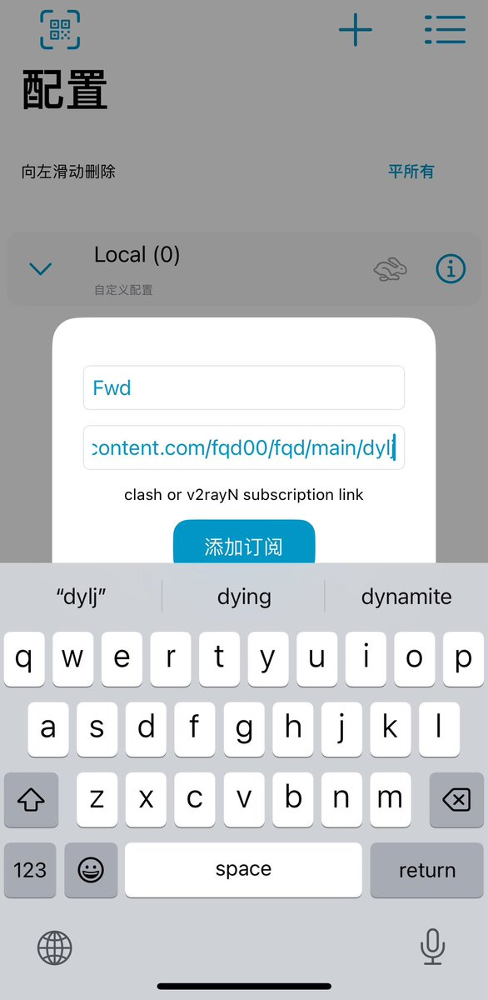
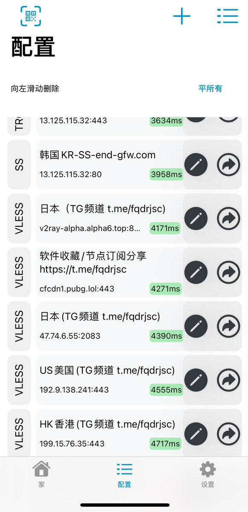

拆墙运动公号 北京时间 2024-02-05T05:37:42Z 1754257950191841558 【 #2259专案组 互联网防火墙第119号嫌犯 #赵波】  
 性别：男
国 籍：中国
民 族：汉族
籍 贯：山东青岛
出生日期：1972年12月
毕业院校：武汉大学
职 业：教师
研究方向：可信计算理论、嵌入式体系结构
教学职称：教授
政治面貌：中共党员
工作单位：武汉大学

党委书记：赵波
赵波，1972年12月生，男，博士、教授，博士生导师。 国家网络安全学院 副院长；中国密码学会理事，中关村可信计算联盟副理事长，CCF（中国计算机学会）高级会员，CCF 信息安全与保密专委会、容错计算专委会委员。TCG（国际可信计算组织）组织个人会员。
官网：https://t.co/LZ1NK8udKm
详细资料见: #BanGFW拆墙运动（建墙罪犯录）：https://t.co/80vd7mXBbT

赵波，男，1972年12月生，汉族，山东青岛人，中共党员，研究生学历，博士学位，四级教授。
曾任武汉大学原计算机学院副院长兼国家网络安全学院副院长。拟任武汉大学国家网络安全学院副院长。

人物经历
1994年毕业留校至今任武汉大学计算机学院教师，教授，博士生导师。武汉大学计算机学院信息安全研究所副所长，空天信息安全与可信计算教育部重点实验室 副主任，中国计算机学会（CCF）高级会员，CCF信息保密专委委员。微软亚洲研究院技术俱乐部顾问。

赵波，教授，博士生导师，武汉大学国家网络安全学院常务副院长，湖北省网络空间安全研究中心主任，国家网络安全优秀教师，中国密码学会理事，中关村可信计算产业联盟副理事长，CCF信息安全与保密专委会、容错计算专委会委员、DAO安全技术实验室安全技术专家顾问。主要研究方向为可信计算、嵌入式系统及云计算安全、应用密码学等。

战略合作伙伴：1、中共恶人榜：#ccpevils       
    2、#zhinawiki   拆墙运动公号 北京时间 2024-02-05T22:45:18Z 1754516555772117360 #拆墙运动 给建立 #防火墙 的恶人四川大学网络空间安全学院院长、教授 #陈兴蜀 打电话劝她停止对 #防火墙 方面的工作。
大家有条件的都可以打电话 https://t.co/bkCCHu4neR   拆墙运动公号 北京时间 2024-02-05T23:26:05Z 1754526818151915851 北京市政务信息安全保障中心（北京信息安全测试中心）主任刘海峰涉嫌严重违纪违法，目前正接受北京市纪委监委纪律审查和监察调查
https://t.co/2rDM2lDuAD   拆墙运动公号 北京时间 2024-02-05T05:56:32Z 1754262690938179763 RT @milpitas95035: CECC中国人权听证会最动人一幕：丁家喜妻罗胜春举起了近期中国政治犯群像牌子，语气哽咽、欲哭又止。全场一片哀恸，坐在她后排的我也热泪盈眶！https://t.co/5ZRx5GUW0x   拆墙运动公号 北京时间 2024-02-05T06:03:57Z 1754264557059510733 RT @zjgddr: 苹果手机用户没有小火箭不要紧啦，新出v2box 可代替，目前苹果商店免费下载。 https://t.co/0IugyWMXUx   拆墙运动公号 北京时间 2024-02-05T00:00:15Z 1754173028324220992 RT @VOAChinese: 中国网民有苦无处诉，美驻华使馆微博成躲避网警封杀的“哭墙” https://t.co/2CIjqyRcHV   