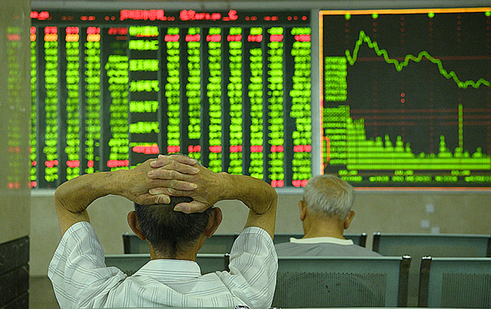
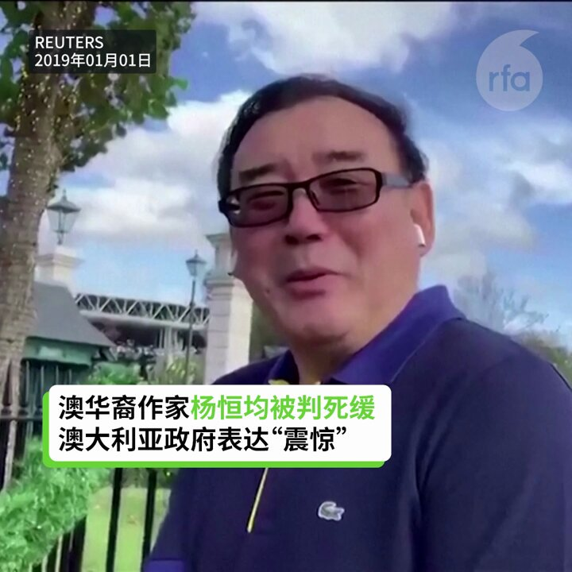
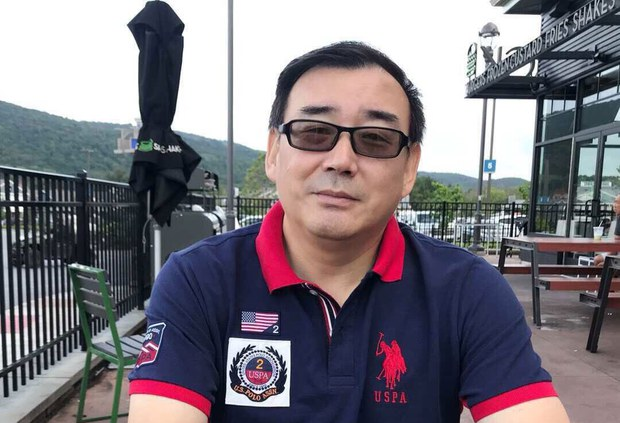
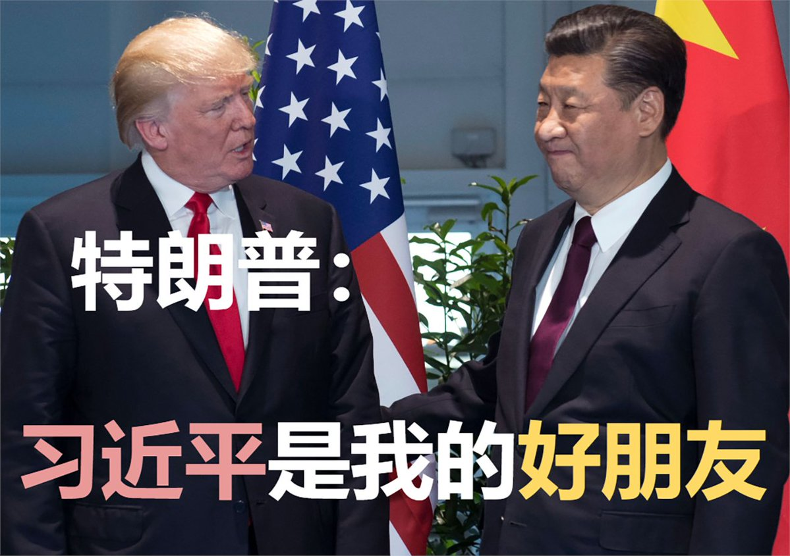

自由亚洲电台 北京时间 2024-02-05T18:39:49Z 1754454776467825059 【中国降准放水1万亿 A股跌跌不休】
【股民在美国印度使馆微博宣泄情绪】
中国央行从5日起降准0.5个百分点，为市场挹注1万亿人民币资金。然而，中国股民却乐观不起来，上证A股周一开盘不久跌破2700点，再度冲上热搜。中国股民接连几天在美国驻华大使馆微博宣泄情绪后，本周印度驻华大使馆微博也涌入大批网民留言。https://t.co/nyyRyqfYdd   自由亚洲电台 北京时间 2024-02-05T18:09:12Z 1754447069409169806 【澳华裔作家杨恒均被判死缓】
【澳大利亚政府表达“震惊”】
澳大利亚华裔作家、中国时事评论员杨恒均(又名“杨军”)遭中国以间谍罪拘留逾5年，2月5日在北京被判死刑，缓期2年执行，澳大利亚外交部长黄英贤对北京当局的决议表达“震惊”和反对。中国外交部发言人汪文斌说，中国充分保障了杨军(杨恒均)的各项诉讼权利。
#杨恒均 #杨军   自由亚洲电台 北京时间 2024-02-05T14:43:29Z 1754395299765002503 【澳华裔作家杨恒均被判死缓】
【澳大利亚政府表达“震惊”】
路透社报道，澳大利亚华裔作家、中国时事评论员杨恒均(又名“杨军”)遭中国以间谍罪拘留逾5年，5日在北京被判死刑，缓期2年执行，澳大利亚政府对北京当局的决议表达“震惊”。https://t.co/zsqorVaE0P   #杨恒均 https://t.co/y9yX8vfrkk   自由亚洲电台 北京时间 2024-02-05T13:46:25Z 1754380939776708682 【四万球迷争睹梅西踢球 梅西却没有上场 】
【球迷大失所望 嘘声不断 高喊退票】
球王梅西所属的“国际迈阿密”作客香港，2月4日下午以4比1轻取香港明星联队，取得季前热身赛的首场胜利。不过，两位大牌球星梅西和苏亚雷斯都没有上场，现场球迷大失所望，高喊退钱、退票 ! #梅西 https://t.co/W6IPZ2j43q   自由亚洲电台 北京时间 2024-02-05T10:48:41Z 1754336211370381768 专栏 | #有问有答：中国留学生骚扰威胁民主人士被定罪  #吴啸雷  https://t.co/YuYErf2ksi   自由亚洲电台 北京时间 2024-02-05T06:25:22Z 1754269944483631459 【钓鱼岛中国浮标已生锈，日本为其安装发光物】
日本 #海保部门 表示，目前中方浮标处于颠倒倾覆状态，淹在水里，已经不起作用。为确保附近航行船舶的安全，在浮标上加装了发光物。#日本 政府也已向中方通报情况。
详阅：
https://t.co/2X6dOrgZAp   自由亚洲电台 北京时间 2024-02-05T07:01:36Z 1754279064993431690 【马化腾: 腾讯腐败令人震惊, 已开除120余员工】
法新社评论：腾讯公司的 #马化腾 显然比阿里巴巴创建人 #马云 更顺服于党的领导。
详阅：
https://t.co/nG3vyBkcT3   自由亚洲电台 北京时间 2024-02-05T07:35:32Z 1754287602075574307 【特朗普: 我很喜欢习主席, 他是非常好的朋友】
共和党候选人 #特朗普 在Fox电视节目中否认会与中国发动新贸易战，不仅希望中国也能发展得好，更表示非常喜欢习近平, 称 #习近平 是他任内的好友。
（"It's not a trade war... I want China to do great, I do. And I like President Xi a lot. He was a very good friend of mine during my term."）
详阅：https://t.co/SnByOzTZe1   自由亚洲电台 北京时间 2024-02-05T04:37:32Z 1754242808393699628 “看看 #喀什噶尔、和田、阿克苏、伊犁等城市的政府网站，到处是维吾尔儿童穿戴所谓汉服，面对孔子雕像，背诵孔孟古文，用汉语大呼共产党爱国口号的视频和宣传图片；而 #维吾尔人 的母语却被挤出了学校，维吾尔文的书籍自2016年年底起就被收缴”。— #伊利夏提
详阅：
https://t.co/fqjLiVg8R5   自由亚洲电台 北京时间 2024-02-05T05:51:24Z 1754261397850956075 罗马天主教宗 #方济各 当天在 #梵蒂冈 圣彼得广场的午间祈祷仪式上，向中国人民发出迎春祝愿：让这个社会里每个人的尊严都完全得到尊重，每个人都被接纳。
详阅：
https://t.co/0MAwFot2dz   自由亚洲电台 北京时间 2024-02-05T06:08:49Z 1754265781070610832 被控“诈骗罪”的仁爱归正教会长老 #张春雷 被羁押近3年开庭超1年，至今仍未宣判。2018年，他因参与《#牧者联署：为基督信仰的声明》的签名活动，遭贵阳当局严控。
详阅：
https://t.co/F8gSujhYTC   自由亚洲电台 北京时间 2024-02-05T02:50:55Z 1754215976181092702 【两会在即，多地进京访民遭截】
四川拆迁户维权志愿者 #王蓉文 近日进京上访被捕，遣返成都后关进黑狱，至今仍未获释。
宅基地房产权维权人士肖书君夫人 #尹登珍 被打，手机及家中财物被抢走。
详阅：
https://t.co/VpXbbGrmxG   自由亚洲电台 北京时间 2024-02-05T00:38:31Z 1754182659113119885 【股民留言美使馆微博事件，管理部门作回应】
中国 #证监会 2月4日发布新闻稿承诺“加快推进 #上市公司 调研走访工作，切实解决具体困难和问题，加大优质上市公司支持力度”。另外，网文《整个 #鲁镇 都洋溢着乐观向上的氛围》经大量转发后遭到删除。
详阅：
https://t.co/54qMcniSmA   自由亚洲电台 北京时间 2024-02-05T01:01:16Z 1754188382748414190 【台总统访澎湖: 请乡亲放心, 会全力支持 #澎湖 发展】
赖清德表示: “国际上多数肯定台湾 这次的选举结果，肯定 #台湾 人民对民主的坚持，证明台湾是民主法治的国家，让台湾在国际上能有更多更深入的合作机会”。
详阅：
https://t.co/bAcHxi2tyL   自由亚洲电台 北京时间 2024-02-05T01:20:41Z 1754193269645312189 广西北海 #海城区 广东路某门诊部有一男子持刀伤人，3人受伤，其中1人经救治无效。
详阅：
https://t.co/vvfZmO2eMS   自由亚洲电台 北京时间 2024-02-05T02:11:05Z 1754205954428620918 四川阿坝 #藏族 羌族自治州僧侣#RinchenTsultrim （仁青持真）因煽动分裂罪入狱4年零6个月后刑满获释。#仁青持真 因长期博客上呼吁藏人保护西藏的语言文化，被当局视为严控维稳的异己对象。
详阅：
https://t.co/yfWysKpuMW   