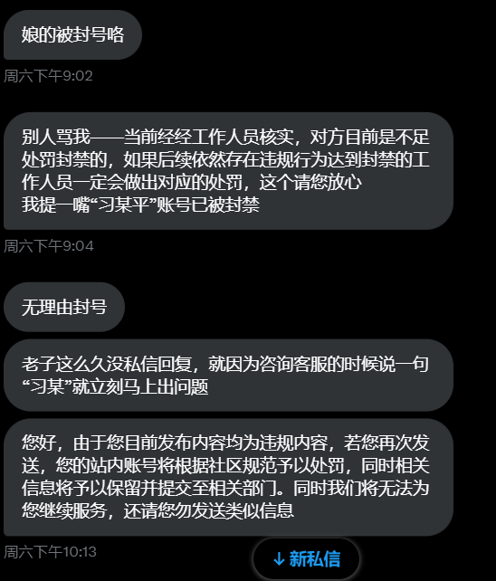
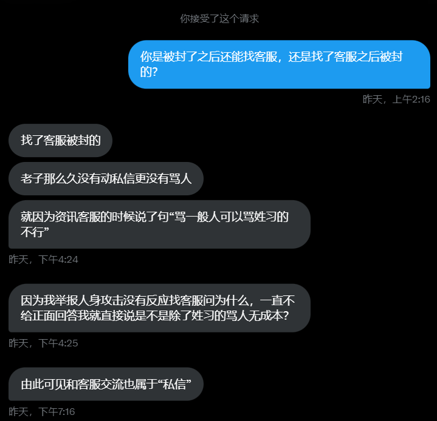
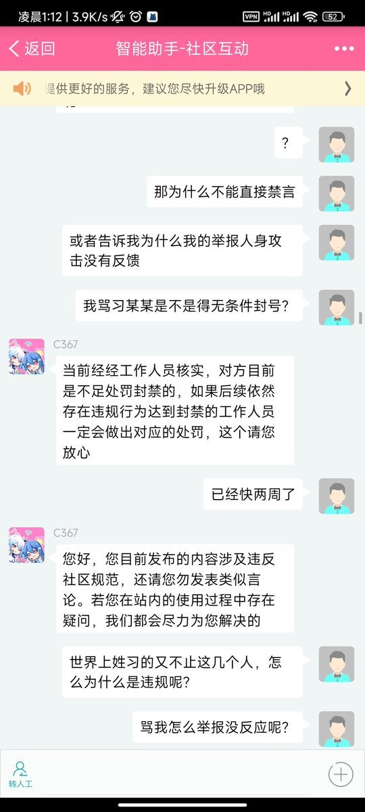

谁将十万横扫三江 北京时间 2024-02-05T09:39:36Z 1754318828115525991 RT @XJPSBCNM8964: B站网友由于被其他用户辱骂，寻找客服。

但客服不予受理，该用户生气地质问道“那我骂了习某某是不是得无条件封号？”

随后该用户被无条件封号。 https://t.co/7FBntYq6Bt   谁将十万横扫三江 北京时间 2024-02-05T10:14:58Z 1754327725773668520 RT @jakobsonradical: 2月3日，一位网友发帖称，“我的研究生生涯结束了”。
该考生称，政治考试结束后，他发现试卷背面的考生姓名没写，就只补充了姓名，“完全没想到会被人盯上”。此外，他补充道，举报者是同校同学，没有瓜葛没有结仇，“坐进考场以后才发现举报者是报考…   