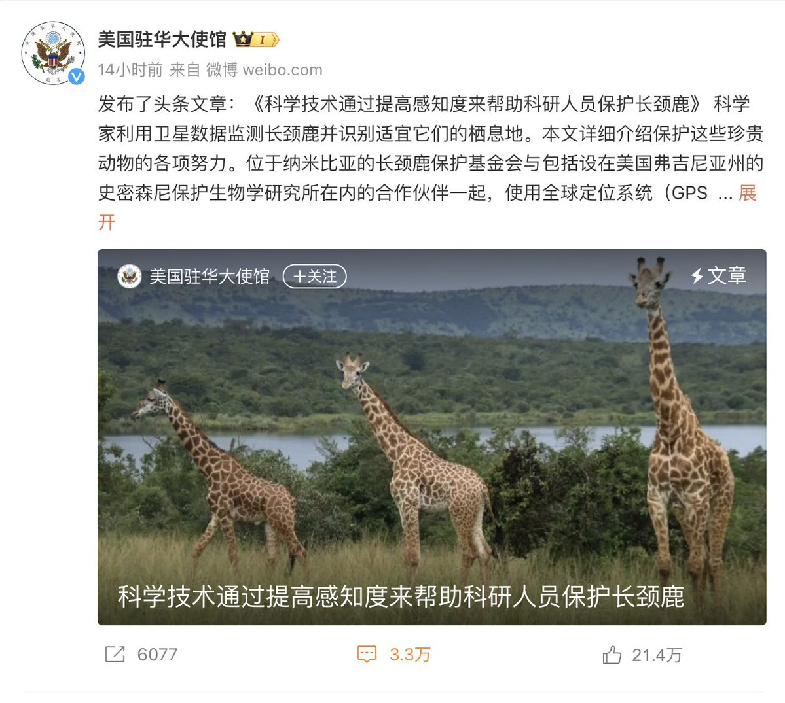
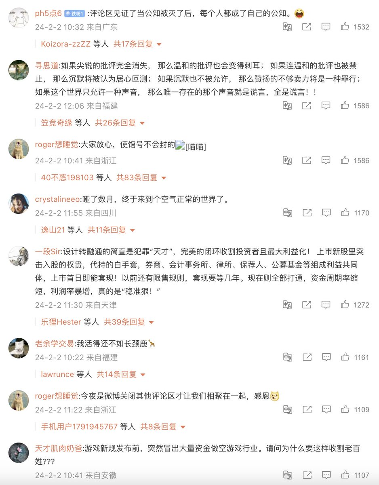
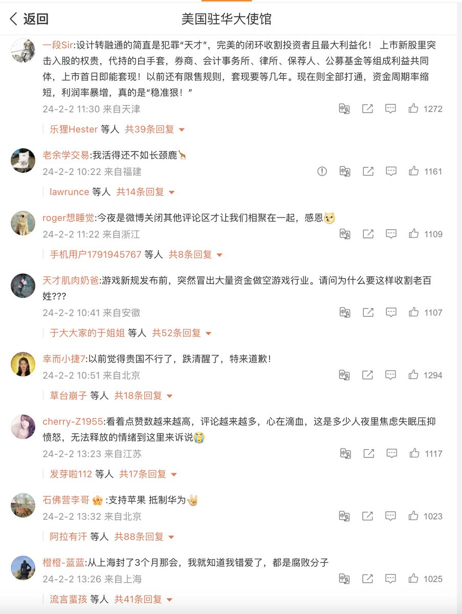

自由亚洲电台 北京时间 2024-02-04T06:46:28Z 1753912867881898307 深圳千禾和香港 #TopAce 资产管理公司创始人，明星基金经理 #王亚伟 将不再参与公司运营和管理。路透社报道，王自八月以来一直被当局拘留调查。
详阅：
https://t.co/mKDBlcSVnx   自由亚洲电台 北京时间 2024-02-04T07:51:30Z 1753929234966298716 RT @RFA_Chinese: 【#美国大使馆微博 被A股 #股民 刷屏ing!】
一条保护 #长颈鹿 的贴子下方已有三万多条评论, 直白得惊人！ https://t.co/gft7MFpenu   自由亚洲电台 北京时间 2024-02-04T07:53:14Z 1753929670062489663 RT @RFA_Chinese: 【本周周线再度收黑，中国股民向美使馆“求救”】
深圳成分指数跌2.24%，接近8000点大关，创业板指数跌幅更超2.43%，官方却要求网红不要唱衰经济。网友在美国 #驻华大使馆 微博留言：天天唱赞歌，假大空，高质量发展，美国听说过吗？
详阅：…   自由亚洲电台 北京时间 2024-02-04T07:57:49Z 1753930824355860627 “相信智库兵推的人认为中共不敢发动战争，没考虑到经济衰退形势下，冒险发动战争以凝聚内部团结也是一种选择 ... 即使中共失败了，也没有哪个国家能够并且愿意占领中国。习近平集团借助战争加大了对中国的掌控之后，#共产党 继续执政几十年的梦想就成功了”。— #魏京生
详阅：
https://t.co/1QxLUp5yHR   自由亚洲电台 北京时间 2024-02-04T04:41:39Z 1753881456944804295 湖南卫视播出的 #反腐专题片《忠诚与背叛》披露，湖南湘潭市委原书记 #曹炯芳 自2016年上任后，为了政绩、升副省级，违法融资举债435亿元人民币，最终造成33个烂尾工程。
详阅：
https://t.co/yNELzZ3WpX   自由亚洲电台 北京时间 2024-02-04T05:21:55Z 1753891590106460287 随着 #拜登 政府继续采取行动对抗中国日益增加的区域影响力，美国将在2025年恢复在 #北太平洋 帕劳岛长期暂停的和平工作队项目。#帕劳 是世界上少数与台湾有外交关系的国家之一。
详阅：
https://t.co/XzybJUhJBg   自由亚洲电台 北京时间 2024-02-04T05:47:26Z 1753898012076589061 中国CAFI对2300多家小型微利企业的调查，发布《#小微企业 金融健康报告》，结果显示逾1/3的小微企业金融不健康，或将影响1.8亿人的就业前景。
详阅：
https://t.co/QcbnGTTKsP   自由亚洲电台 北京时间 2024-02-04T06:15:15Z 1753905011011002779 美国高级官员周五在与中国讨论 #芬太尼 上瘾药物控制后表示，#美国 有留意到中国为遏制芬太尼贩运而采取的重大措施。
详阅：
https://t.co/YpVfyOJ6pI   自由亚洲电台 北京时间 2024-02-04T02:40:21Z 1753850929491685700 中国当局正加大力度在西藏住宅和商业区进行抽查，阻止 #藏族 儿童参加非正式寒假藏语课程、讲习班和宗教活动。家长表示，此举将对孩子们与母语的联系产生负面影响。
详情：
https://t.co/B9Da44j16Q   自由亚洲电台 北京时间 2024-02-04T03:40:06Z 1753865967879193000 在过去一个月里，有三位省级中共党委书记访问了负责台湾军事事务的解放军 #东部战区 司令部，会见了司令员 #林向阳 将军，并承诺全力支持战争准备。
详阅：
https://t.co/SPJ4qtJKpk   自由亚洲电台 北京时间 2024-02-04T04:13:44Z 1753874429556166934 【台湾间接参与乌战?】俄罗斯 #IMachineTechnology 公司在去年从台湾进口了价值两千万美元的由电脑控制的精密机器设备，可用于制造武器。该公司主要的销售对象是俄罗斯国防工业。
详阅：
https://t.co/t3TWjOgVYi   自由亚洲电台 北京时间 2024-02-04T00:27:27Z 1753817485185286630 【维族基金会称访问新疆是助长“种族灭绝旅游”】
外交部发言人 #汪文斌 表示，2023年中国政府资助了来自各国的近400个代表团及4300余人访问新疆，包括参观 #清真寺 和遗址，“看看 #新疆 的传统文化是如何受到保护的... 看到了各族人民的幸福生活。”
详阅：
https://t.co/mMyW34jlgN   自由亚洲电台 北京时间 2024-02-04T00:51:15Z 1753823473334456746 RT @RFA_Chinese: 【#美国大使馆微博 被A股 #股民 刷屏ing!】
一条保护 #长颈鹿 的贴子下方已有三万多条评论, 直白得惊人！ https://t.co/gft7MFpenu   自由亚洲电台 北京时间 2024-02-04T00:58:19Z 1753825251329220770 被美国 #国防部 列入协助解放军实体名单后，中国最大的存储芯片制造商 #长江存储 表态：
“我们没有受指示向任何实体提供用于军事用途的技术......长江存储不属于中国军方所有或控制。”
详阅：
https://t.co/1kOpjP1gvs   自由亚洲电台 北京时间 2024-02-04T01:27:19Z 1753832552274551189 黑龙江 #同江市 残疾冤民肖书君，在北京 #大紫草坞村 租房内癫痫病发的时候，被房山公安分局一帮截访人员绑架到警车押走，目前 #肖书君 仍然处于失联状态。
详阅：
https://t.co/ZuWAUymfu4   自由亚洲电台 北京时间 2024-02-04T01:58:39Z 1753840438199435733 【火箭军反腐风暴后，核工系统开始整顿】
#中央纪委 国家监委网公告称，中核集团科学技术高级顾问 #李广长 委员涉嫌严重违纪违法，正接受 #纪律审查 和监察调查。
详阅：
https://t.co/x4Gw49l4WK   自由亚洲电台 北京时间 2024-02-04T02:02:44Z 1753841462578459009 RT @RFA_Chinese: 2月1日，美国一家上诉法院表示，佛罗里达州一项限制“定居”在中国且不是美国公民或绿卡持有人的个人在该州拥有房产的法律可能被联邦法律推翻，并阻止了对两名正在进行房地产交易的原告的执行。该法庭表示，两名提出上诉的中国公民可能胜诉。
您认为，美国是否…   自由亚洲电台 北京时间 2024-02-04T02:02:52Z 1753841496866824401 RT @RFA_Chinese: 【汪文斌感谢美中情局长“提醒”  伯恩斯究竟说了啥？】
2月2日，中国外交部发言人 #汪文斌 回应美国 #中情局 局长威廉·伯恩斯 (William Burns) 关于已投入更多资源用于对华情报收集的言论时表示，中方感谢提醒，将一如既往做好防范…   自由亚洲电台 北京时间 2024-02-04T02:17:25Z 1753845161371549699 “出生于1964年的 #刘振立 比习近平年轻11岁，比连任军委副主席的张又侠年轻13岁，比新任 #军委 副主席何卫东年轻7岁，所以从“年龄梯队”角度分析，#习近平 选中了刘振立接替参谋长时，就已设计好了他将是习近平在 #二十一大 上连任第四届时的军委副主席之一。”
详阅：
https://t.co/m7ZMUbKFiR   