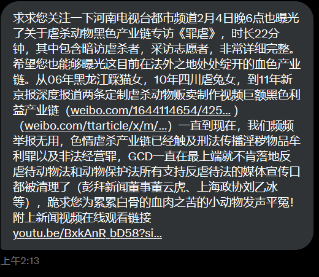

谁将十万横扫三江 北京时间 2024-02-04T10:03:43Z 1753962505637073128 网友投稿：河南电视台都市频道曝光了关于虐杀动物黑色产业链专访《罪虐》，时长22分钟，其中包含暗访虐杀者，采访志愿者，非常详细完整。希望您也能够曝光这目前在法外之地处处绽开的血色产业链。从06年黑龙江踩猫女，10年四川虐兔女，到11年新京报深度报道两条定制虐杀动物贩卖制作视频巨额黑色利益产业链（https://t.co/WYx65igREc ）（https://t.co/qbI8o2JnfU）一直到现在，我们频频举报无用，色情虐杀产业链已经触及刑法传播淫秽物品牟利罪以及非法经营罪，中国政府一直在最上端就不肯落地反虐待动物法和动物保护法所有支持反虐待法的媒体宣传口都被清理了（澎湃新闻董事董云虎、上海政协刘乙冰等），希望您为累累白骨的血肉之苦的小动物发声平冤！附上新闻视频在线观看链接 https://t.co/mTnvPo1dXz   谁将十万横扫三江 北京时间 2024-02-04T10:18:51Z 1753966314845315288 RT @XJPSBCNM8964: 网友投稿，在B站，虐待猫咪已经成了政治正确。 https://t.co/0O90uJHsjJ   