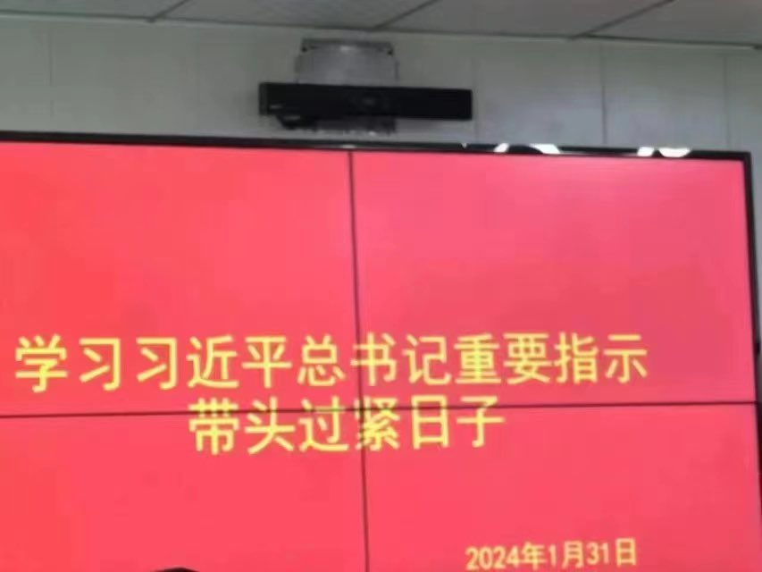
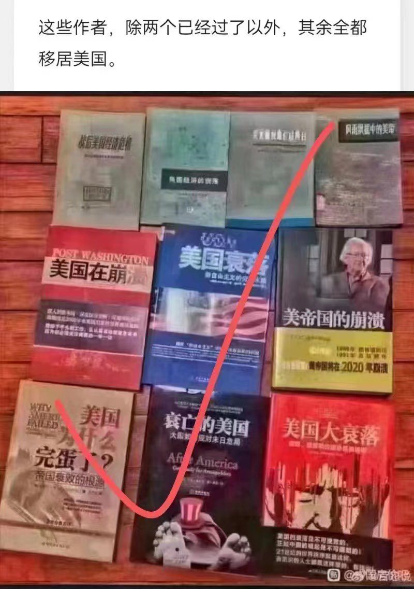

Petrichor 北京时间 2024-02-03T08:48:04Z 1753581081692176829 从庆丰包子到狗不理包子，习近平在国内外人们心中的印象产生滑坡，晚了，现在无论他装出如何亲民，人民都恶心他。在他的愚蠢统治下，人民的生活水平不升反降。他本应该到站下车，但他却成为独裁皇帝，为了保皇位，他不顾人民死活。经济下行的第一责任人就是习近平。许多人为他和他家人前途担忧，恨他的人太多了。据估计，比当年恨王莽的人还多。

 https://t.co/IB7Hlw5cyE   Petrichor 北京时间 2024-02-03T05:07:08Z 1753525481914208603 昨天群里一个中国大陆大学教授发言道：【这是美国人的阳谋，做空中国。让你花钱花时间抓间谍，产生机会成本；让外资不敢进入中国，让已经进入的赶紧远离。一句话就可以做空中国，极具性价比。】

听完这话，我醉得一塌糊涂，就想反问：你们傻啊，被美国人带沟里去。 https://t.co/YxWKegUE5a   Petrichor 北京时间 2024-02-03T02:41:43Z 1753488888704766328 两张图片说明两个意思。第一，跟着200斤，过紧日子。这是必然的，败家子。第二，中共立衷吹嘘自己，偏低美国。经济发展靠自己，不是吹响就来的，别人唱衰也无济于事。那些迎合中共的作者，心里清楚，做好猪食，卖给🐷吃，自己得钱后去了他们唱衰的美国。骗子太多了。200斤那样的笨猪，被骗子骗，也在情理之中。

戰後美國經濟危險
​美國經濟的衰落
​風雨飄蕩中的美帝
​美國在崩潰
​美國衰落
​美帝國的崩潰
​美國為什麼完蛋了
​衰亡的美國
​美國大衰落
......

​看看以上這些“名著”的作者們​，現在都在哪裡享受生活！   