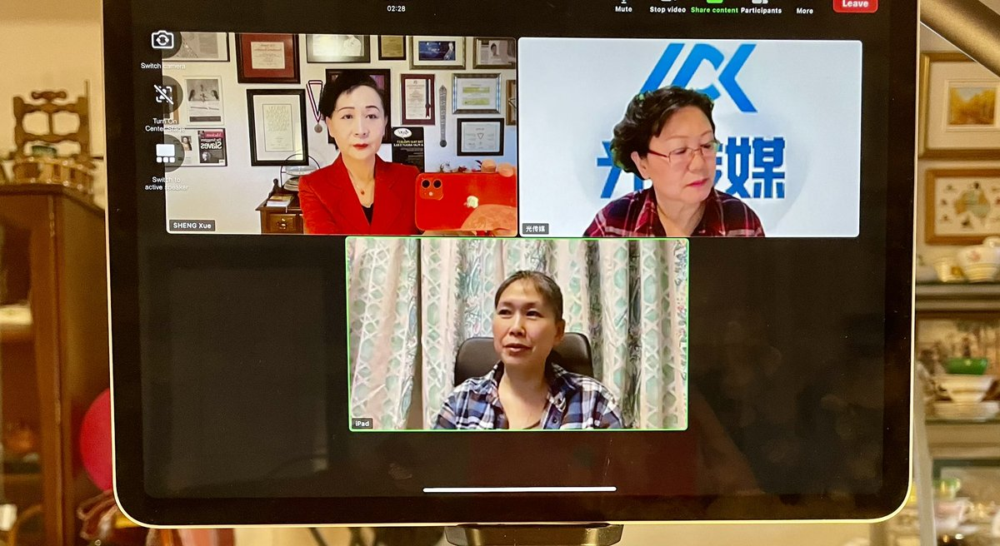

拆墙运动公号 北京时间 2024-02-03T16:06:30Z 1753691415870165081 #拆墙运动 议题会议，
 会议时间： 今天的北京时间晚上10点，
   欧洲时间下午3点， 
  纽约时间上午9点，   
温哥华时间早上6点， 
 韩国时间晚上11点 
 会议规则：按照举手顺序文明发言 
1、有人发言时不准抢麦，有发言者发言完毕按照举手的先后顺序发言，   
2、文明发言，不得人身攻击。
3、围绕拆墙主题发言、不得偏离主题   拆墙运动公号 北京时间 2024-02-03T08:00:08Z 1753569020194775552 RT @ShengXue_ca: 大家一起拆掉中共大监狱的铁墙……
和光传媒安娜女士及拆墙项目负责人之一刘栋玲女士一起讨论拆墙行动。
敬请期待节目上线🙏 https://t.co/MX51mFmhiw   拆墙运动公号 北京时间 2024-02-03T08:04:09Z 1753570031277904073 感谢盛雪姐对 #拆墙运动 的大力支持,我们携起手，共同拆掉中共 #互联网防火墙   拆墙运动公号 北京时间 2024-02-03T02:56:57Z 1753492719278690712 RT @ShengXue_ca: 参与牵头抵制北京冬奥的大卫乔高当时已经在病中～左侧中间🙏
2022年4月5日病逝❤️‍🩹
他是加拿大连续七届联邦众议院国会议员，律师，前皇家检察官，曾出任内阁国务部长。
和人权律师大卫梅塔斯合作完成《血腥的器官活摘》报告。因为独立调查中共活摘器…   拆墙运动公号 北京时间 2024-02-03T03:14:16Z 1753497077273735596 RT @xu96175836: 清华大学教授 #刘瑜 ：“转发是最大的作为” 

“许多年后，假如有人问，当年你为社会做过的贡献是什么？我会说：我转发、传播了很多充满人性、良知、散发着正义光芒的文字，我拒绝了与邪恶同流合污”

——柴静 https://t.co/6SlDc2F…   