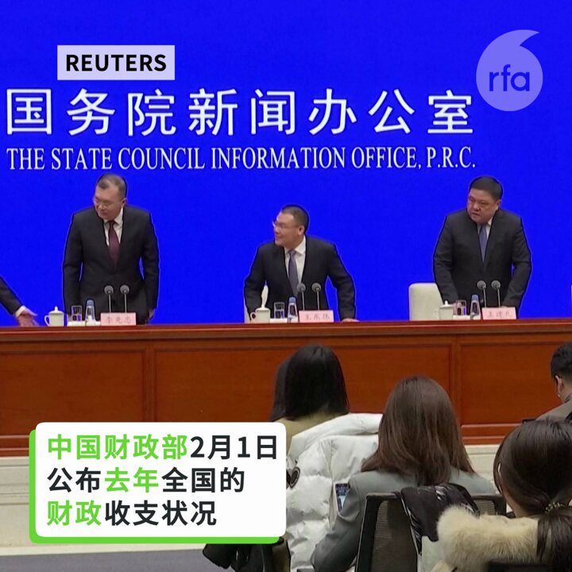
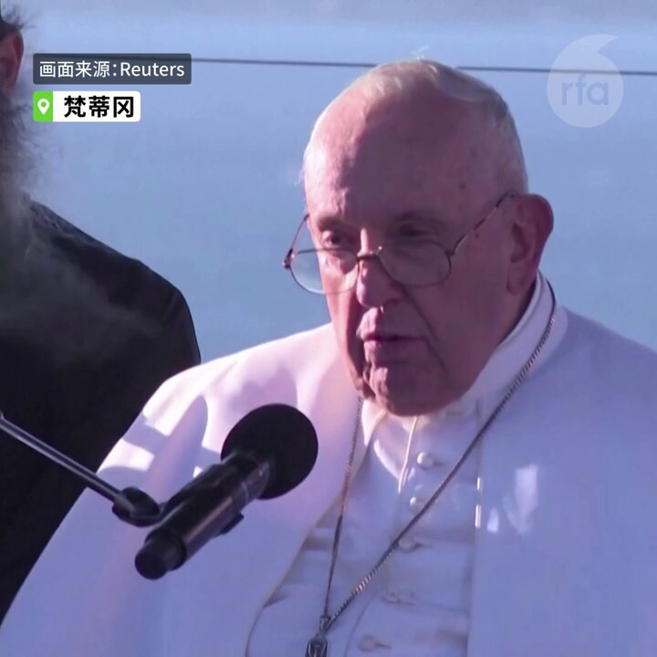
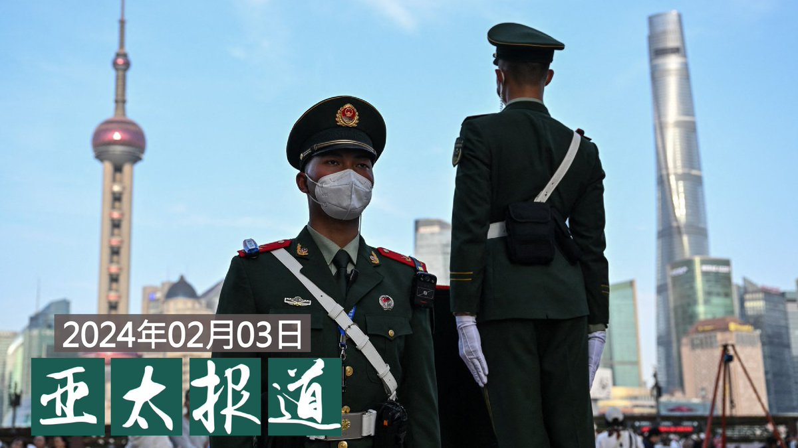

自由亚洲电台 北京时间 2024-02-03T08:21:04Z 1753574288718983438 【中国财政部报喜  纯属“唱好”？】
中国财政部2月1日公布去年全国的 #财政收支状况，#全国一般公共预算收入 超过21万亿元人民币，同比增长6.4%。新公布的正向数据能否证明中国经济已走出谷底？ https://t.co/IVdE8y2GtY   自由亚洲电台 北京时间 2024-02-03T08:34:22Z 1753577635941318967 【中国连续祝圣三位教宗任命的主教  中国与罗马教廷关系缓和了？】
在梵蒂冈教会宣布一周内任命第三位中国主教后，中国周四表示，正在寻求“持续改善”与梵蒂冈的关系。 https://t.co/pHfu5KdGTa   自由亚洲电台 北京时间 2024-02-03T08:39:15Z 1753578862959599713 RT @RFA_Chinese: “去中国的经历让我精神压力很大，也比较恐惧。我认为应该尽量避免去中国，那是一个歇斯底里的国家。"身为澳大利亚公民的杨先生说。https://t.co/UfizyVbSRX   自由亚洲电台 北京时间 2024-02-03T09:06:12Z 1753585643043815717 欢迎收听和订阅播客【＃亚太报道】 https://t.co/MjLNSvVMqc

IMF下调中国经济预期; 过半数美企缺乏在华投资信心；多国 #免签 与“中外有别”；人权团体呼吁台湾尽快通过《#难民法》；#新疆 新建 #宗教 场所被要求体现“中国特色”。 https://t.co/vSTTdIVG9J   自由亚洲电台 北京时间 2024-02-03T04:20:07Z 1753513649518608463 专栏 | #中国透视：恐怖政治边际效应递减：暴政的末路  https://t.co/Er3BUmJ827   自由亚洲电台 北京时间 2024-02-03T05:09:36Z 1753526101161148651 “去中国的经历让我精神压力很大，也比较恐惧。我认为应该尽量避免去中国，那是一个歇斯底里的国家。"身为澳大利亚公民的杨先生说。https://t.co/UfizyVbSRX   自由亚洲电台 北京时间 2024-02-03T06:09:32Z 1753541185933595083 专栏 | #周嘉有话说：批评与自我批评 
#周孝正  https://t.co/42HDSUD7uc   自由亚洲电台 北京时间 2024-02-03T02:59:01Z 1753493239364039027 【汪文斌感谢美中情局长“提醒”  伯恩斯究竟说了啥？】
2月2日，中国外交部发言人 #汪文斌 回应美国 #中情局 局长威廉·伯恩斯 (William Burns) 关于已投入更多资源用于对华情报收集的言论时表示，中方感谢提醒，将一如既往做好防范工作。
#伯恩斯 近日在美国《外交事务》杂志发文《间谍与治国道》，研判国际局势，信息量很大。您如何看待他关于中国的论断？   自由亚洲电台 北京时间 2024-02-03T03:49:30Z 1753505944166687148 #恒大 集团被法院下达清盘令以来，中国股市连续大幅下跌，本周五更加速探底。与此同时，#国际货币基金组织 （IMF)也再次下调中国经济预期。那么，中国政府接下来出手救市的空间还有多大呢？

https://t.co/eVMe29WYmQ   自由亚洲电台 北京时间 2024-02-03T04:07:41Z 1753510522790846479 2月1日，美国一家上诉法院表示，佛罗里达州一项限制“定居”在中国且不是美国公民或绿卡持有人的个人在该州拥有房产的法律可能被联邦法律推翻，并阻止了对两名正在进行房地产交易的原告的执行。该法庭表示，两名提出上诉的中国公民可能胜诉。
您认为，美国是否应该限制中国公民在美买房置业？ https://t.co/gWzhCp0q1x   自由亚洲电台 北京时间 2024-02-03T00:27:20Z 1753455066734788733 美商会调查在华美企，有没有“幸存者偏差”？
 国安部发文说反间谍法无碍营商，你信吗？ https://t.co/H4dapvGk6N   自由亚洲电台 北京时间 2024-02-03T00:44:14Z 1753459321793572912 嘘！不要在中国讨论 #人民币  https://t.co/KZ4GM1gj2D   自由亚洲电台 北京时间 2024-02-03T01:36:16Z 1753472416318177552 专栏 | #江棋生：“#法治天下”中的法治刍议 https://t.co/n4kdIHYMXC   自由亚洲电台 北京时间 2024-02-03T02:16:10Z 1753482458161639937 新疆维吾尔自治区从二月份起落实新的法规，除了要求宗教团体、院校教职人员和信众坚持"#宗教中国化"方向外，所有新建的宗教场所也必须体现"中国特色和风格"。https://t.co/41XjNL0nqD   自由亚洲电台 北京时间 2024-02-03T00:04:38Z 1753449355028144440 #亚洲很想聊  完整视频：https://t.co/S1ZHm0UTBf   