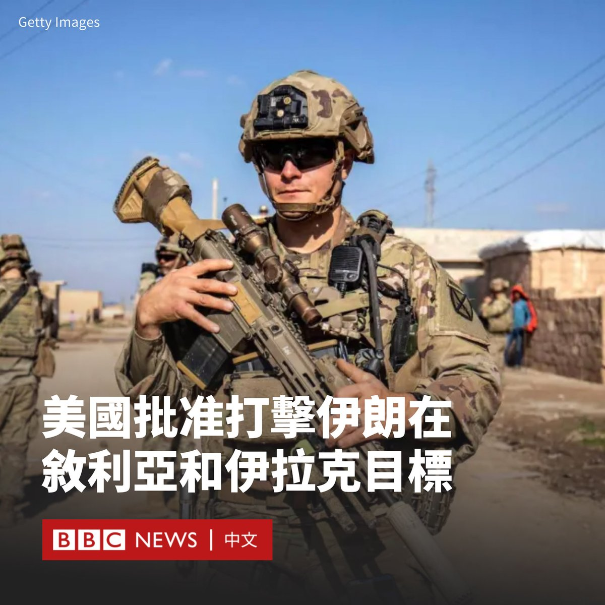

D英国广播公司BBC 北京时间 2024-02-02T14:01:02Z 1753297454970351794 美国官员表示，华盛顿已经批准了对叙利亚和伊拉克境内的伊朗目标进行打击行动的计划。

美国官员称，空袭将持续数日，何时发动空袭可能取决于天气情况。

上周，一架无人机对约旦靠近叙利亚边境附近的美军基地发动袭击，造成三名美国军人死亡，41名士兵受伤。

美国指责伊朗支持的武装组织实施了该袭击，但伊朗否认与此次袭击有任何关系。

美国官员称，情报部门认为，用于袭击该设施的无人机是伊朗制造的，与伊朗为俄罗斯运送的无人机类似。

在周四的记者会上，美国国防部长奥斯汀（Lloyd Austin）解释为何尚未进行军事回应：“我们将在我们选择的地点、时间和方式做出反应。”

“我认为每个人都认识到，确保让正确的人承担责任是一项挑战。”他补充说。

总统拜登（Joe Biden）持续受到国会压力，要求他打击伊朗境内的目标。拜登和其他国防官员表示，华盛顿并不寻求与伊朗爆发更广泛的战争，也不寻求加剧该地区的紧张局势。

据报道，该打击计划似乎将瞄准叙利亚和伊拉克境内的伊朗目标，而不是伊朗本国。   D英国广播公司BBC 北京时间 2024-02-02T12:10:46Z 1753269702992752995 “这不是结束，而是漫长的清算过程的开始。” 法国外贸银行（Natixis）高级经济学家吴卓殷（Gary Ng）称。

随着香港高等法院颁布对中国恒大集团的清盘令，恒大留下的百万套“烂尾楼”的命运成为关注的焦点。
https://t.co/W6X9t5ZiFP   D英国广播公司BBC 北京时间 2024-02-02T09:49:47Z 1753234226126745751 尽管普京不会是总统选举选票上的唯一名字，但挑战者将不会有其宿敌。克里姆林宫在过去近四分之一个世纪，铲除了政治版图上所有潜在挑战者，确保“不然由谁来做”的问题没有答案。https://t.co/PR9IRm0uwH   