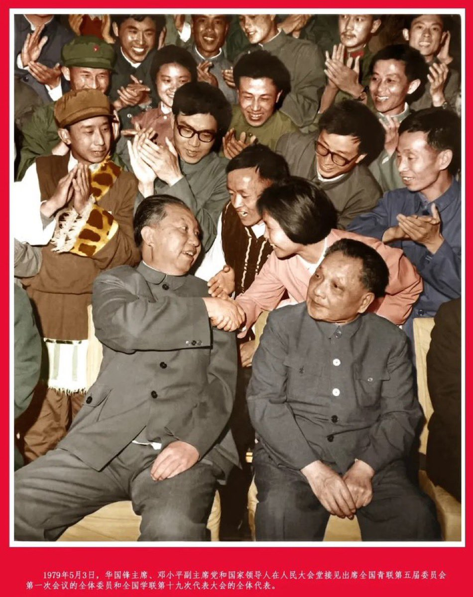

Petrichor 北京时间 2024-02-02T12:26:48Z 1753273740857639418 历朝历代都没有共产党荒唐。
自己是傻子，以为别人都是白痴。结果把自己骗信了。
毛泽东不是农民出身吗？小时候种过水稻，他爸给他的人生规划是去长沙米店做学徒，以后在长沙开一米店。他怎么不知道一亩田能收多少稻谷呢？昏头了，昏君。 https://t.co/dn2dXEevPH   Petrichor 北京时间 2024-02-02T13:15:25Z 1753285975885684906 第一次知道焊接的技术还有一种叫摩擦焊接。摩擦、升温、融化、嘎然而止，冷却。 https://t.co/SlfaTz6pJ3   Petrichor 北京时间 2024-02-02T13:25:16Z 1753288452303425903 培养奴才的必修课
不问有没有用，只问你服不服从命令。
在屎上先雕出花，然后扔马桶让水冲走。
早上严肃认真地把被子叠成豆腐块，晚上哗啦拉盖身上。日复一日，循环往复。 https://t.co/5jUDGXBSFM   Petrichor 北京时间 2024-02-02T10:40:19Z 1753246944372175001 羡慕嫉妒恨 https://t.co/2Pj7n8mJqB   Petrichor 北京时间 2024-02-02T06:21:29Z 1753181804205375506 一群生活不能自理的人，自称为人民服务，天大的谎言。谁信谁傻瓜！ https://t.co/jjctXsFEtM   Petrichor 北京时间 2024-02-02T05:00:11Z 1753161343216111712 据说在某国， “猪头”成为敏感词。一些人把他们不喜欢的领导称之为“猪头”。

为什么许多文化中猪都不讨人喜欢，犹太人和穆斯林明确规定不能吃猪肉。人们为何普遍厌猪、禁猪呢？原因如下：

一、猪貌丑、怪异，性贪婪、愚笨。世界各民族语言在形容人貌丑、懒散、愚笨等方面都用“猪”字形容。说某个人太笨的时候，也说：“某某人是个猪头”。

二、猪喜污秽。其生活区域骯脏不堪，食用的饲料也是污秽的，难与食草类动物相比。

三、性恶无常。俗话说：“虎毒不食子”，但猪一旦饿极连生猪崽也照食不误。一般动物，即便小鸟也会与饲养它的人建立某种感情，义犬救主等动物助人的故事广为人知，但猪其性较之虎狼有过之而不及。

四、猪随意交配。幼猪一旦到发情期，有的会同生养他的母（公）猪交配，繁衍后代无上下、尊幼之分，而牛羊则不会这样。

五、猪的脖子上只有一根筋，既不能看到天，也不能回头。一根筋地走到黑，有错误也不愿改。

明代医学家李时珍在其名著《本草纲目》写道：“猪，吃不择食，卧不择埠，目不观天，行如病夫。其性淫，其肉寒，其形象至丑陋，一切动物莫劣于此，人若食之恐染其性”。   Petrichor 北京时间 2024-02-02T05:02:07Z 1753161830145442090 这一切皆由于“无脑治国”。 https://t.co/BgOy1iEbW4   Petrichor 北京时间 2024-02-02T05:10:58Z 1753164057551479243 蘑菇云，爆炸太大了，才能产生蘑菇云。爆炸发生于宁东能源化工基地，它位于宁夏回族自治区中东部，规划区总面积3484平方公里，核心区面积800平方公里，是国务院批准的国家重点开发区。为中国亿吨级大型煤炭基地、千万千瓦级煤电基地、现代煤化工产业示范区及循环经济示范区，也是国家产业转型升级、新型城镇化综合改革、增量配电业务改革等试点地区和国家能源“金三角”重要一极。2019年获评中国化工园区30强第6名，荣获全国石化行业绿色园区、全国智慧化工园区试点示范单位等荣誉称号，“加快产业转型升级、推动经济高质量发展”的典型经验两次受到国务院通报表彰。
2020年3月4日，被工业和信息化部评定为国家新型工业化产业示范基地。   Petrichor 北京时间 2024-02-02T04:16:21Z 1753150315312955497 据说在某国， “猪头”成为敏感词。一些人把他们不喜欢的领导称之为“猪头”。

为什么许多文化中猪都不讨人喜欢，犹太人和穆斯林明确规定不能吃猪肉。人们为何普遍厌猪、禁猪呢？原因如下：

一、。猪貌丑、怪异，性贪婪、愚笨。世界各民族语言在形容人貌丑、懒散、愚笨等方面都用“猪”字形容。说某个人太笨的时候，也说：“某某人是个猪头”。

二、猪喜污秽。其生活区域骯脏不堪，食用的饲料也是污秽的，难与食草类动物相比。

三、性恶无常。俗话说：“虎毒不食子”，但猪壹旦饿极连生猪崽也照食不误。壹般动物，即便小鸟也会与饲养它的人建立某种感情，义犬救主等动物助人的故事广为人知，但猪其性较之虎狼有过之而不及。

四、猪随意交配。幼猪一旦到发情期，有的会同生养他的母（公）猪交配，繁衍后代无上下、尊幼之分，而牛羊则不会这样。

五、猪的脖子上只有一根筋，既不能看到天，也不能回头。一根筋地走到黑，有错误也不愿改。

明代医学家李时珍在其名著《本草纲目》写道：“猪，吃不择食，卧不择埠，目不观天，行如病夫。其性淫，其肉寒，其形象至丑陋，壹切动物莫劣于此，人若食之恐染其性”。   