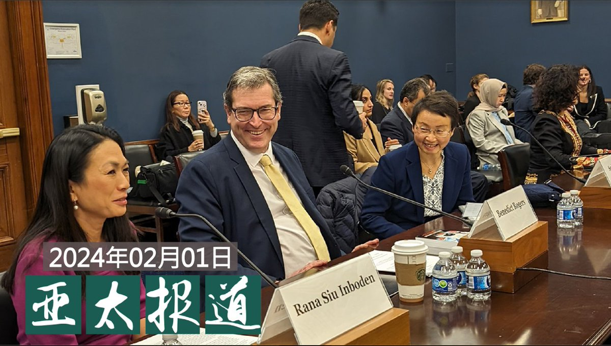
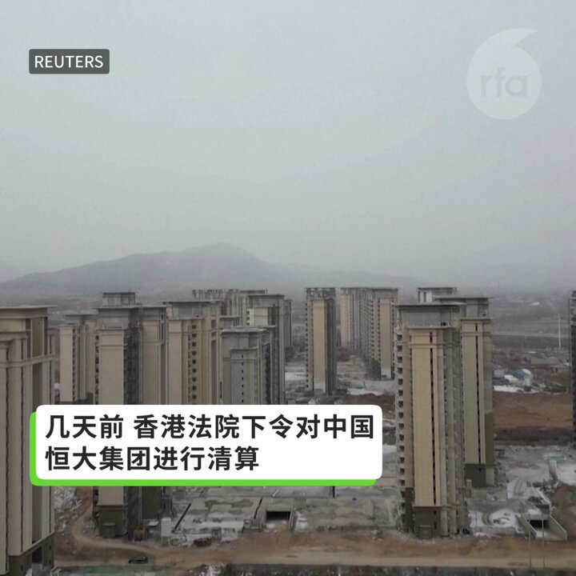
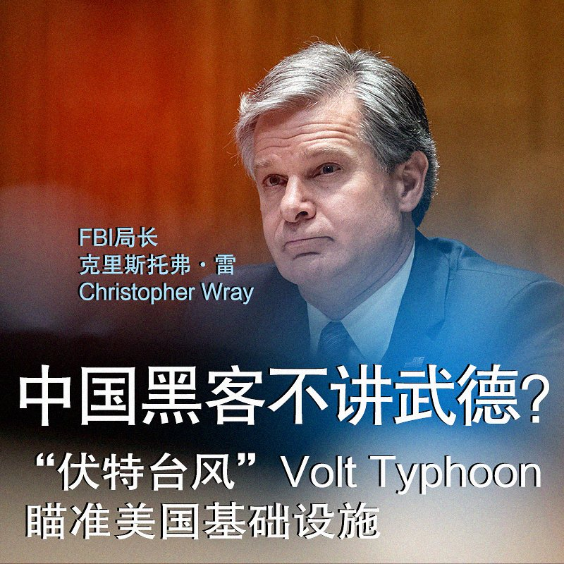

自由亚洲电台 北京时间 2024-02-02T07:22:37Z 1753197188555936009 RT @RFA_Chinese: 【专访伦敦 #钢琴家 Dr K @brenkav：他们告我就太棒了!】
“这样的诉讼会使中共难堪，这将会成为国际事件。如果他们这样做就太棒了！因为我认为这将成为全球笑柄，这已经是国际笑话了，但会使他们显得更荒谬。” 
#黄明志  #龙的传人…   自由亚洲电台 北京时间 2024-02-02T08:00:11Z 1753206644157317398 欢迎收听和订阅播客【＃亚太报道】 https://t.co/MjLNSvVMqc
#黎智英、#伊力哈木、#许志永 和 #丁家喜 获提名角逐 #诺奖；三名在台 #跳机 中国人被遣返马来西亚；本台专访 #英国钢琴家 Dr. K；#余文生 夫妇被控“煽动颠覆”一案移送苏州审查起诉；知名异议人士 #郭泉 刑满出狱。 https://t.co/QDuj9ISsKg   自由亚洲电台 北京时间 2024-02-02T05:11:35Z 1753164213722198256 美国立法者们提名 #黎智英、#伊力哈木·土赫提、#许志永 和 #丁家喜  为本年度 #诺贝尔和平奖 候选人。https://t.co/09S1Pg57Bb   自由亚洲电台 北京时间 2024-02-02T05:25:12Z 1753167640892424571 《华盛顿邮报》2月1日撰文报道说，中国将目光投向台湾仅存的三个太平洋小盟友，可能对其展开攻势，并称这是北京数十年来恐吓台湾行动的一部分。
对此，您怎么看？您认为，台湾会因此受到恐吓吗？ https://t.co/WY8AIwcjqv   自由亚洲电台 北京时间 2024-02-02T05:25:59Z 1753167839148884330 恒大被勒令清算后，中国房地产风险能否“得到控制”？ https://t.co/ryP27yiegj   自由亚洲电台 北京时间 2024-02-02T05:33:52Z 1753169820596760887 【美国参议员为何反复追问周受资与中国关系】
TikTok首席执行官 #周受资 1月31日参加美国参议院就儿童性剥削问题举行的听证会。共和党籍参议员Tom Cotton多次追问周受资与中国的关系。 https://t.co/81bciUmROb   自由亚洲电台 北京时间 2024-02-02T06:09:42Z 1753178840912859211 【专访伦敦 #钢琴家 Dr K @brenkav：他们告我就太棒了!】
“这样的诉讼会使中共难堪，这将会成为国际事件。如果他们这样做就太棒了！因为我认为这将成为全球笑柄，这已经是国际笑话了，但会使他们显得更荒谬。” 
#黄明志  #龙的传人  #小粉红  https://t.co/OqHIt70ITd   自由亚洲电台 北京时间 2024-02-02T06:13:05Z 1753179690192244860 由法官Marie-Josee Hogue主持的外国干预选举调查听证会传唤证人。
维吾尔人权倡导项目鉴于3名被指与中国政府关联人士获准继续参与聆讯，恐对侨民社区”构成重大安全风险“，决定退出听证会https://t.co/g6xBjYZxeY   自由亚洲电台 北京时间 2024-02-02T03:35:32Z 1753140042912895143 评论 | #余杰：润者无疆，润者不分先后。过了七十五年没有自由的生活，#茅于轼 生命中最后的时光终于有了自由。茅于轼的离开，象征着一个时代的结束——中国从来没有真正的政治改革，中国缠着裹脚布的经济改革也就此宣告终结。https://t.co/nSyJv5mPa3   自由亚洲电台 北京时间 2024-02-02T00:23:19Z 1753091670864752718 台湾的国会新科立委2月1日报到，并举行立法院长改选。由于三党议席均不过半，历经两轮投票，国民党籍前高雄市长 #韩国瑜当选立法院长。不过，在场外有多个民间团体发起"#拒绝中国的选择"抗议活动。

https://t.co/FtWQKFvW6R   自由亚洲电台 北京时间 2024-02-02T00:23:50Z 1753091797549821996 台湾的国会新科立委2月1日报到，并举行立法院长改选。由于三党议席均不过半，历经两轮投票，国民党籍前高雄市长 #韩国瑜当选立法院长。不过，在场外有多个民间团体发起"#拒绝中国的选择"抗议活动。

https://t.co/tMrhNhZF9o https://t.co/8WUIIduEin   自由亚洲电台 北京时间 2024-02-02T00:53:08Z 1753099172088316043 南京师范大学前副教授 #郭泉 被以煽动颠覆政权罪判刑四年后，本周二（30日）刑满出狱。
郭泉接受本台采访时，感谢外界对他的关心，他正在适应新环境，稍后会将狱中的经历写成文章发表。

https://t.co/2GW7smWwhJ   自由亚洲电台 北京时间 2024-02-02T00:53:47Z 1753099336404308329 南京师范大学前副教授 #郭泉 被以煽动颠覆政权罪判刑四年后，本周二（30日）刑满出狱。
郭泉接受本台采访时，感谢外界对他的关心，他正在适应新环境，稍后会将狱中的经历写成文章发表。
https://t.co/0SMByNvuo0 https://t.co/e60XoI2hjs   自由亚洲电台 北京时间 2024-02-02T01:46:35Z 1753112623787241775 【#三名中国人在台湾跳机后　被遣返回出发地马来西亚】 
“我们向台湾申请帮助是事实，他们可以不帮忙，但是不要骗我们。可以正当地告诉我们，现在无法帮忙。但是你不该扣我们手机，跟外界隔绝联系。”被遣返回马来西亚的 #韦亚妮 跨海接受自由亚洲电台访问，表达她的不满。

https://t.co/WJ2tSOaddt   自由亚洲电台 北京时间 2024-02-02T02:10:21Z 1753118603875082645 据路透社报道，美国挫败了中国政府支持的黑客组织“#伏特台风”（Volt Typhoon）”。“伏特台风”在去年底开始袭击美国的水、电、石油、天然气供应及大众交通运输等基础设施系统
1月31日，FBI局长克里斯托弗·雷（Christopher Wray）警告，中国正在加强进行大规模的 #黑客 攻击行动，“对平民的低程度打击是中国计划的一部分”，目的是在台湾问题一旦引发冲突的情况下破坏美国的电网、石油管道和供水系统。
美国网络司令部和国家安全局一位前指挥官说，“负责任的网络行动者”不会针对 #民用基础设施 进行攻击。
https://t.co/i3SyhJkDI2   自由亚洲电台 北京时间 2024-02-02T02:19:49Z 1753120985820115377 又有15家中国企业被美国防部列入投资黑名单
#军民融合  #美国严选  #长江存储 #旷视科技  #上海禾赛科技
https://t.co/AbFap901Qx   自由亚洲电台 北京时间 2024-02-02T00:07:29Z 1753087685252858330 美国政府证实，入侵西方基础设施的中国黑客组织"#伏特台风"终于在多方努力下被瘫痪。在 #中国黑客 规模前所未有，世界第一的情况下，今年秋季的 #美国总统大选 是否也将受到影响？
https://t.co/b5FGLtJpzr https://t.co/Cq1t6mAhh5   