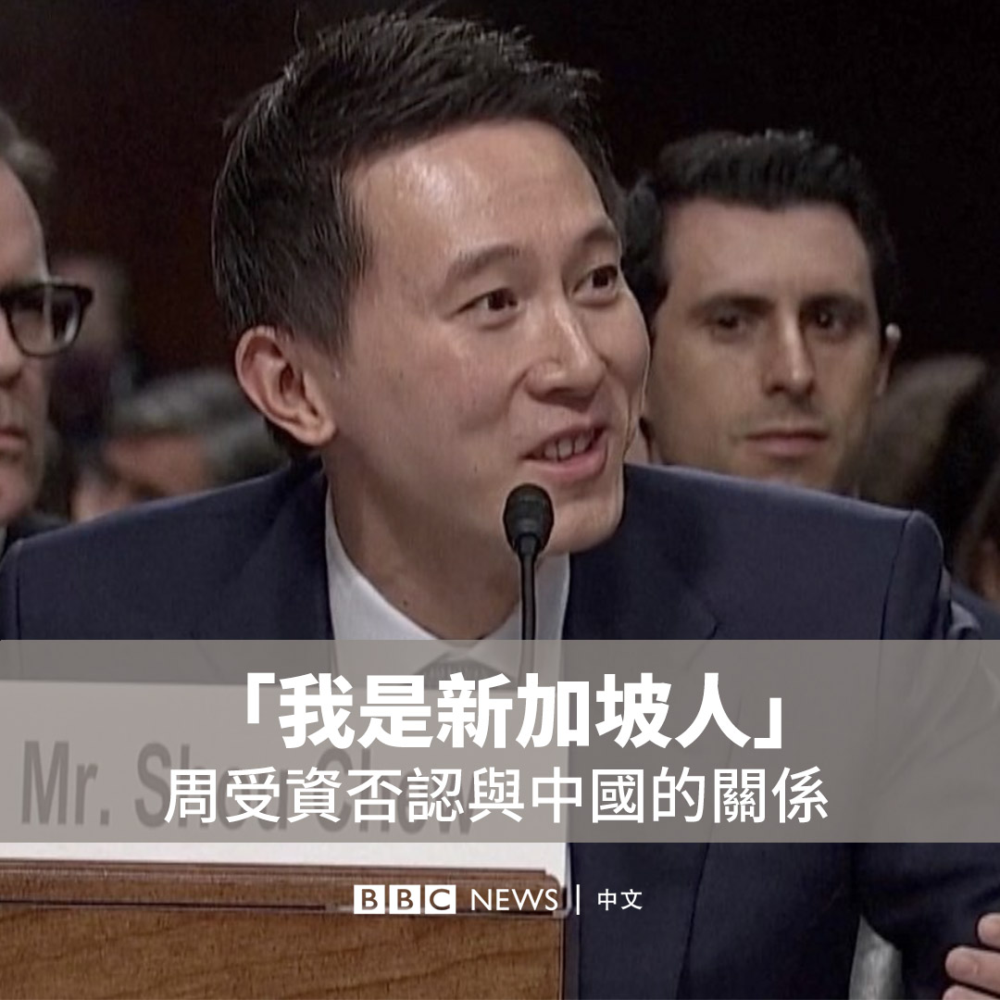
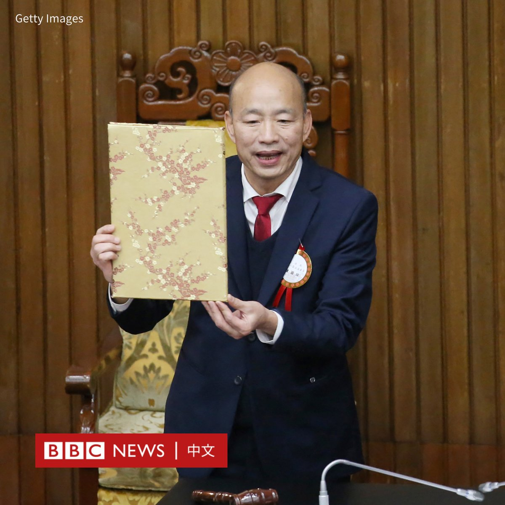
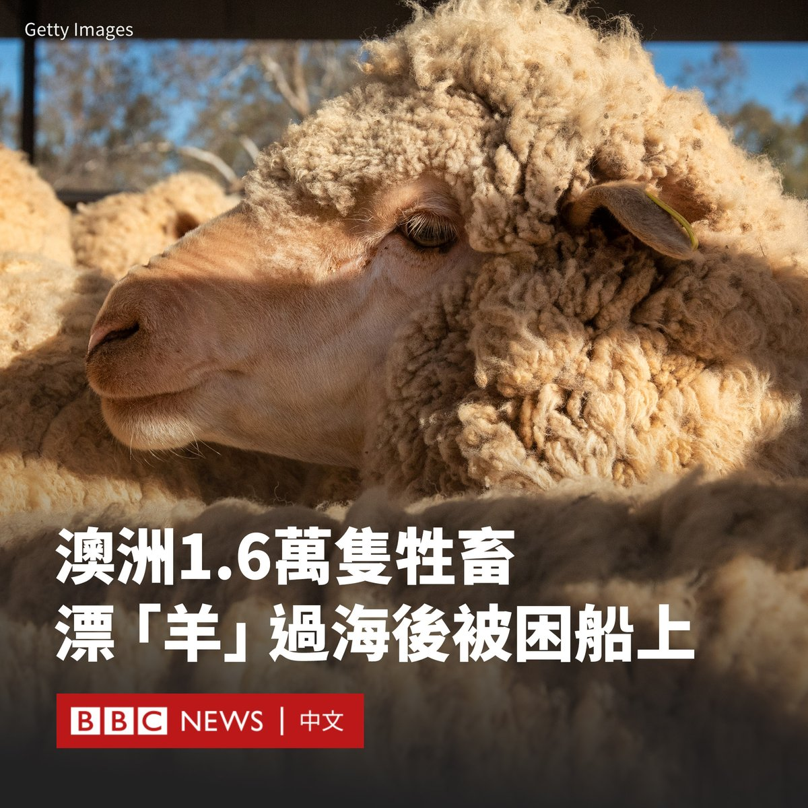

D英国广播公司BBC 北京时间 2024-02-01T17:39:01Z 1752989923702133052 TikTok首席执行官周受资周三（1月31日）与多家社交媒体巨头高管参加美国参议院就儿童性剥削问题举行的听证会。

其间，共和党籍参议员汤姆·科顿（Tom Cotton）多次质问周受资与中国的关系，对此，周受资表示，他是新加坡人，不曾申请中国籍也并非中共党员。 https://t.co/AC4p8mvqeD   D英国广播公司BBC 北京时间 2024-02-01T14:28:06Z 1752941878574825481 球王梅西（Lionel Messi）13岁时与巴塞罗那足球俱乐部非正式签署的第一份“纸巾合同”将被拍卖，起拍价为30万英镑。

这份写在餐巾纸上的合同写于2000年12月，当时巴塞罗那高管卡雷斯·雷查（Carles Rexach）迫切希望签下梅西。

这家西班牙俱乐部的转会顾问何塞普·明格拉（Josep Minguella）和推荐梅西的经纪人奥拉西奥·加吉奥利（Horacio Gaggioli）也在餐巾纸上签名。

梅西在一个月后加入巴塞罗那 ，并成为最高进球纪录保持者。他在16岁时首次上场，为巴塞罗那共踢了778场比赛，进球672个。

现年36岁的梅西在巴塞罗那赢得10次西甲联赛冠军，和四次欧洲冠军联赛冠军后，于2021年转会至巴黎圣日耳曼（Paris St-Germain）。

这份合同在雷查邀请梅西的父亲豪尔赫（Jorge）共进午餐时写下。当时俱乐部对于签下梅西仍存在分歧，但雷查已认识到梅西的天赋。因为事出匆忙，因此只能在餐厅的一张纸巾上写下承诺。

协议用蓝色墨水书写，内容是：“2000年12月14日，巴塞罗那，在明格拉先生和奥拉西奥先生的见证下，巴塞罗那足球俱乐部体育总监卡雷斯·雷查特此同意在他的责任范围内，只要遵守约定的金额，即不考虑任何不同意见，签下球员莱昂内尔·梅西。”

这张餐巾纸将于今年3月通过英国邦瀚斯（Bonhams）拍卖行拍卖。   D英国广播公司BBC 北京时间 2024-02-01T14:57:13Z 1752949206778855750 【最新消息】台湾立法院举行立法院长选举。据台湾中央社报道，国民党籍立委韩国瑜在第二轮投票中以54票比51票，击败执政的民进党推派的游锡堃，当选立法院长。 https://t.co/vylJjKtwf2   D英国广播公司BBC 北京时间 2024-02-01T11:29:26Z 1752896916843831388 红海袭击正给一万多公里外的1.6万头牛羊带来影响。这些动物目前被困在澳大利亚海岸附近的一艘船上。

这批动物1月5日登上了MV Bahijah号牲畜船，该船本计划穿越红海，前往以色列。

但由于也门的胡塞武装在红海对船只发动袭击，这艘船被召回澳大利亚弗里曼特尔港，但船上的牲畜仍滞留在船上，等待卸船的批准。

澳大利亚政府表示，该国的生物安全规定是世界上最严格的规定之一，任何乘船抵达该国的动物都将受到“严格的生物安全控制”，这意味着所有动物都需经过检疫程序。

澳大利亚每年都会向中东出口数十万只动物。红海是通往苏伊士运河的重要航线。目前的不安全局势促使许多国际航运公司改道非洲南部的好望角，对全球供应链造成扰乱。

据路透社报道，这艘船上有大约14,000只羊和2,000头牛，而当地气温接近40°C，这引发了动物保护群体的担忧。   D英国广播公司BBC 北京时间 2024-02-01T09:24:59Z 1752865597757538393 中国中部的河南省不久前公布GDP数据显示，该省经济在2023年同比增长4.1%，但数字上实际比2022年减少了2200多亿元人民币。

BBC中文发现，这种向下“修正”经济数据的情况至少出现在中国四个省。有分析人士指，这可能源于曾经“注水”甚至造假的数据已引起北京的警告。https://t.co/V4b5WviJKC   