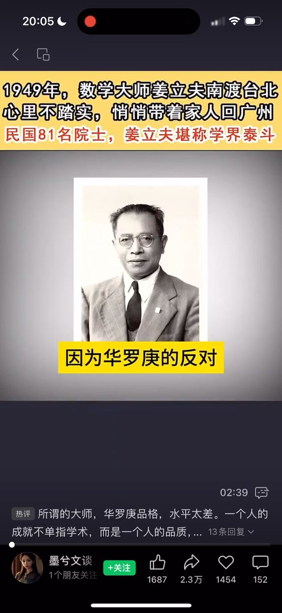

Petrichor 北京时间 2024-02-01T09:36:31Z 1752868498584305751 华罗庚人品不好的。

他在北伐时期（1926年）加入过国民党。北伐后，他因没有参加登记而自动脱党。1942年12月，他请朱家骅介绍重新加入国民党。《华罗庚致朱家骅函》（1942年12月19日）："骝先部长先生赐鉴：遥颁大教，语重心长，谋国之忠，垂念之切，跃然纸上。罗庚敢不奉教，今后当体念国父遗教、总裁训诲，以追随先生为党为国，尽其绵薄。溯民十五时，罗庚曾在沪入党。其时军阀之势犹张，革命之花未发，北伐成功后，罗庚为经济所困，不得不负责经营先父之店铺，日则持称运筹，晚则研习算学，每日工作有过于十六小时者，致对党务方面因循未暇登记。今常戚戚，愧为国父信徒。今先生振聩启蒙，使罗庚得生新机而还旧识，感激之殷，有若拨云霓而见天日者……"《朱家骅档·人才人事卷》：459-（2）。

华罗庚后致函朱家骅，“溯罗庚自民十四折节读书以来，久违党教，凡百举措，类多隔膜，自去年先生重介入党以后，每思有以报党之道，但常有不知从何处努力及如何努力之感，是以苟能来渝聆训，饱识时宜，或可为党尽一分力量，而不致徒为挂名党员而已也。"《华罗庚致朱家骅函》（1943年8月7日），《朱家骅档·人才人事卷》：459-（2）。

朱家骅感其意态殷恳，于1943年11月让华罗庚入国民党中央训练团受训（即中央党校）。受训期间，他还专门就党团问题与党国要政，向朱家骅进言献策。据姚从吾称，华在入党之前，曾上书蒋介石，"条陈青年问题，颇蒙奖许"。《姚从吾致朱家骅函》（1942年11月28日）。1945年5月，国民党召开第六次全国代表大会。大会选举新一届中央委员时，朱家骅签呈总裁蒋介石，将华罗庚列为中央委员候选人。华罗庚虽然最终未能当选，但对朱家骅"感深铭腑，莫可言宣"。《华罗庚致朱家骅函》（1945年6月26日），《朱家骅档·人才人事卷》：459-（2）。

1945年12月1日，西南联大和云南大学等大中学校的师生，在中共地下党领导下举行罢课，遭到特务的殴打和追捕，造成四人死亡重伤29人。华罗庚执行教育部长朱家骅的密令，赶回昆明，秘密收集情报，及时向朱家骅作了报告。那时候的华罗庚就是国民党在大学的秘密特务，负责监视其他教授和学生。   Petrichor 北京时间 2024-02-01T08:21:10Z 1752849535267692963 伟大舵手驾驶着时代航船，吹着牛逼筒，一路向后倒。 https://t.co/4F3hKk2H99   Petrichor 北京时间 2024-02-01T08:33:27Z 1752852628189458773 社会主义精神文明教育、五讲四美、八荣八耻、学雷锋开展几十年了，中国国民素质提高了吗？ https://t.co/sL3JMix80X   Petrichor 北京时间 2024-02-01T00:23:04Z 1752729218310349003 这稿子送到CCTV大裤衩去播，女播音就不会笑翻而需要从头再录。那里的播音员笑点高，每天都一本正经地播着政治笑料。 https://t.co/WnEq0MCt7n   