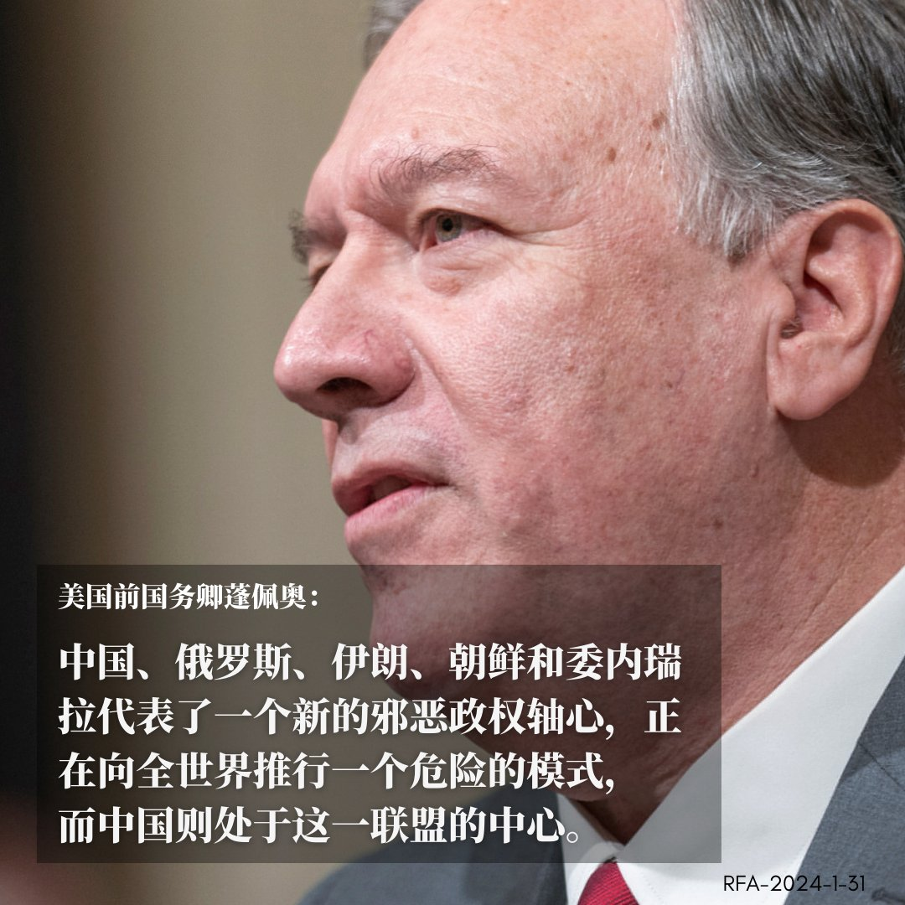
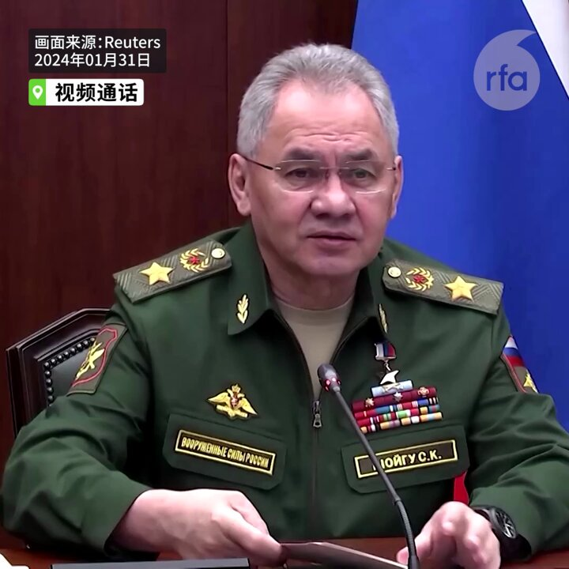
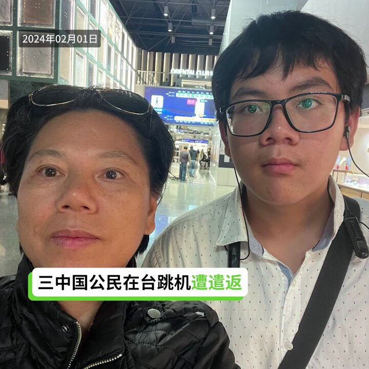
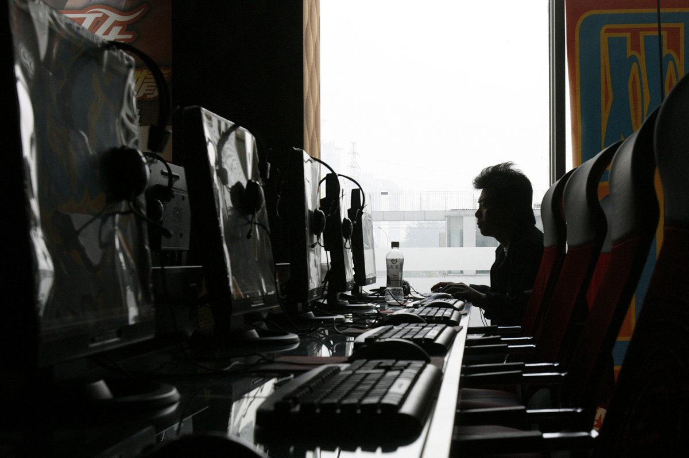
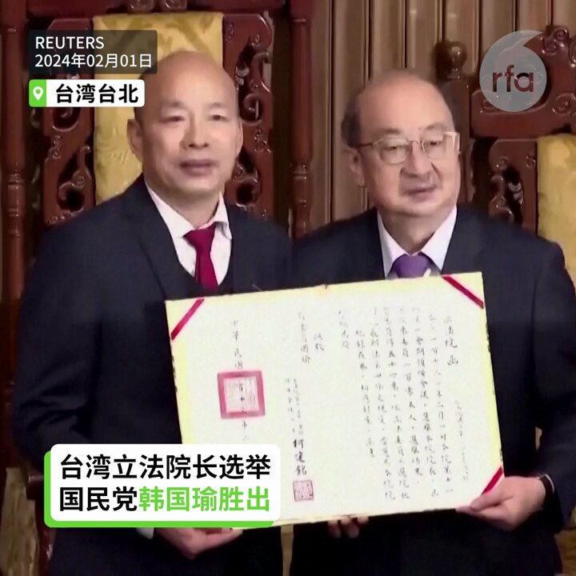
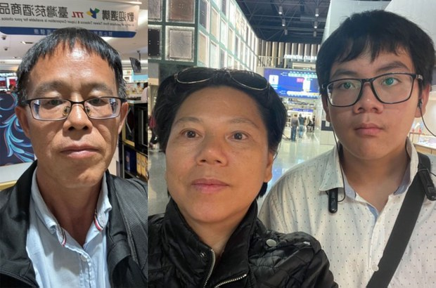
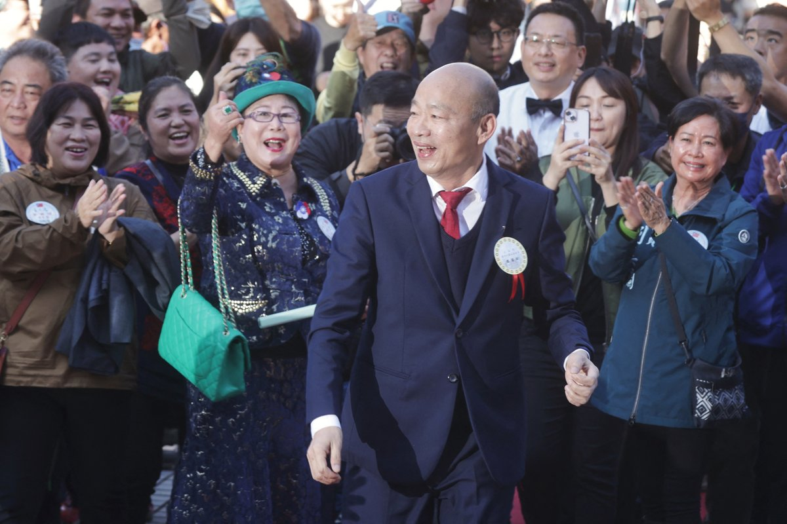
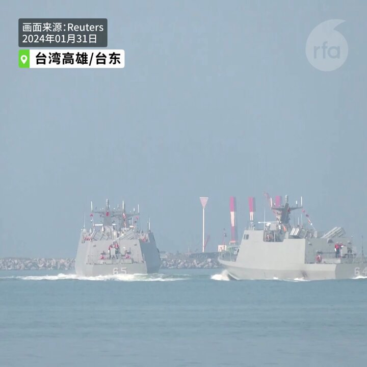
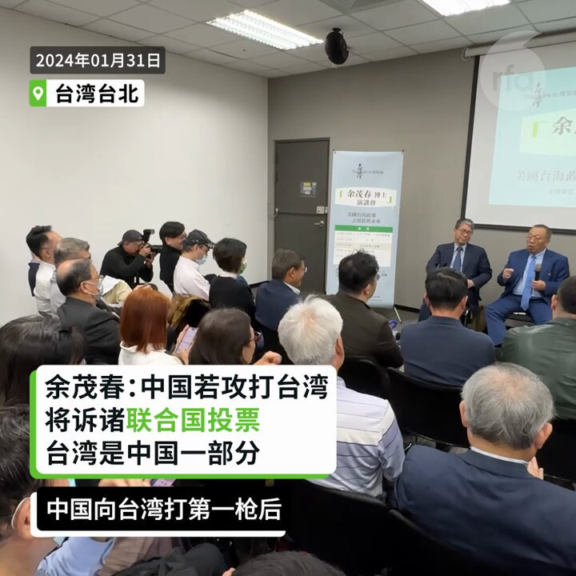

自由亚洲电台 北京时间 2024-02-01T23:16:27Z 1753074840150704346 RT @RFA_Chinese: 1月30日，中国民航局公告，将启用M503航线W122、W123衔接航线由西向东运行，提升空域运作效率。
台湾陆委会抗议，称“佯称缓解有关地区航班增长压力、保障飞行安全，实则未经两岸沟通启用相关航路”，并指北京“刻意以民航包装对台政治，乃至军事…   自由亚洲电台 北京时间 2024-02-01T23:16:46Z 1753074923025895537 RT @RFA_Chinese: 1月30日，美国前国务卿蓬佩奥在国会众议院美国与中国共产党战略竞争特设委员会举办的听证会上表示，中国共产党领导的独裁联盟不仅仅影响到台湾，美国本土利益也与之密切相关。
他还这样说： https://t.co/PxDrOaQ3c3   自由亚洲电台 北京时间 2024-02-01T23:45:14Z 1753082084111929500 北京人权律师 #余文生 和妻子 #许艳 因涉及“煽动颠覆国家政权”等罪名被羁押已接近10个月。近期两人从北京被转移到苏州关押，案件也被移送到苏州审查起诉。有法律界人士表示，此案深受外界乃至国际社会重视，当局此举显然是为了“减压”。

https://t.co/PDpbVsrx5e   自由亚洲电台 北京时间 2024-02-01T21:49:46Z 1753053026359689495 RT @RFA_Chinese: 【绍伊古与董军视频会谈】
据中国国防部消息，俄罗斯国防部长绍伊古与中国新任国防部长董军举行视频会谈。这是董履新以来首次公开亮相。 https://t.co/MLaIQJLeDb   自由亚洲电台 北京时间 2024-02-01T22:04:29Z 1753056731767144934 去年中国调停了 #沙特阿拉伯 与 #伊朗 的世纪和解，为其自身定位为全球调停者的努力再添一笔"功绩"。但自哈以冲突爆发以来，中国的谨慎表态引来 #以色列 的不满。近日有多位专家表示，中国参与中东地区事务意在对抗美国，且参与方式十分浮于表面。 https://t.co/q5ecgV3RIm   自由亚洲电台 北京时间 2024-02-01T19:09:04Z 1753012587191837114 【三名在台跳机中国人遭遣返回马来西亚】
【台湾的移民署称依法遣返回上一个航点】
三名中国人田永德、韦亚妮和儿子黄星星，30日自马来西亚吉隆坡飞抵台湾桃园机场，跳机寻求台湾政府准予紧急避难。不过，2月1日周四三人被遣返回出发地马来西亚。台湾的移民署和陆委会表示，外来旅客来台转机，应依其原定航程前往下一个目的地；若未前往下一个目的地，且未具备入境有效签证或许可，依惯例及现有法令遣返回上一个航点。韦亚妮飞抵吉隆坡后接受本台采访谈到最新情况。   自由亚洲电台 北京时间 2024-02-01T17:36:32Z 1752989298398495028 【中国网信办去年约谈网站逾万家】
【南昌广电局禁网吧24小时营业】
中国网信办最新通报2023年约谈一万多家网站负责人，同时吊销一万多家网站执照，下架259款APP、119款小程序，指令性封号一万余个。当局指遭处罚的网站传播“虚假信息、煽动对立等不良信息”。另外，南昌广电旅游局下令禁止当地网吧全天候营业，受到舆论批评。详细报道：https://t.co/gzqi9ZeW6X   自由亚洲电台 北京时间 2024-02-01T17:58:26Z 1752994809063858355 【国民党韩国瑜当选台湾立法院长】
【场外抗议 “拒绝中国选择”】
台湾第11届立委2月1日报到宣誓就职，并投票选出立法院正副院长。国民党推出的立委韩国瑜拿到54票，已超过105位领票立委的半数，当选第11届立法院长。民进党推派的立委游锡堃则获得51票。立法院外有抗议民众高喊:“国瑜当院长、引进共产党，我们拒绝中国的选择！”
#韩国瑜   自由亚洲电台 北京时间 2024-02-01T15:02:32Z 1752950543067009122 RT @RFA_Chinese: 【中国著名独立记者高瑜：批评社会是知识分子的责任｜＃观点】
高瑜说《人民日报》前社长 ＃胡绩伟 曾希望出台 ＃新闻法，#赵紫阳 也提出加快制定，可惜 #六四 之后再无下文。高瑜说，知识分子的责任就是批评社会：“但在中国你看看有一拨人讲的是什么？…   自由亚洲电台 北京时间 2024-02-01T15:49:46Z 1752962428227420590 【三名中国公民在台跳机已遭遣返回马来西亚】
三名中国人田永德、韦亚妮和儿子黄星星，30日自马来西亚吉隆坡飞抵台湾桃园机场，跳机寻求台湾政府准予紧急避难。不过，台湾的移民署2月1日证实，1日周四上午三人已经被遣返回马来西亚。https://t.co/ylRPh3FdCJ https://t.co/VqRQFyZL3l   自由亚洲电台 北京时间 2024-02-01T14:01:26Z 1752935166581047411 【国民党立委 #韩国瑜 当选台湾的立法院长】
台湾第11届立委今天2月1日报到，随后进行立法院长选举，第一轮投票无人过半，第二轮投票结果，在民众党8位立委未进场投票下，国民党推出的立委韩国瑜拿到54票，已超过105位领票立委的半数，当选第11届立法院长。民进党推派的立委游锡堃则获得51票。（图片来源：法新社）   自由亚洲电台 北京时间 2024-02-01T11:49:42Z 1752902015137751526 【台湾军事演习 大陆“战备巡逻”】
#台湾 军方1月31日军演模拟了中国突然将一次例行环岛演习转变为实际攻击的场景。同一天中国在台湾附近进行了另一次“战备巡逻”，有 22 架中国飞机参与。 https://t.co/llBRG2ey42   自由亚洲电台 北京时间 2024-02-01T11:54:39Z 1752903259260355067 RT @RFA_Chinese: 【#余茂春:不能使用武力改变台海现状】
【任何美国总统都不可能改变这点】… https://t.co/OK4ORFY4zx   自由亚洲电台 北京时间 2024-02-01T08:00:11Z 1752844253884276954 欢迎收听和订阅播客【＃亚太报道】 https://t.co/MjLNSvVMqc
中国片面启用 #M503 西向东航线；3名中国公民 #跳机 台湾；美国安顾问 #沙利文 谈美中关系；#习近平 出书三百册；南京异议人士 #史庭福 遭跨省抓捕 https://t.co/TA7slukwA6   自由亚洲电台 北京时间 2024-02-01T05:07:23Z 1752800768158273885 【绍伊古与董军视频会谈】
据中国国防部消息，俄罗斯国防部长绍伊古与中国新任国防部长董军举行视频会谈。这是董履新以来首次公开亮相。 https://t.co/MLaIQJLeDb   自由亚洲电台 北京时间 2024-02-01T05:35:08Z 1752807753381523781 1月30日，美国前国务卿蓬佩奥在国会众议院美国与中国共产党战略竞争特设委员会举办的听证会上表示，中国共产党领导的独裁联盟不仅仅影响到台湾，美国本土利益也与之密切相关。
他还这样说： https://t.co/PxDrOaQ3c3   自由亚洲电台 北京时间 2024-02-01T05:35:59Z 1752807964849639543 1月30日，中国民航局公告，将启用M503航线W122、W123衔接航线由西向东运行，提升空域运作效率。
台湾陆委会抗议，称“佯称缓解有关地区航班增长压力、保障飞行安全，实则未经两岸沟通启用相关航路”，并指北京“刻意以民航包装对台政治，乃至军事的不当企图”，有改变台海现状疑虑。
对此，您怎么看？您认为，此举是否会造成台湾防空威胁？   自由亚洲电台 北京时间 2024-02-01T05:42:17Z 1752809551173156873 专栏 | #网络博弈:#海外自媒体观选团 直播 #台湾大选 效果如何？ https://t.co/moIef4ZCBF   自由亚洲电台 北京时间 2024-02-01T06:04:05Z 1752815037922558215 美国总统国家安全事务助理杰克· #沙利文 1月30日出席了加州大学圣地亚哥分校二十一世纪中国研究中心举办的 #美中关系论坛，谈论美中关系的未来。

https://t.co/OT71x4bWUd   自由亚洲电台 北京时间 2024-02-01T06:06:23Z 1752815615113310243 评论 | #唯色：《#杀劫》2023年最新修订版与前两版有何不同？(十三) https://t.co/QHvfg2Iegq   自由亚洲电台 北京时间 2024-02-01T06:18:14Z 1752818601135124628 2019年《#习近平谈治国理政（第一卷）》至2022年，共出四卷
《习近平谈‘一带一路’》
《习近平书信选集（第一卷）》
《习近平外交演讲》第一、二卷
《习近平关于总体国家安全观论述摘编》
《习近平重要讲话单行本》
《习近平亚洲文明对话大会重要讲话》等
合共三百多册。https://t.co/pNUFnpekQT https://t.co/d2sExAnfZP   自由亚洲电台 北京时间 2024-02-01T02:35:19Z 1752762500351685078 港府的《#基本法》#二十三条 立法建议，新加入多项罪名，其中包括泄漏国家秘密和间谍相关的罪行以及"#境外干预罪"等。这些新加的罪名将如何影响甚至扼杀香港仅有的新闻和国际合作自由？以及会对其他国家的公民构成什么影响？

https://t.co/w14PKy3BFC   自由亚洲电台 北京时间 2024-02-01T01:06:52Z 1752740240396087767 中国民航局30日宣布取消 #M503 航线自北向南飞行偏置，和启用M503航线W122、W123衔接航线由西向东运行。
针对中国片面宣告的行为，台湾的陆委会表达严正抗议及强烈不满，认为此举有改变台海现状疑虑。
https://t.co/gLEUtu9DU2   自由亚洲电台 北京时间 2024-02-01T01:33:47Z 1752747016499744849 香港传媒大亨 #黎智英 被控“串谋勾结外国势力”等罪名的案件仍在香港法院审理中。联合国特别报告员致函中国政府，就黎智英案关键证人怀疑被刑讯迫供表达关注，并要求当局在证供呈堂前，调查相关指控。
https://t.co/OOmoHKmoyp   自由亚洲电台 北京时间 2024-02-01T02:01:45Z 1752754051442225244 中国公民 #田永德、#韦亚妮 和黄星星三人 #跳机 寻求 #台湾 准予暂时中继避难一案，由自由亚洲电台1月31日凌晨率先披露。经向台湾有关部门查证，三人都没有入台签证，目前仍滞留在台湾桃园机场，没有搭乘原订31日下午飞北京的航班。

https://t.co/evDFJEl3Af   