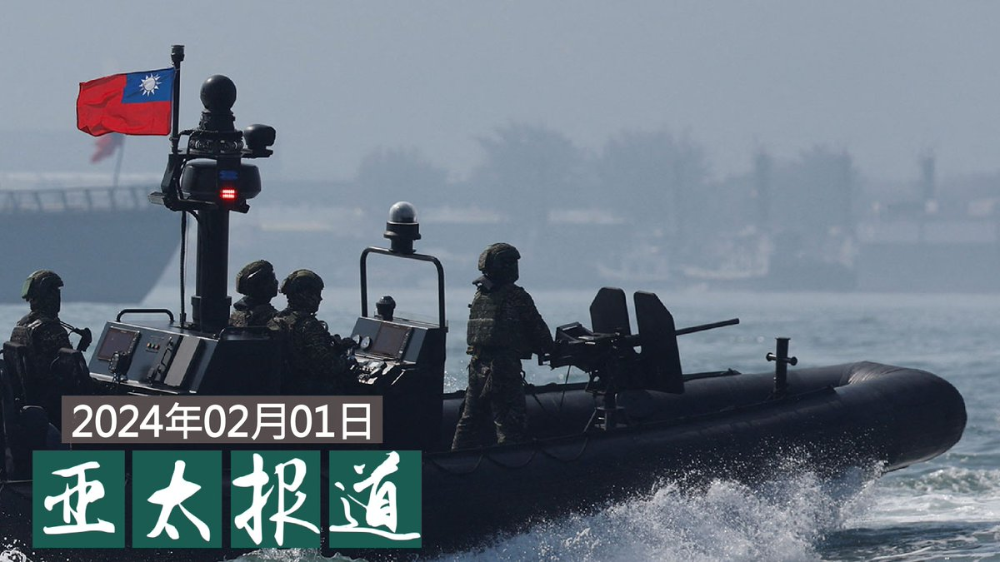
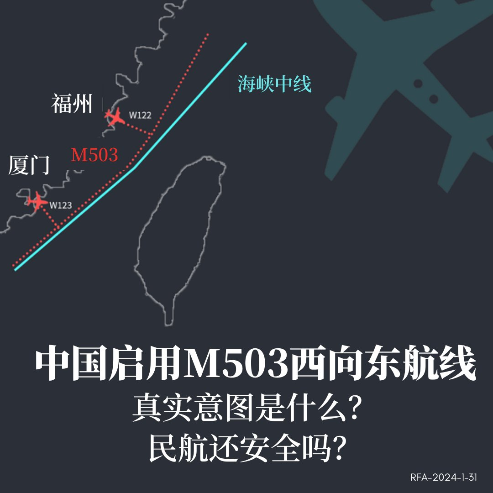
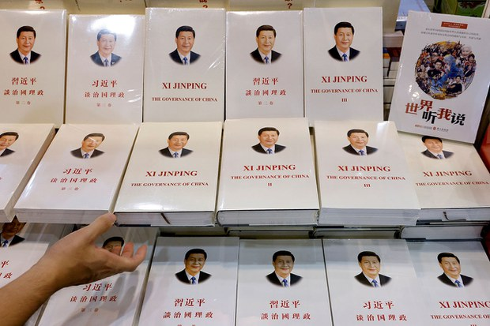

自由亚洲电台 北京时间 2024-02-01T08:00:11Z 1752844253884276954 欢迎收听和订阅播客【＃亚太报道】 https://t.co/MjLNSvVMqc
中国片面启用 #M503 西向东航线；3名中国公民 #跳机 台湾；美国安顾问 #沙利文 谈美中关系；#习近平 出书三百册；南京异议人士 #史庭福 遭跨省抓捕 https://t.co/TA7slukwA6   自由亚洲电台 北京时间 2024-02-01T05:07:23Z 1752800768158273885 【绍伊古与董军视频会谈】
据中国国防部消息，俄罗斯国防部长绍伊古与中国新任国防部长董军举行视频会谈。这是董履新以来首次公开亮相。 https://t.co/MLaIQJLeDb   自由亚洲电台 北京时间 2024-02-01T05:35:08Z 1752807753381523781 1月30日，美国前国务卿蓬佩奥在国会众议院美国与中国共产党战略竞争特设委员会举办的听证会上表示，中国共产党领导的独裁联盟不仅仅影响到台湾，美国本土利益也与之密切相关。
他还这样说： https://t.co/PxDrOaQ3c3   自由亚洲电台 北京时间 2024-02-01T05:35:59Z 1752807964849639543 1月30日，中国民航局公告，将启用M503航线W122、W123衔接航线由西向东运行，提升空域运作效率。
台湾陆委会抗议，称“佯称缓解有关地区航班增长压力、保障飞行安全，实则未经两岸沟通启用相关航路”，并指北京“刻意以民航包装对台政治，乃至军事的不当企图”，有改变台海现状疑虑。
对此，您怎么看？您认为，此举是否会造成台湾防空威胁？   自由亚洲电台 北京时间 2024-02-01T05:42:17Z 1752809551173156873 专栏 | #网络博弈:#海外自媒体观选团 直播 #台湾大选 效果如何？ https://t.co/moIef4ZCBF   自由亚洲电台 北京时间 2024-02-01T06:04:05Z 1752815037922558215 美国总统国家安全事务助理杰克· #沙利文 1月30日出席了加州大学圣地亚哥分校二十一世纪中国研究中心举办的 #美中关系论坛，谈论美中关系的未来。

https://t.co/OT71x4bWUd   自由亚洲电台 北京时间 2024-02-01T06:06:23Z 1752815615113310243 评论 | #唯色：《#杀劫》2023年最新修订版与前两版有何不同？(十三) https://t.co/QHvfg2Iegq   自由亚洲电台 北京时间 2024-02-01T06:18:14Z 1752818601135124628 2019年《#习近平谈治国理政（第一卷）》至2022年，共出四卷
《习近平谈‘一带一路’》
《习近平书信选集（第一卷）》
《习近平外交演讲》第一、二卷
《习近平关于总体国家安全观论述摘编》
《习近平重要讲话单行本》
《习近平亚洲文明对话大会重要讲话》等
合共三百多册。https://t.co/pNUFnpekQT https://t.co/d2sExAnfZP   自由亚洲电台 北京时间 2024-02-01T02:35:19Z 1752762500351685078 港府的《#基本法》#二十三条 立法建议，新加入多项罪名，其中包括泄漏国家秘密和间谍相关的罪行以及"#境外干预罪"等。这些新加的罪名将如何影响甚至扼杀香港仅有的新闻和国际合作自由？以及会对其他国家的公民构成什么影响？

https://t.co/w14PKy3BFC   自由亚洲电台 北京时间 2024-02-01T01:06:52Z 1752740240396087767 中国民航局30日宣布取消 #M503 航线自北向南飞行偏置，和启用M503航线W122、W123衔接航线由西向东运行。
针对中国片面宣告的行为，台湾的陆委会表达严正抗议及强烈不满，认为此举有改变台海现状疑虑。
https://t.co/gLEUtu9DU2   自由亚洲电台 北京时间 2024-02-01T01:33:47Z 1752747016499744849 香港传媒大亨 #黎智英 被控“串谋勾结外国势力”等罪名的案件仍在香港法院审理中。联合国特别报告员致函中国政府，就黎智英案关键证人怀疑被刑讯迫供表达关注，并要求当局在证供呈堂前，调查相关指控。
https://t.co/OOmoHKmoyp   自由亚洲电台 北京时间 2024-02-01T02:01:45Z 1752754051442225244 中国公民 #田永德、#韦亚妮 和黄星星三人 #跳机 寻求 #台湾 准予暂时中继避难一案，由自由亚洲电台1月31日凌晨率先披露。经向台湾有关部门查证，三人都没有入台签证，目前仍滞留在台湾桃园机场，没有搭乘原订31日下午飞北京的航班。

https://t.co/evDFJEl3Af   