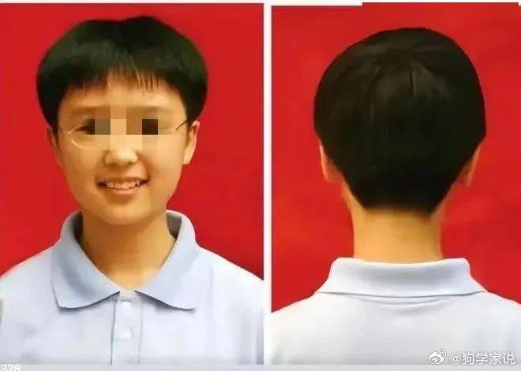

谁将十万横扫三江 北京时间 2024-02-01T15:51:14Z 1752962797653426561 河北女中学生是如何被查头发的？权力不讲逻辑

　　说之前先叠个甲：本人是省会城市的一所规模极大（十年前上学的时候每个年级28个班近2000人，现在每个年级三十多个班）的公私立混同初中及其高中部读的，虽然都是管头发，但是河北省的各个学校管得各有千秋，比我校严格的比比皆是。本文只以个人经验记载一些被劝剪头发的话术和青春期疼痛，不代表所有河北省学校的最高水平。

　　在正式上初中之前，我听说中学要剪短发，于是去剪了个波波头，并自我感觉已经够短了。现在想起来，我的初中生活的正式开幕可能就是始于年级主任的一句大声的“留那么长头发干嘛”。这位被众多家长信赖、学生敬畏的年级主任以严格著称，学生们往往还没正式开始上课就知道这个大块头妇人不好惹，只要稍微有所不敬，她就会像一辆战车一样轰鸣着碾压过来，运气不好还会被喷一身口水。尽管在之后的三年许多和我成绩相仿的学生已经对她产生了斯德哥尔摩情结，我还是无法单独跟她说一句话。

　　女生头发的标准是前不过眉，后不遮颈，两侧不盖耳朵，男生则是要多于3mm但是不能高于手指。从刚刚入学，初中生之间就流传着另一所更为严格的公立中学的传言：有嫌麻烦干脆剃了1mm左右“光头”的男生被送回家养头发了。对女生而言，这个发型并不适合所有发质，天然卷和细软的自然服帖，有些相当可爱，像我这种有轻微沙发的两侧剪得过短就会翘起来，就算吹了头发，睡一觉也得乱了。一开始我还不太适应，坚持每天早上起来用湿毛巾压一下头发，到了初二也就麻木了，只要没人来找我事，发型怎样都无所谓了。

　　在众多劝人剪头的话术中，出现频率最高的就是“你给自己找麻烦干什么”。查头发的过程是一个班六七十人全部站起来，班主任在教室里巡视，有不合格的就拖出去教育几句，下个死命令，比较凶悍的班主任甚至会自带剪刀；没有不合格的就没有来自年级主任的责备，班主任自然大喜，表扬所有人。学校让你剪，你剪了不就完了？不剪的话反而要被拉去教育，浪费学习的时间，再不剪叫家长过来，浪费家长的时间，还让你们家闹得不愉快，你听他的不就完了，给自己找麻烦干什么？剪个头发怎么你了？你来学校是选美的？你失去了什么？这一串问下来，一般初中生都要脸涨得通红，想反驳但是师出无名，过两天就去乖乖剪了。如此往复几次，学生们自然不会在意这些事情，因为身边所有人都是服从的。

　　另外一个理由是我校特有的，即阻止学生之间攀比。我校初中部因为公私部门混在一起，难免有些周边财主的孩子，当时的百度贴吧里不乏家长顾虑孩子进了我们学校会染上攀比的恶习。在这些老师和家长当中，短发并非让女生在样貌上接近男生，而是让女生失去了打扮自己、突出个性的最主要的一块画布。这一规定到了所有人准备体育中考、可以自由穿运动裤上学的初三，又发展出了不允许穿荧光色运动鞋、不允许穿侧边有明显几条杠的运动裤、不允许把连帽衫的帽子翻出校服外套等等。在很多女生们发现可以随手买到更加宽松的男生夏季校服之后（女生的夏季白衬衫收腰贴身而且较透），年级又发布了女生禁止穿男生校服的禁令。这一切都是出于禁止攀比。

　　唯一能够留长发的人群，是练健美操和舞蹈等需要留头发的体育项目、备战二级运动员的女生们。她们被要求梳马尾或者盘头，也是不允许把头发披下来的。这一期间我看到那些洗发水广告，一直都觉得那种黑长直的披肩发一定是假的，人的披肩发怎么可能那么顺滑、留到那么长还不打结呢？

　　到了初三学习紧张的时候，对头发的管制就没有那么严格了。但是这种发型留一段时间就会扎脖子和耳朵，所以很多学生还是会自动修剪回要求的发型，只为了不在紧张的初三给自己找麻烦。这个服从逻辑在2020年后经历过一切的话，已经不难看破，但是在十年前的初中生眼里是非常有道理的。我的班主任对这个逻辑最为惊为天人的运用是：马上要过年了，你考不好要挨骂，那你考好一点不就好了？这样就不会给自己找麻烦了。

　　到底麻烦是谁给找的，还得到了高中才能理解。我校高中从来是不管头发的，结果在我高一时教导主任心血来潮想管，此时高二一位理科班成绩很好的女生说，你要让我剪头我就转学去⚪中（全河北省最超级的中学，不是衡中），教导主任就不再提及此事。在我高三保送决定之后，还听闻了衡中的一位同级生的传说。她初中在我校，是个天才中的天才，高二就已经四处上竞赛集训，基本没怎么在衡中待过，到了高三定了保送北大数院之后，便以转学要挟学校，在一个军事化的校园里过着悠然自得、不受时间表管控的生活。

　　这种事的发生比任何理论都能证明，剪头发也好、禁止攀比也好、军事化管理也好，都只是权力弱肉强食的体现。只要你强到能够要挟学校，就可以踩在他们的那些规矩上，反过来就是规矩踩在你的脸上。高中毕业后我又回到初中部给班主任帮过一段时间忙，看到大部分学生也还剪着头发，但长发女生的比例变高了，而且有些也留着低马尾和披肩发，只是不戴发饰。其中有些是家里准备好送去美高的，在学校也是散漫的脱产状态，这是在我上学时难以想象的。去问班主任时，得到的答复是，有些学生的家长太厉害了，说不剪头发就不剪，他们做老师的也不敢惹。

　　我问班主任，那之前不是还说什么禁止攀比？学生们难道不会因此攀比家长吗？这并不是有钱没钱的问题，是会不会给自己撑腰的问题。

　　班主任说，看她们成绩也不错，就这样吧。少管也是少给自己找麻烦。

【网评】写得非常好的一篇，尤其赞同“这种事的发生比任何理论都能证明，剪头发也好、禁止攀比也好、军事化管理也好，都只是权力弱肉强食的体现。”

【网评】始终觉得压抑青少年爱美的本能是一种虐待 source (https://t.co/NC6ft4ilQk)   谁将十万横扫三江 北京时间 2024-02-01T09:09:30Z 1752861700284637642 雨果奖幕后世界科幻协会出公告，最高职权的主席和总监辞职，严厉谴责包括成都科幻协会秘书长陈石在内的成都科幻大会委员会，只发一次内定奖就让洋人这么大动干戈，太辱华了，看不下去，但是没关系，我们有流浪地球😆 https://t.co/9qrYFCjAbe   