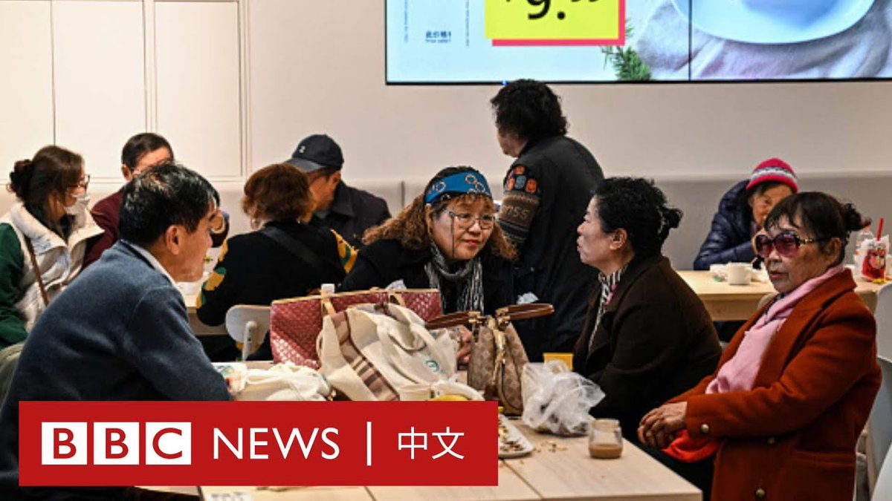
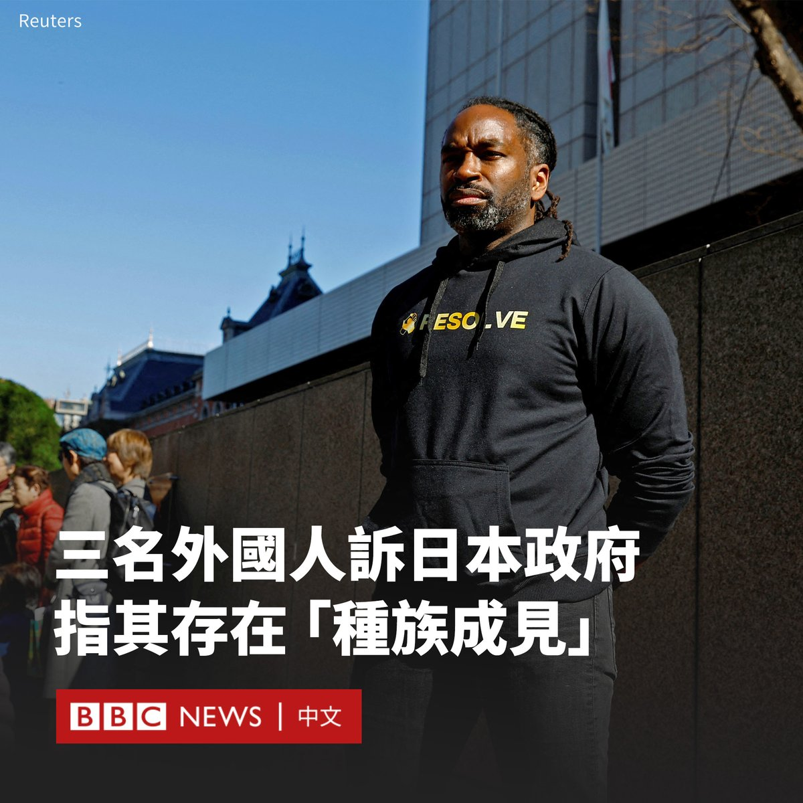
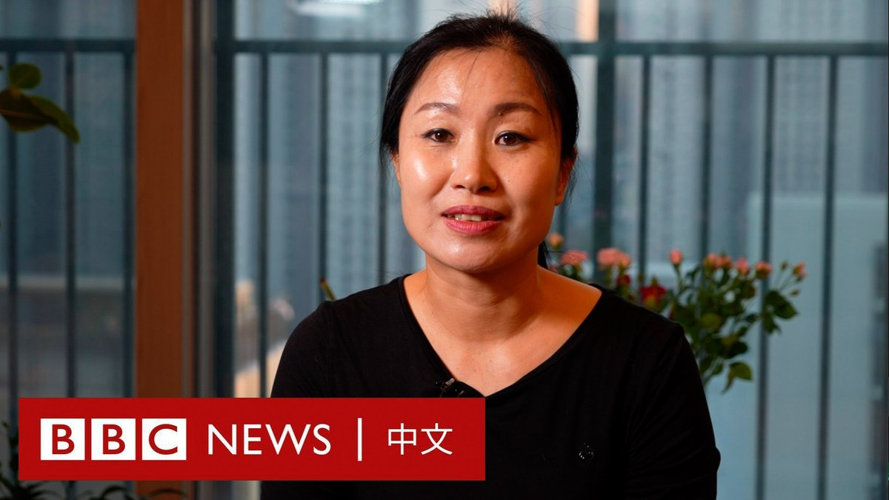
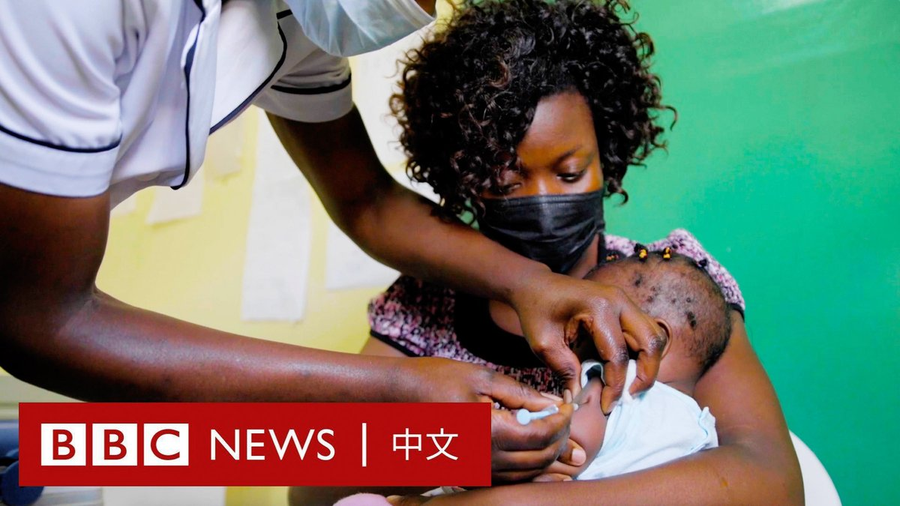

D英国广播公司BBC 北京时间 2024-01-31T17:25:00Z 1752624009869713640 位于上海徐汇的宜家家居（IKEA）卖场，在过去十多年间成为当地银发族的相亲圣地。每周的特定时间，都有许多退休老人涌进这家跨国家具品牌的餐厅，自备茶水零食，开启约会模式。

官方数据显示，在中国近三亿60岁及以上的老年人中，四分之一是单身。随着老龄化程度加重，老年人的孤独问题受到关注。 https://t.co/qiwmqLvgNm   D英国广播公司BBC 北京时间 2024-01-31T16:05:17Z 1752603945351168238 三名在国外出生的日本居民起诉日本当局，指其涉嫌存在“种族脸谱化”的歧视行为。原告表示，警方基于他们的外表反复盘问他们，给他们造成了困扰。

该诉讼要求明确基于种族特征的成见是非法的，并要求赔偿每位原告300万日元（20,250美元）。

赛义德·扎因（Syed Zain）出生于巴基斯坦，在日本生活了二十多年，日语流利。他在一场记者会上说，他经常被警察拦截、盘问和搜查。

“有一种非常强烈的印象，‘外国人’等于‘罪犯’。”他说道。“现在是反思警方审讯方式的时候了。”

另一名原告马修（Matthew）是印度裔，是日本永久居民。他称自2002年抵达日本以来，至少接受了70次警方问询。据报道，他称自己现在避免出门。

第三名原告莫里斯（Maurice）是一名非裔美国人，也是日本永久居民，他称自己也受到了“普通日本人”的询问，包括一些人问他签证是否过期。

这三名男子已向东京地方法院起诉日本政府、东京都政府和爱知县政府。

由于日本是单一民族社会，移民水平相对较低，此前有多起外国人或移民抱怨受到基于肤色和族裔的偏见的案例。

不久前，乌克兰裔模特椎野‧卡洛琳娜（Karolina Saluk）在一场全国选美比赛中摘得“日本小姐”的桂冠，引起激烈辩论。一些人质疑没有日本血统的她并不能代表日本。   D英国广播公司BBC 北京时间 2024-01-31T13:29:53Z 1752564837908193743 “向朝鲜汇款就像一部间谍电影，他们冒着生命危险。”

由于朝鲜对资金流动严格控制，许多逃到韩国的“脫北者”往往依靠中介将钱寄回给国内的家人。

有中介向BBC表示，他们首先将钱转移到中国，再以各种方式送往朝鲜。这种行为将冒着巨大的风险，韩国当局也开始不再容忍。 https://t.co/2haWDiyfUM   D英国广播公司BBC 北京时间 2024-01-31T10:38:12Z 1752521632940519784 非洲每年有60多万人死于疟疾。随着世卫组织在2021年批准使用全球第一款疟疾疫苗，喀麦隆成为世界上首个开始大规模推广该疫苗的国家。 https://t.co/KDWbTsNjNw   