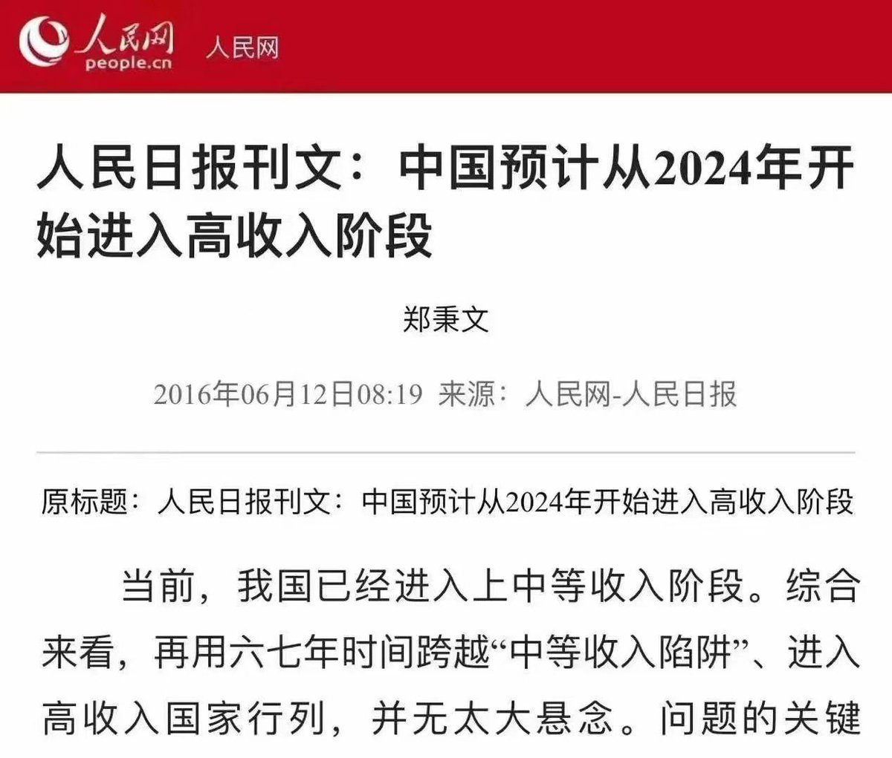

Petrichor 北京时间 2024-01-31T09:46:06Z 1752508521545949628 作者   在猫眼看人

       日前，偶然在朋友宴请上碰到已经成为金融大鳄的旧识。酒酣耳热之时，他对反腐一事大泼冷水，闻者无不心惊。
       大鳄说：“反腐是场必败的战争！”中央早就发出风声：“反腐败永远都在路上！”再也没有勇气说反腐败“取得阶段性胜利”“取得决定性胜利”，中央已经准备白旗投降。

      原因在于：
      第一、资源上，国家资源掌握于腐败者。反腐败必须依赖贪腐败集团，否则寸步难行。权力越大越腐败，你如何反腐败；
      第二、队伍上，体制内没有不腐败的人，谁也脱不开腐败。最腐败的人在中共中央、中央纪委、立法司法、中央军委。请问：谁能将自己脑袋割下，像申公豹那样重新安装？
      第三、理念上，中国社会信奉打江山坐江山，官二代、红二代，有自己的共识:江山是我先人打下，贪腐是我家窝事，与你们老百姓无关。权力绝对不能与百姓分享，你说我贪腐，我不贪腐，先人当年打江山为个甚？朱元璋霹雳手段反腐败，为的就是不让异姓人腐败，以保障自己子子孙孙，永永远远能腐败；
       第四、风气上，百姓仇视腐败，也羡慕腐败。普遍认为腐败者有本事。这是腐败深厚的群众基础。

       中国反腐既不能长久，也不能深入，更不能改变腐败体制。反腐只能治标，不能治本。反腐永远是一阵风，过后一切照旧。医疗反腐就是最好的例证。为什么？全部腐败啊，反个屁！“噗”的一声，戛然而止。然后自欺欺人地说一声“医疗反腐败取得决定性胜利！”
       金融大鳄混迹北京与省府官员群中，经常与高官切磋时局。他什么都知道。
      中国官僚已经由起初对反腐败惊惶失措，变得毫无忧虑之色，对反腐败十分麻木，百分淡定。心里只会说，你小子命不好，或者说你他妈的不会来事儿，咋弄的叫纪委盯上了，甩不脱手，只能借你小子“人头一用”，求得全体安全。
      中国反腐力量在强大的腐败力量磨损下衰竭乏力。现在，恐惧的不是贪腐集团，而是反腐集团。腐败者有绝对把握，确保任何涉及根本性改革政策例如“公务员财产公开法”，叫它永远胎死腹中。
      大道至简，反腐败很简单，只需要一招：公开化，除了公开化，还是公开化。
       重庆人大代表韩德云一届又一届连续7年锲而不舍提出“公务员财产公开议案”，年年以99.9%高票否决。第八年，他准备发动网络签名，不仅代表重庆人民，而是代表全国数以亿计的人民提出议案，看你通过不通过？！“咔嚓”一声，韩德云代表资格被否定。这件事说明什么？中央不愿意真的反腐败，而是做做样子，安抚人心而已。韩德云不是搞政治的料，是书呆子，他反腐败竟然要来真的，好，那就把你先干掉。所以：
      第一，中国决不启动任何真正落实公民权利的政治改革。例如公民有知情权绝对不会实现，“公务员财产公开法”绝对不会出台；
      第二，铁桶体制，不留缝隙。决不吸收体制外的民主党派进入体制，将他们打入冷宫，彻底压死。除非他们也被彻底“党化”，也学会腐败；
      第三，坚决地毫不留情地打杀权力中枢理想主义者的"宫廷政变"，像王岐山那样的铁面反腐败者是害群之马，必须清除。只要政权不出现突发性变动，政治性反腐败就能延续，司法反腐败，永远不许得逞。

      记住：权力与资本通吃，寻租永远是中国政治的主轴，就算每过20年有一次反腐风暴，只是为挽民心、救权力而采取的应景之术罢了，绝对不可当真。反腐永远是政治手段，不是为了政治清明。说到底，反腐败是为了更大的、永远的腐败而做的“合理牺牲”“小小让步”罢了。毛泽东当年已经认识到这个问题，指示对历史上的统治者实施“让步政策”做专门研究。陕西师范大学历史系青年教师孙达人的研究拔得头筹，引起毛泽东关注，改革开放后一步登天，做了陕西省副省长。毛泽东为什么要关注统治阶级的“让步政策”，为的是“让一步，天高地阔”，能够永远统治下去。也就是一个贪官都不愿意杀掉，那么，大家就得集体死掉。丢卒保车，舍一保万。这就是毛泽东关注“让步政策”的初衷。毛泽东杀掉刘青山、张子善就是这个原因。
      注意：没有权力与经济脱钩，没有公开性，任何反腐败都是政治手段，是技术选择，充其量是清理门户的“让步政策”而已。
       
      这是穿梭于中国省级以上官场的金融大鳄对中国反腐败的看法，胜过一万个司法干部专业理解。中国贪腐势力   永远充满必胜信心。中国政府永远腐败，也永远的在反腐败。所以中央自知之明地说：“反腐败永远都在路上。”   Petrichor 北京时间 2024-01-31T10:19:20Z 1752516884631617723 按江胡时期的速度发展，本可达到预期目标的。可惜被小学博士闹了，倒车回去了。 https://t.co/1RTt6sy2gf   Petrichor 北京时间 2024-01-31T06:48:40Z 1752463868377358377 一只黄🐕跑到白🐶的地盘，白🐶问你在那边吃的也不错，为啥非得到我们这里来呢？黄🐕说我在那边除了吃的还行，这不是吃饱了还想叫几声嘛，可那边不让叫啊，谁叫谁挨揍。白🐶说：你是黄狗，不能把你们原先狗窝的坏习惯都带过来啊，还念念不忘原先狗窝主人的好。你得入乡随俗。   Petrichor 北京时间 2024-01-31T07:18:44Z 1752471436793446567 博士生集体患癌出现在中山大学苏士成教授的实验室，学生们怀疑是实验试剂造成对人体的毒害。
苏士成曾留学日本，导师石井春海，石井春海的父亲是石井四郎，他曾是731部队的最高指挥官。
这都是网上传的。有人怀疑苏士成是日本间谍，实践石井四郎未完成的实验。

我对这些网络传言的真实性感到怀疑。 https://t.co/6DsYHsGJ2P   Petrichor 北京时间 2024-01-31T07:25:02Z 1752473021959262482 消化转发

随着中国足球队昨晚0：1不敌卡塔尔出局，有人出对联：
上联：试问中国足球有多愁？ 
下联：恰似一群太监上青楼。 
横批：无人能射。 
上联：再问中国足球有多愁？ 
下联：恰似一群妓女守青楼。 
横批：总是被射。 
上联：三问中国足球有多愁？ 
下联：恰似阳痿患者逛青楼。 
横批：欲射不能。 
上联：四问中国足球有多愁？ 
下联：恰似早泄患者逛青楼。 
横批：射也白射。 
上联：五问中国足球有多愁？ 
下联：恰似一群白痴逛青楼。 
横批：不知怎射？ 
夫妻俩在家看了世界杯，还看了对联，既过足了球瘾，又疏泄了内心的不快。 妻子抱着老公撒娇： ＂老公！管他们能射不能射的，今晚你要射我的门呵！？＂。 
老公一把推开妻子说： ＂你懂个锤子，射自家的门算输，射别人家的门才算赢！……＂ 
老公接着还淡淡地说：＂等中国队赢了，我就跟你离婚。＂，听完老公的话后，妻子心里暖暖的，她想，等中国队赢只有下辈子了，没有比这更天长地久、海枯石烂的承诺了。   Petrichor 北京时间 2024-01-31T04:45:31Z 1752432877017403839 中国的院士制度早该取消，里面没有几个有真正学术成就的。我二叔说，有的人当年在美国找不到博士后的位置，被迫回国，凭几篇论文，先做杰青，后做院士，马上什么都懂，成神了。各地想做院士的教授都拍他马屁，给他送礼，他又先后做了所长和省科协的官，没时间看书，但论文却不断地发表，都是挂名的，恐怕数据错了，他也不知道。   Petrichor 北京时间 2024-01-31T04:10:31Z 1752424069746823475 她，问题大着呢。什么职业？ https://t.co/9xdJ5w7eGL   Petrichor 北京时间 2024-01-31T04:11:06Z 1752424216824029581 她，问题大着呢。什么职业？ https://t.co/sxmJEtvXY1   