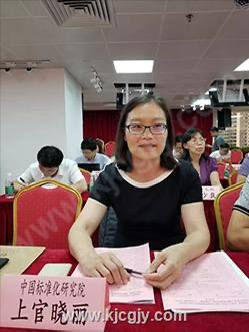
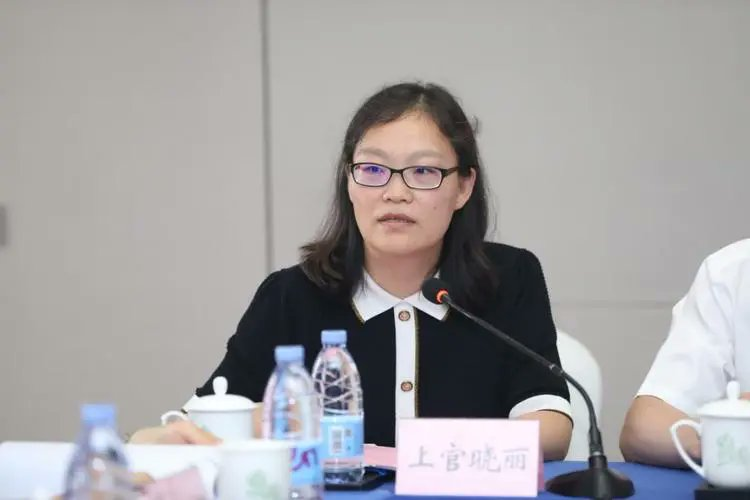
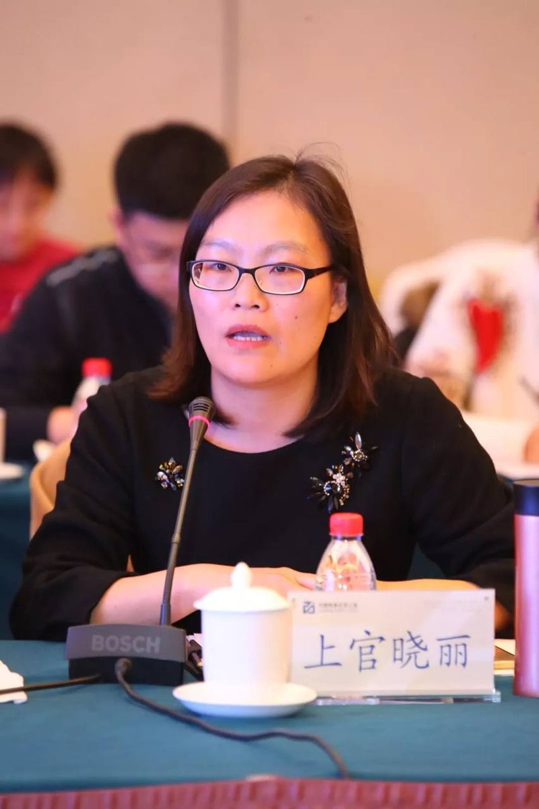

拆墙运动公号 北京时间 2024-01-31T19:54:23Z 1752661600866025677 【 #2259专案组 互联网防火墙第117号嫌犯 #上官晓丽】  
性别：女
职务：信安标委副秘书长、中国电子技术标准化研究院网络安全研究中心副主任
工作单位：北京赛西科技发展有限责任公司

官网：https://t.co/LZ1NK8udKm
详细资料见: #BanGFW拆墙运动（建墙罪犯录）：https://t.co/MClINC5RnJ

北京赛西科技发展有限责任公司
国有独资 高新技术企业 科技型中小企业 瞪羚企业

2024-01-19更新
统一社会信用代码：91110302678204402X
法定代表人：程多福
关联企业 1
注册资本：3100万元人民币
成立日期： 2008-07-20
邮箱1、：sunst@cesi.cn
2、gujd@cesi.cn

地址：北京市北京经济技术开发区荣华中路10号1幢13层2单元1603
战略合作伙伴：1、中共恶人榜：#ccpevils       
 2、#zhinawiki   拆墙运动公号 北京时间 2024-01-31T06:21:38Z 1752457068961763392 RT @LawrenceSellin: China's United Front Work Department (UFWD) conducts influence and espionage operations in the United States, working t…   