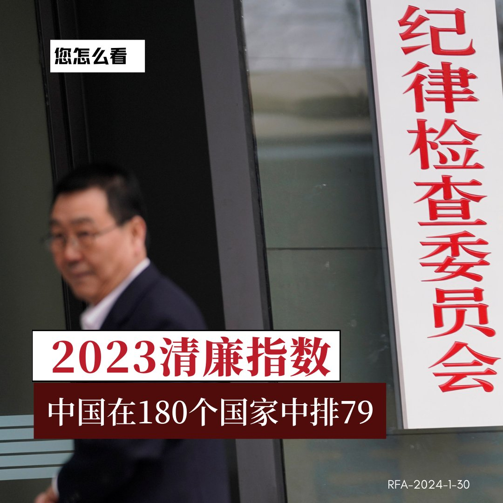
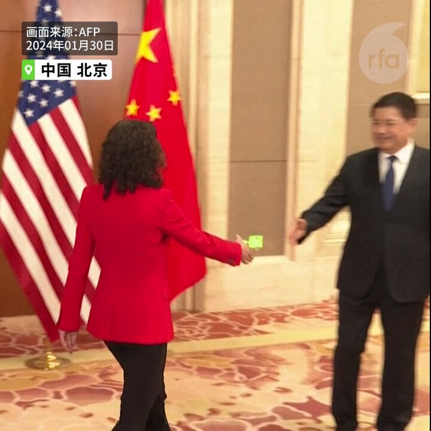
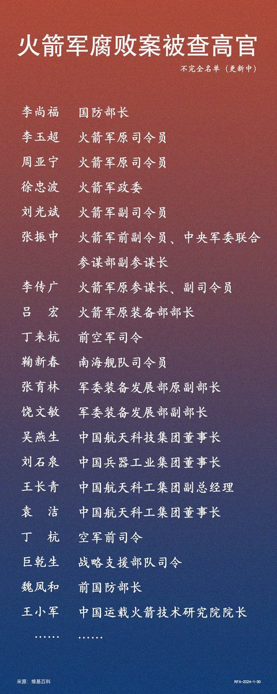
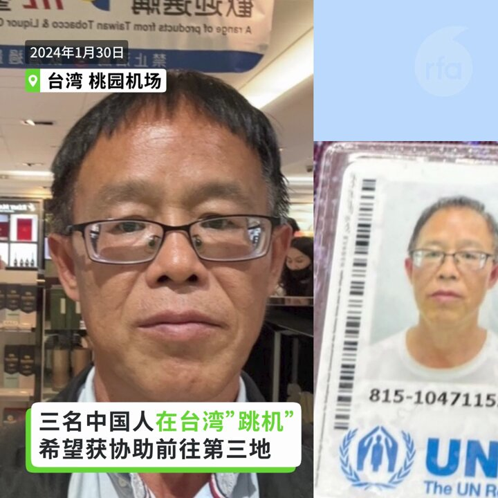

自由亚洲电台 北京时间 2024-01-31T03:07:15Z 1752408149930217663 港府宣布启动《＃基本法》 ＃23条 立法谘询后，香港股市的  ＃恒生指数 应声下跌，海外人权组织也忧虑港人的自由和权利再受损。
这条新的 ＃香港国安法 例，将对香港的经济和公民社会带来什么影响？

https://t.co/Plw1PeqFlD   自由亚洲电台 北京时间 2024-01-31T05:19:28Z 1752441420902694984 中共在强调今年要优化 ＃民营企业 发展环境，促进民营经济发展壮大之际，江苏一家民企近日公开悬赏人民币100万元，征集一名市场监管官员的违法线索，指控他不断滥权骚扰。https://t.co/ZJHM8b0YxH   自由亚洲电台 北京时间 2024-01-31T05:22:07Z 1752442088686526692 1月30日，国际组织透明国际发表发表“2023年度腐败指数”报告，对全球180个国家和地区的腐败程度进行排名，中国2023年度腐败指数42分，排名第79。有网友认为，中国的严重腐败不是能用指数表现出来的。对此，#您怎么看？ https://t.co/We2ZAoFITz   自由亚洲电台 北京时间 2024-01-31T05:47:16Z 1752448418923094497 【美中在北京重启 ＃芬太尼 会谈】
１月３０日，由美国国土安全副顾问Jen Daskal率领的华盛顿代表团抵达北京，出席 ＃禁毒合作工作组 首次会议。 https://t.co/zYgAmWDkIG   自由亚洲电台 北京时间 2024-01-31T05:53:06Z 1752449886006501469 据法媒30日消息，＃加拿大移民和难民局 发现音译为张晶（Jing Zhang）的女士，曾为中国国务院 ＃侨务办公室 （OCAO）工作，并认为该机构在加拿大从事间谍活动。https://t.co/ygPYAUzSLh   自由亚洲电台 北京时间 2024-01-31T06:06:25Z 1752453238517907495 RT @RFA_Chinese: 【欢迎加入自由亚洲电台电报群】https://t.co/UkKZmFSRkG https://t.co/Qid2LNZxJn   自由亚洲电台 北京时间 2024-01-31T06:12:16Z 1752454710374896030 1月29日，中国全国政协会议撤销曾担任中国运载火箭技术研究院院长 #王小军 的政协委员资格。
#火箭军 持续遭整肃，网民议论：从研发到部队的实装，整个链条主官全部落马，仅仅是因为 #腐败 吗？火箭军究竟实力如何？ 
＃您怎么看？ https://t.co/lIphPL7UIv   自由亚洲电台 北京时间 2024-01-31T02:43:37Z 1752402202549772494 前有 ＃五十万， 后有 ＃十杯茶。
传唤手续下放，人口、经济、物价都属“国安”
https://t.co/FNxeVH7wBa   自由亚洲电台 北京时间 2024-01-31T03:56:57Z 1752420654513533183 虽然中国拒绝在俄乌危机及哈以冲突中选边站队，但北京的官方态度一再向俄罗斯及哈马斯倾斜。1月30日，美国众议院美国与中国共产党战略竞争特设委员会就此举行听证，以审议中国政府对美国对手国家的支持。https://t.co/DVo54XTBNQ   自由亚洲电台 北京时间 2024-01-31T04:13:39Z 1752424859047719006 【三名中国人在台湾跳机】
去年十一月先出逃至泰国，１月３０日自马来西亚飞抵台湾的中国公民田永德及韦亚妮和黄星星母子共三人当天深夜在台湾桃园国际机场，向自由亚洲电台表示不返回北京将跳机寻求台湾政府协助至第三地。
https://t.co/aOA2ZK4ONJ https://t.co/lLJN6rm3zK   自由亚洲电台 北京时间 2024-01-31T00:47:19Z 1752372931710038328 近日，中国天主教官网和 ＃梵蒂冈教廷 官方新闻网在同一天发布了两位中国新主教祝圣的消息。梵蒂冈新闻网强调，两人都是由教宗任命。但 ＃中国天主教 官网则未见相关表述。有评论认为，此举显示双方关系在一段时间的不和之后，正恢复合作。 https://t.co/5KClxh5MrG   自由亚洲电台 北京时间 2024-01-31T02:13:53Z 1752394716660765093 中国国安部示警十种情况“请喝茶” 
龚与剑：“＃十杯茶”形同 ＃口袋罪   人口、经济、物价都属“国安”
https://t.co/FNxeVH7wBa   