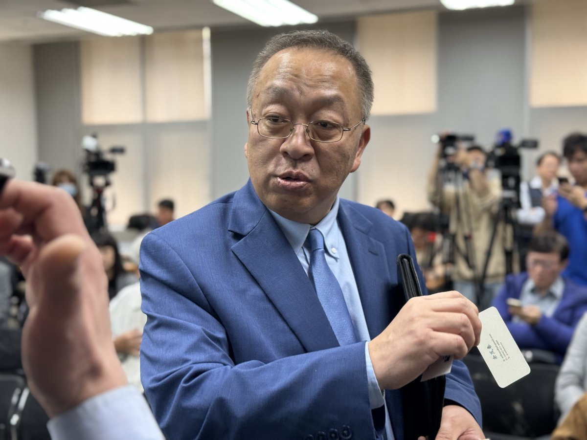
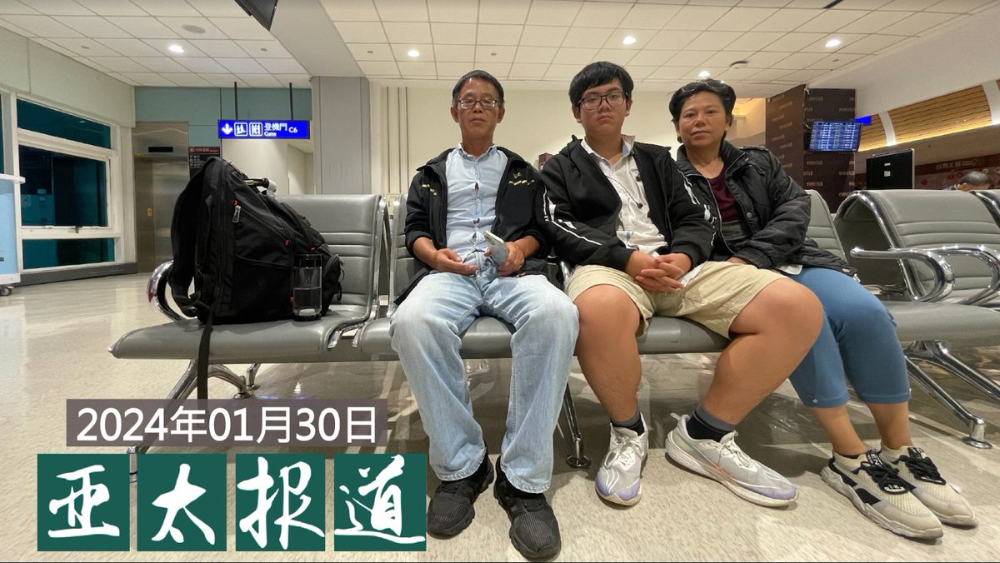

自由亚洲电台 北京时间 2024-01-31T19:31:29Z 1752655838890856603 【#余茂春：中共太大 太胖 内部有很多毛病】
【不能以武力改变台海现状 任何美国总统不可能改变这点】
美国智库哈德逊研究所(Hudson Institute)中国中心主任余茂春31日以“美国台海政策之现状与未来”为题在台发表演说，他说来台访问期间，最多人关心的是美国若是政权更替，对台政策有何变化。
他解释，外界很关注领导阶层更替的变化，然而美对台基本政策框架无法改变。这不在于外交承认与否等等，从1950年代韩战开始，杜鲁门总统派遣第七舰队进入台湾海峡时，就已奠定“不能以武力改变现状”的基调。当时是为了阻止国民政府反攻大陆；现在指的当然是“中共”，这件事万变不离其宗，以不变应万变，任何美国总统都不可能改变这点。
余茂春上午见蔡英文总统时告诉她，中共太大、太胖，体弱，内部有很多毛病，不一定中国大就有绝对优势，它的内政、外交、民心…等有很多毛病。https://t.co/uhRcAcfJpP   自由亚洲电台 北京时间 2024-01-31T17:51:17Z 1752630623729263030 【#余茂春:不能使用武力改变台海现状】
【任何美国总统都不可能改变这点】
美国智库哈德逊研究所中国中心主任余茂春31日在台北演讲时强调，自1950年韩战以来，杜鲁门总统派遣美国第7舰队来到台湾海峡就奠定了“不能使用武力改变台海现状”的美国对台政策，任何美国总统都不可能改变这点，他要台湾放心。他也提醒，中国若向台湾打第一枪，之后一定会去联合国大会，就台湾是否为中国的一部分进行投票。
余茂春是随哈德逊研究所(Hudson Institute)访问团在台湾访问，先后见了蔡英文总统和总统当选人赖清德。   自由亚洲电台 北京时间 2024-01-31T15:42:09Z 1752598127574761508 【美国出口禁令影响】
【美半导体设备供应商从中国撤出10亿美元制造业】
美国半导体测试设备供应商泰瑞达的发言人周一说，泰瑞达去年已将价值约10亿美元的生产制造撤出中国。中国业内人士说，受到美国出口管制的影响，美国半导体测试设备在中国市场前景日趋黯淡。详细报道：https://t.co/GhfsV9ZXsI https://t.co/4vrQZ9sqiR   自由亚洲电台 北京时间 2024-01-31T11:42:27Z 1752537802179297416 RT @RFA_Chinese: 【三名中国人在台湾跳机】
去年十一月先出逃至泰国，１月３０日自马来西亚飞抵台湾的中国公民田永德及韦亚妮和黄星星母子共三人当天深夜在台湾桃园国际机场，向自由亚洲电台表示不返回北京将跳机寻求台湾政府协助至第三地。
https://t.co/aOA2…   自由亚洲电台 北京时间 2024-01-31T11:42:49Z 1752537893757706701 RT @RFA_Chinese: 欢迎收听和订阅播客【＃亚太报道】 https://t.co/MjLNSvVMqc
三名中国人在 ＃台湾桃园机场 ＃跳机；香港启动《基本法》＃23条立法；中国警方发布“＃十杯茶”文章；＃张忠顺 因“ ＃厦门聚会案” 被起诉；中梵同天发布 ＃祝圣…   自由亚洲电台 北京时间 2024-01-31T11:43:57Z 1752538180522283058 RT @RFA_Chinese: 1月29日，中国全国政协会议撤销曾担任中国运载火箭技术研究院院长 #王小军 的政协委员资格。
#火箭军 持续遭整肃，网民议论：从研发到部队的实装，整个链条主官全部落马，仅仅是因为 #腐败 吗？火箭军究竟实力如何？ 
＃您怎么看？ https:/…   自由亚洲电台 北京时间 2024-01-31T10:05:26Z 1752513388289159247 专栏 | #中国最钱线：苦中作乐的"#中华大旅行" https://t.co/FdmmUbIvFI   自由亚洲电台 北京时间 2024-01-31T04:35:37Z 1752430387471524185 美国非营利组织"中国行动"两周前公布了"#全民非暴力不合作行动方案"征文获奖名单，其中《构建颠覆性平行结构路线图》一文获得了一等奖。这个由中国青年人设计的方案传递了什么样的思想？又为什么获得了评委会的认可？
https://t.co/qgdw1OrygU   自由亚洲电台 北京时间 2024-01-31T08:00:08Z 1752481857202245858 欢迎收听和订阅播客【＃亚太报道】 https://t.co/MjLNSvVMqc
三名中国人在 ＃台湾桃园机场 ＃跳机；香港启动《基本法》＃23条立法；中国警方发布“＃十杯茶”文章；＃张忠顺 因“ ＃厦门聚会案” 被起诉；中梵同天发布 ＃祝圣 消息。 https://t.co/XHxhgbf9oi   自由亚洲电台 北京时间 2024-01-31T01:37:08Z 1752385468358881773 1月30日，三名此前逃离中国前往泰国的中国公民　＃田永德、韦亚妮和黄星星从马来西亚搭机抵达　＃台湾。但三人告诉自由亚洲电台，他们决定　＃跳机　滞留台湾，原因是回中国恐有入狱风险，并希望台湾政府同意他们停留直至前往第三地。
https://t.co/V6N9x79qZu   自由亚洲电台 北京时间 2024-01-31T03:07:15Z 1752408149930217663 港府宣布启动《＃基本法》 ＃23条 立法谘询后，香港股市的  ＃恒生指数 应声下跌，海外人权组织也忧虑港人的自由和权利再受损。
这条新的 ＃香港国安法 例，将对香港的经济和公民社会带来什么影响？

https://t.co/Plw1PeqFlD   自由亚洲电台 北京时间 2024-01-31T05:19:28Z 1752441420902694984 中共在强调今年要优化 ＃民营企业 发展环境，促进民营经济发展壮大之际，江苏一家民企近日公开悬赏人民币100万元，征集一名市场监管官员的违法线索，指控他不断滥权骚扰。https://t.co/ZJHM8b0YxH   自由亚洲电台 北京时间 2024-01-31T05:22:07Z 1752442088686526692 1月30日，国际组织透明国际发表发表“2023年度腐败指数”报告，对全球180个国家和地区的腐败程度进行排名，中国2023年度腐败指数42分，排名第79。有网友认为，中国的严重腐败不是能用指数表现出来的。对此，#您怎么看？ https://t.co/We2ZAoFITz   自由亚洲电台 北京时间 2024-01-31T05:47:16Z 1752448418923094497 【美中在北京重启 ＃芬太尼 会谈】
１月３０日，由美国国土安全副顾问Jen Daskal率领的华盛顿代表团抵达北京，出席 ＃禁毒合作工作组 首次会议。 https://t.co/zYgAmWDkIG   自由亚洲电台 北京时间 2024-01-31T05:53:06Z 1752449886006501469 据法媒30日消息，＃加拿大移民和难民局 发现音译为张晶（Jing Zhang）的女士，曾为中国国务院 ＃侨务办公室 （OCAO）工作，并认为该机构在加拿大从事间谍活动。https://t.co/ygPYAUzSLh   自由亚洲电台 北京时间 2024-01-31T06:06:25Z 1752453238517907495 RT @RFA_Chinese: 【欢迎加入自由亚洲电台电报群】https://t.co/UkKZmFSRkG https://t.co/Qid2LNZxJn   自由亚洲电台 北京时间 2024-01-31T06:12:16Z 1752454710374896030 1月29日，中国全国政协会议撤销曾担任中国运载火箭技术研究院院长 #王小军 的政协委员资格。
#火箭军 持续遭整肃，网民议论：从研发到部队的实装，整个链条主官全部落马，仅仅是因为 #腐败 吗？火箭军究竟实力如何？ 
＃您怎么看？ https://t.co/lIphPL7UIv   自由亚洲电台 北京时间 2024-01-31T02:43:37Z 1752402202549772494 前有 ＃五十万， 后有 ＃十杯茶。
传唤手续下放，人口、经济、物价都属“国安”
https://t.co/FNxeVH7wBa   自由亚洲电台 北京时间 2024-01-31T03:56:57Z 1752420654513533183 虽然中国拒绝在俄乌危机及哈以冲突中选边站队，但北京的官方态度一再向俄罗斯及哈马斯倾斜。1月30日，美国众议院美国与中国共产党战略竞争特设委员会就此举行听证，以审议中国政府对美国对手国家的支持。https://t.co/DVo54XTBNQ   自由亚洲电台 北京时间 2024-01-31T04:13:39Z 1752424859047719006 【三名中国人在台湾跳机】
去年十一月先出逃至泰国，１月３０日自马来西亚飞抵台湾的中国公民田永德及韦亚妮和黄星星母子共三人当天深夜在台湾桃园国际机场，向自由亚洲电台表示不返回北京将跳机寻求台湾政府协助至第三地。
https://t.co/aOA2ZK4ONJ https://t.co/lLJN6rm3zK   自由亚洲电台 北京时间 2024-01-31T00:47:19Z 1752372931710038328 近日，中国天主教官网和 ＃梵蒂冈教廷 官方新闻网在同一天发布了两位中国新主教祝圣的消息。梵蒂冈新闻网强调，两人都是由教宗任命。但 ＃中国天主教 官网则未见相关表述。有评论认为，此举显示双方关系在一段时间的不和之后，正恢复合作。 https://t.co/5KClxh5MrG   自由亚洲电台 北京时间 2024-01-31T02:13:53Z 1752394716660765093 中国国安部示警十种情况“请喝茶” 
龚与剑：“＃十杯茶”形同 ＃口袋罪   人口、经济、物价都属“国安”
https://t.co/FNxeVH7wBa   