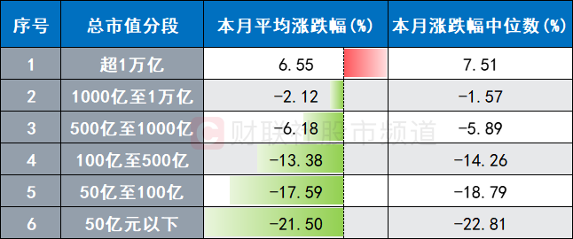

谁将十万横扫三江 北京时间 2024-01-31T19:30:58Z 1752655710088020425 2024年1月，中国股市创历史第二大奇迹，平均股价跌幅：17%。国证2000跌幅接近20%；科创50也接近20%；创业板跌幅接近17%。
即使在2016年股灾，从6124的崩盘单月跌幅也没有超过17%。这还是在救市的基础上。如果没有救市，估计平均个股跌幅会超过20%。这是历史上第二大月跌幅。第一大月跌幅：27.44%，是90年代的事情，这或许意味着曾经因为民营经济掌握部分生产资料形成的特殊政治体制要彻底变回去了，不再需要经济活力，一切经济活动仅需要服务于降低管理压力，就像76年以后花了15年部分改变体制一样，这次改回去也需要一定的时间...

1992年初，邓小平在南巡中说：“证券、股市，这些东西究竟好不好，有没有危险，是不是资本主义独有的东西，社会主义能不能用？允许看，但要坚决地试。看对了，搞一两年对了，放开；错了，纠正，关了就是了。关，也可以快关，也可以慢关，也可以留一点尾巴。”   谁将十万横扫三江 北京时间 2024-01-31T12:35:21Z 1752551116171313368 网友投稿：中铁十一局工会副主席党委组织部部长陈小刚利用网络诱骗已婚军嫂视频裸聊打飞机，此前陈小刚曾代表湖北省总工会视察襄阳市第十九中学、襄阳市妇幼保健院指导工作，弘扬铁道兵精神，打造“人民铁军” https://t.co/ybgwiG3012   