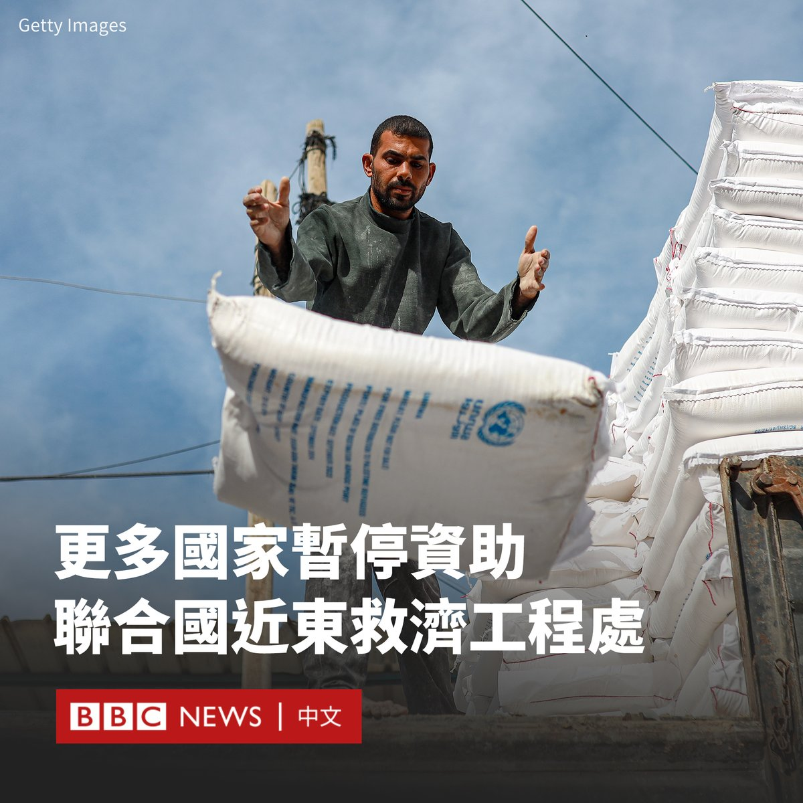
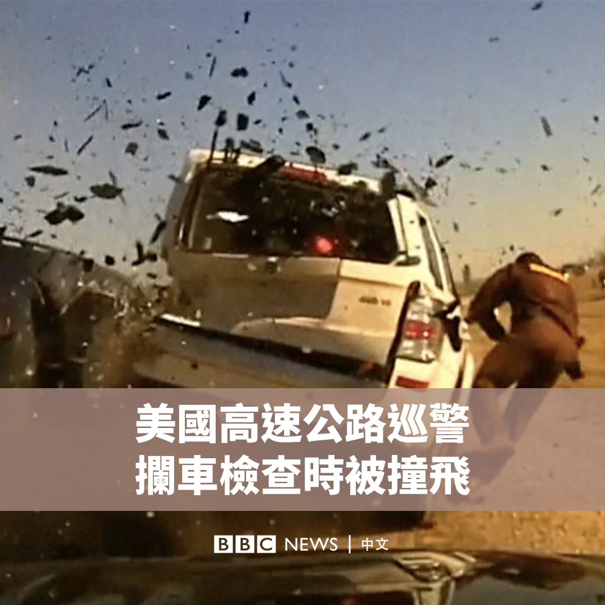
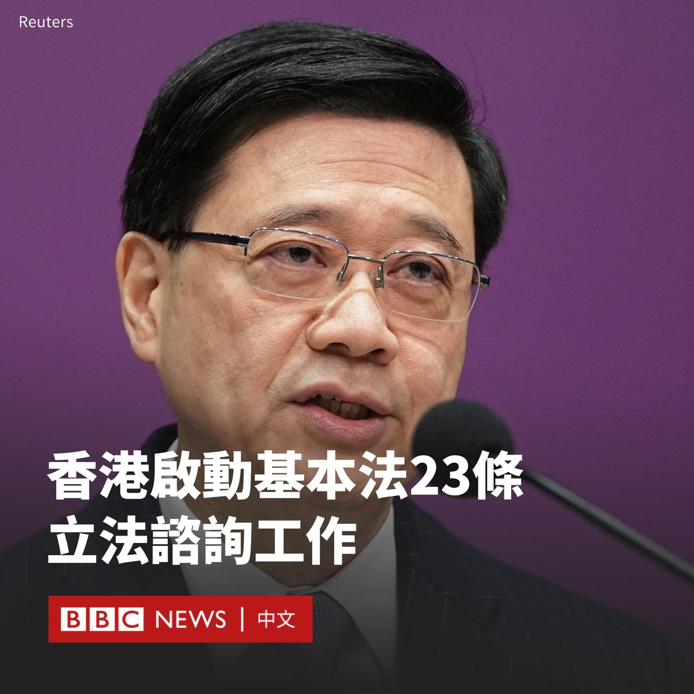
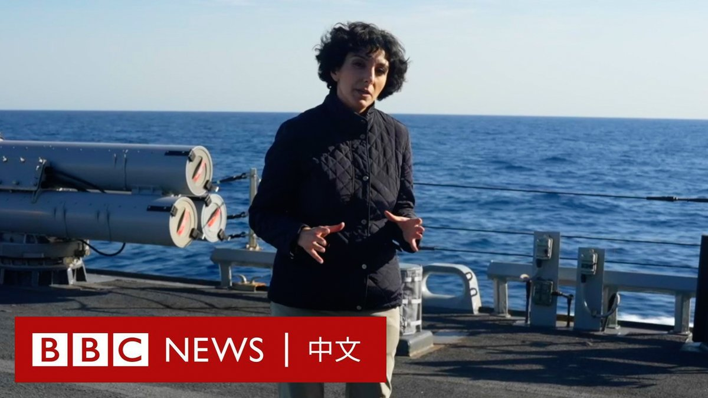

D英国广播公司BBC 北京时间 2024-01-30T18:42:43Z 1752281180811165999 在联合国近东巴勒斯坦难民救济和工程处（UNRWA）有多名雇员被控参与去年10月7日哈马斯对以色列的袭击后，多国陆续宣布停止资助该机构。

日本和奥地利表示，两国将暂停向该机构支付款项。此前，美国、英国、德国和意大利等国均已宣布将暂停资助。

近东救济工程处则对BBC说，目前的情况“极度绝望”，“加沙的人道主义需求每时每刻都在增长”。

据《纽约时报》报道，以色列情报部门的一份档案称，近200名近东救济工程处工作人员是哈马斯或伊斯兰圣战组织（杰哈德）的特工，但没有提供详细证据。档案还称，至少有12名员工于10月7日越境进入以色列。

近东救济工程处已经解雇了其中的九名雇员，并表示正在进行调查。

《华尔街日报》发表的另一篇报道也援引了以色列的情报档案，称近东救济工程处在加沙的1.2万名雇员中，约有1200人与哈马斯或伊斯兰圣战组织有联系。

周一，以色列总理内塔尼亚胡（Benjamin Netanyahu）证实了该档案的内容，称该机构“被哈马斯渗透”。

“我们发现有13名近东救济工程处的工作人员直接或间接地参与了10月7日的大屠杀。”他在接受英国TalkTV频道采访时说。“在近东救济工程处的学校里，他们一直在教授灭绝以色列的理论。”

联合国拒绝置评，称正在对该机构进行内部调查。在以色列攻打哈马斯以来，加沙有170万人逃离家园，其中许多人在近东救济工程处的设施中避难。

但周日早些时候，联合国秘书长古特雷斯（Antonio Guterres）表示，他对该机构与袭击事件有关的指控感到“震惊”。但他仍呼吁捐助国“确保近东救济工程处业务的连续性”。

美国国务卿布林肯（Antony Blinken）表示，相关报道“令人深感不安”，该组织“亟需”进行调查，以追究相关人员的责任并审查其程序。   D英国广播公司BBC 北京时间 2024-01-30T17:12:17Z 1752258420206616705 美国俄克拉荷马州公路巡逻队发布了一段录像，显示一名巡警在拦下一辆汽车时，被另一辆车撞飞，但涉事的三人都奇迹般仅受轻伤。 https://t.co/J7H1HEtbvk   D英国广播公司BBC 北京时间 2024-01-30T15:27:42Z 1752232101187821790 金融业是香港重要的经济支柱，香港股市下跌造成负财富效应，拖累楼市和消费信心，令整个香港经济弥漫悲观情绪。https://t.co/iHIh5C4G7s   D英国广播公司BBC 北京时间 2024-01-30T13:41:27Z 1752205364484014497 中国于2020年颁布《香港国安法》后，香港星期二（1月30日）开展《基本法》第23条国家安全立法咨询工作，是自2003年推动“23条立法”引起巨大争议后再次尝试。

香港特首李家超在记者会上称，港府有责任履行香港《基本法》第23条所规定的“宪制责任”，同时落实中国人大2020年的“528决定”，立法保障中国国家安全。

《基本法》第23条规定香港特区应自行立法“禁止任何叛国、分裂国家、煽动叛乱、颠覆中央人民政府及窃取国家机密的行为”，此次咨询将其五类罪行引入新条文，包括叛国、具有煽动意图行为、窃取国家秘密及间谍行为、危害国家安全的破坏，以及境外干预行为。《香港国安法》并未涵盖这些行为。

李家超称，香港社会经历了2019年他所称的“港版颜色革命”，明白到国家安全风险是严重和真实，因此必须尽快修补这块短板。

他称，英国情报机关与美国中央情报局（CIA）公开提出要加强对华、对港情报工作，“我们立法是要自卫，对抗你的攻击”。

他提到，“23条”的立法原则包括以“一国两制”为方针，秉持“尊重和保障人权”，以及依法保护言论、新闻、结社等权利和自由。

立法方式方面，李家超称将订立一条全新的《维护国家安全条例》。此次咨询期为期一个月，将于2月28日完结。

李家超被记者问及在港被捕人士会否送往中国大陆受审，他回应指根据“23条”立法的条文，所有行为都会在香港依照香港法例审判。

在2003年推动“23条”立法失败后辞任特区保安局局长，目前担任特区政府行政会议召集人兼立法会议员的叶刘淑仪近日接受BBC HARDtalk节目专访时称，2019年反政府示威后，一些人对她称，后悔并未支持她曾推动的国安立法。

英国1月23日在日内瓦联合国人权理事会对中国进行例行国别人权审议时提出，中国应当废除《香港国安法》，中国驻英国大使馆反指英国国际人权纪录“劣迹斑斑”，称“英方应多拿镜子照照自己”。   D英国广播公司BBC 北京时间 2024-01-30T11:53:52Z 1752178287995216350 在美国及其盟友反制胡塞武装袭击红海船只的行动中，巴丹号（USS Bataan）两栖攻击舰被部署至红海进行威慑。BBC获许登上这艘美国海军军舰，看看它如何工作。 https://t.co/DslHbhMkPP   D英国广播公司BBC 北京时间 2024-01-30T09:43:56Z 1752145591625531871 多年来，北京一直在加强对香港的控制。从民主活动、政治反对派到新闻自由均受到限制。那么香港的未来会如何呢？

BBC HARDtalk栏目主持史蒂文·萨克尔（Stephen Sackur）连线香港行政会议召集人叶刘淑仪，就香港国安法、港人移民潮及资金外流等问题进行对谈。https://t.co/b9FhIqqIaO   