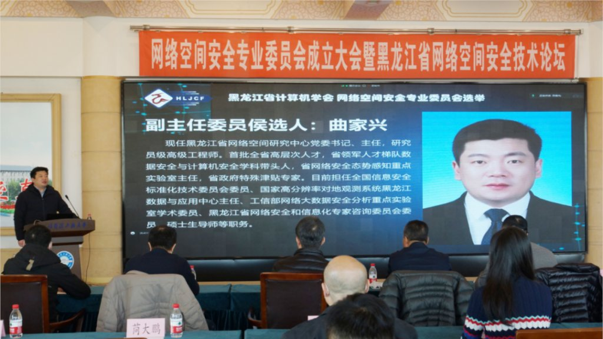

拆墙运动公号 北京时间 2024-01-30T02:58:01Z 1752043435865919565 【 #2259专案组 互联网防火墙第116号嫌犯 #曲家兴】  性别：男
职务：黑龙江省网络空间研究中心主任

现任黑龙江省网络空间研究中心党委书记、主任,研究 员级高级工程师,首批全省高层次人才,省领军人才梯队数 据安全与计算机安全学科带头人,省网络安全态势感知重点 实验室主任,省政府特殊津贴专家,目前担任全国信息安全 标准化技术委员会委员、国家高分辨率对地观测系统黑龙江 数据与应用中心主任、工信部网络大数据安全分析重点实验 室学术委员、黑龙江省网络安全和信息化专家咨询委员会委 员硕士生导师等职务。

官网：https://t.co/LZ1NK8udKm
详细资料见: #BanGFW拆墙运动（建墙罪犯录）：https://t.co/5MPMVFSqC3

黑龙江省网络空间研究中心(黑龙江省信息安全测评中心、黑龙江省国防科学技术研究院)
更新时间：2024年1月26日
法人代表：曲家兴
注册资本：2,231万元
成立日期：1970-01-01
地址： 哈尔滨市南岗区华山路12号
行政区划： 哈尔滨
统一社会信用代码： 12230000424006764J
企业类型： 事业单位营业
战略合作伙伴：1、中共恶人榜：#ccpevils          
   2、#zhinawiki   拆墙运动公号 北京时间 2024-01-30T18:32:20Z 1752278566727758009 RT @VOAChinese: 中国“边控”名单可能达数万人 男女老少皆成“国家囚徒” https://t.co/9EVGOLxz4S   拆墙运动公号 北京时间 2024-01-30T01:29:22Z 1752021129089138861 RT @poland_stan: 英國鋼琴師Brendan Kavanagh遭小粉紅騷擾！揭露驚人發現：中共頭號間諜現身？ 鋼琴師事件的案外案 https://t.co/4M7eWYa5uU   