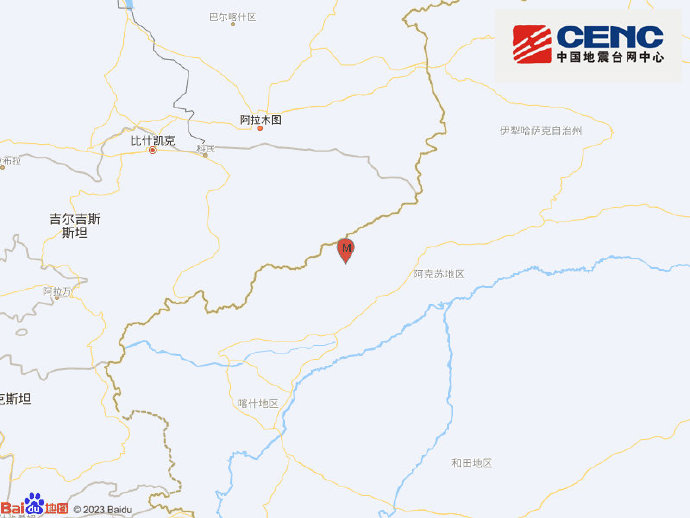
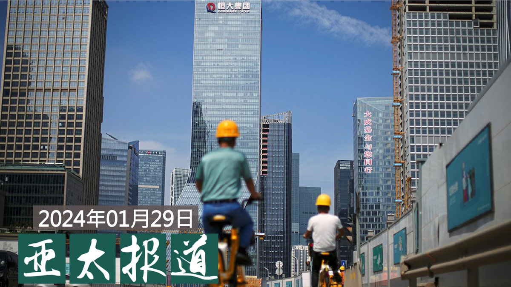
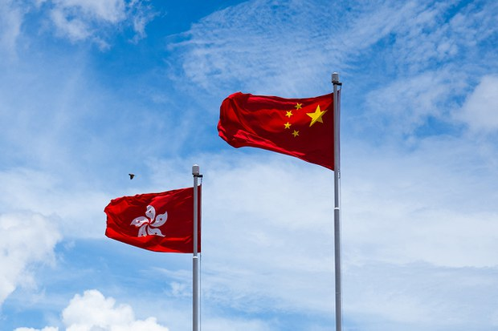
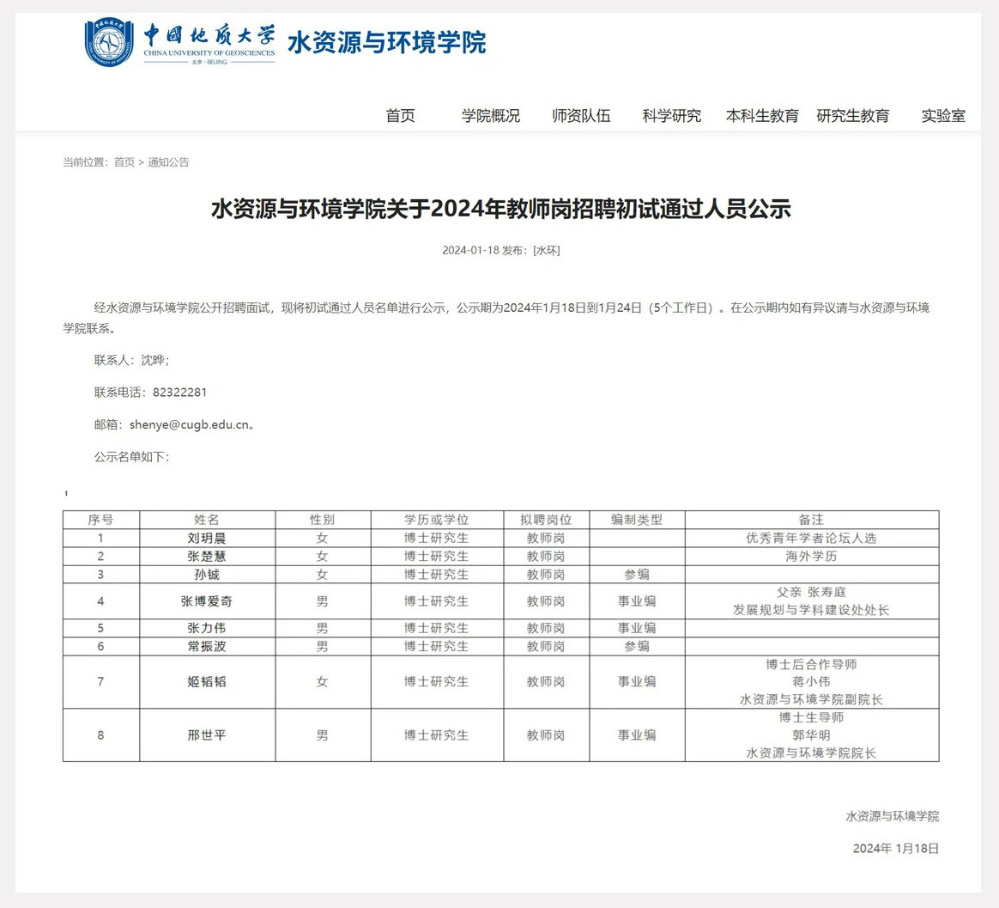
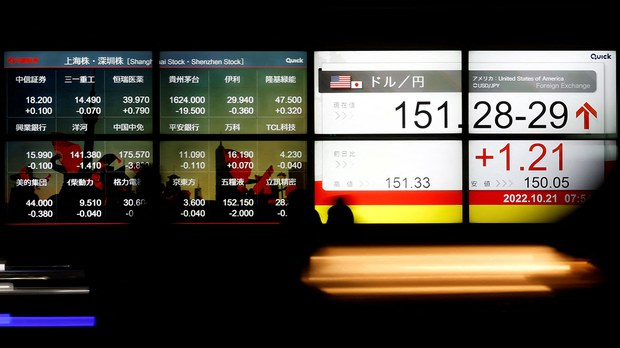

自由亚洲电台 北京时间 2024-01-30T06:52:16Z 1752102387467116581 美国白宫证实，有关打击 #芬太尼 前体化学品的工作会议将于本周二，在北京召开。
这是继去年“#拜习会”后，美中两国打破多年僵局的首次合作打击毒品犯罪会议。
https://t.co/2SVTc7sOB1   自由亚洲电台 北京时间 2024-01-30T07:00:01Z 1752104339215438080 美联社1月27日报道，自由式滑雪世界冠军 #谷爱凌 近日受访时明确表示，她计划继续代表中国参加2026年在意大利举行的冬奥会。
谷爱凌表示，这样可以让成千上万的中国女孩有机会见到冰雪运动的潜力。她还表示，希望在更广泛的女子运动领域扮演更大的角色。
#您怎么看？ https://t.co/bqwOxoeqWu   自由亚洲电台 北京时间 2024-01-30T07:37:14Z 1752113703904768070 本周一，中国最高人民法院和香港特别行政区政府律政司共同宣告，即日起相互认可和执行民商事案件判决。 https://t.co/qWKzgmI33x   自由亚洲电台 北京时间 2024-01-30T07:42:44Z 1752115089837346992 根据 #中国地震台网 正式测定：当地时间1月30日06时27分在新疆克孜勒苏州阿合奇县（北纬41.15度，东经78.67度）发生5.7级地震，震源深度10千米。 https://t.co/cfWMoiJAgx   自由亚洲电台 北京时间 2024-01-30T08:00:08Z 1752119467289776227 欢迎收听和订阅播客【＃亚太报道】 https://t.co/MjLNSvVMqc
#恒大集团 被香港高院裁定清盘；“#房住不炒”政策或淡出监管；#中国地质大学 招聘关系注明“处长儿子”；央视提出“#爱国不是生意”；#拜登 与 #习近平 有望近期通话。 https://t.co/r0iLk0pnGR   自由亚洲电台 北京时间 2024-01-30T08:30:02Z 1752126991640514955 本周一，中国最高人民法院和香港特别行政区政府律政司共同宣告，即日起相互认可和执行民商事案件判决。 https://t.co/FxsamYA5nf https://t.co/ayG8kazrHF   自由亚洲电台 北京时间 2024-01-30T05:00:01Z 1752074140914192631 专栏 | #夜话中南海：“候任外长” #刘建超 和“捞过界”的 #中联部  https://t.co/DSZQQWRr6q   自由亚洲电台 北京时间 2024-01-30T05:29:09Z 1752081469961294077 #铁链女事件两周年　在纽约街头，#王涵 每日白天在时代广场附近发放关于铁链女的传单，手持写有“两年了你在哪里”、“#这个世界不要俺了”字样的标语牌和铁链女画像，用扩音器以英语高喊“请关注这个女人，这个女人作为性奴被贩卖，并且作为生育机器达数十年。在中国许多农村地区，新娘买卖仍然是一个普遍的习俗。”https://t.co/YGImYDm6rp   自由亚洲电台 北京时间 2024-01-30T06:17:34Z 1752093655211634907 【恒大遭清盘　会不会成为中国的雷曼时刻？】
历经两年多违约、重组等债务危机的龙头房企 #恒大 集团，本周一终于迎来法院的清盘裁决。那么，恒大在地产行业的谢幕给中国经济敲响了什么样的警钟呢？有学者认为，恒大遭清盘可能会引发更大的连锁反应。 https://t.co/4GPgwXa3P1   自由亚洲电台 北京时间 2024-01-30T02:30:12Z 1752036436386164736 【#小粉红 将 #境外势力 团结在一起】
英国钢琴家布兰登·卡瓦纳 @brenkav 在 #黄明志 新歌《#龙的传人》下方留言，“我超爱这首歌，你应该来英国，我们一起拍视频！”
黄明志置顶这条留言，并表示：“谢谢K博士！如果你来台湾或是马来西亚务必告诉我！但是，‘#不要碰我'。"
https://t.co/1rRkqQMgdn   自由亚洲电台 北京时间 2024-01-30T03:10:38Z 1752046610287059427 #英国钢琴家 卡瓦纳大战"#小粉红"的事件引发全球关注，加拿大民众也热议讨论。同样的事件如果发生在加拿大，会不会违反 #肖像权？
https://t.co/o84MxEsW0G   自由亚洲电台 北京时间 2024-01-30T03:46:50Z 1752055724208001211 #中国地质大学水资源与环境学院招聘教师事件：大学公示列出8名通过初试的人选名单，备注栏列出其中3人背景，例如张姓博士研究生的父亲，是学校发展规划与学科建设处处长，其他二人则与院长和副院长为师生关係。
这是信息公开还是公器私用？
https://t.co/6r6FUtf7cP https://t.co/QXqRR5csC4   自由亚洲电台 北京时间 2024-01-30T04:11:40Z 1752061972089393344 由于对中国经济前景失去信心，中国散户投资者的资金正在大幅度向美国、日本等境外国家移动，尽管他们需要为购买境外资产付出高昂的溢价。
 https://t.co/qGOeyFlVPB   自由亚洲电台 北京时间 2024-01-30T04:12:08Z 1752062091157192846 由于对中国经济前景失去信心，中国散户投资者的资金正在大幅度向美国、日本等境外国家移动，尽管他们需要为购买境外资产付出高昂的溢价。
 https://t.co/jlq54c3OUz https://t.co/g412zEmYNo   自由亚洲电台 北京时间 2024-01-30T00:35:28Z 1752007562273141144 美国国家安全顾问 #沙利文 与中国外交部长 #王毅 在泰国曼谷举行会晤后，白宫表示，美中双方将寻求更多的高层外交和磋商，包括安排总统 #拜登 和中国领导人 #习近平 在未来数月内通话。
https://t.co/sDC8FHb0tR   自由亚洲电台 北京时间 2024-01-30T00:44:35Z 1752009856419045639 RT @RFA_Chinese: 【中国政府的支持率到底有多高？】
近日，美国学者在《中国季刊》发文，建议学者们不要再用直接提问式调查来衡量中国公民的政治观点，因为他们在当代中国进行的两项调查实验的结果清楚表明，中国公民会因为害怕受到政府打压而隐藏自己对中共的反对。 https…   自由亚洲电台 北京时间 2024-01-30T01:12:42Z 1752016933921177992 #恒大 爆雷七次延期终遭清盘
象征 #中国房地产泡沫 破裂？
中国房企加杠杆举债模式就此终结？
https://t.co/TF9FiiNeNo   自由亚洲电台 北京时间 2024-01-30T01:44:07Z 1752024840511291447 中国住建部表示要建立"#城市房地产融资协调机制"，并出台具体措施，提振房地产市场。
这是否意味着“#房住不炒”政策正在淡出市场吗？
https://t.co/s0JdmqTnvV   