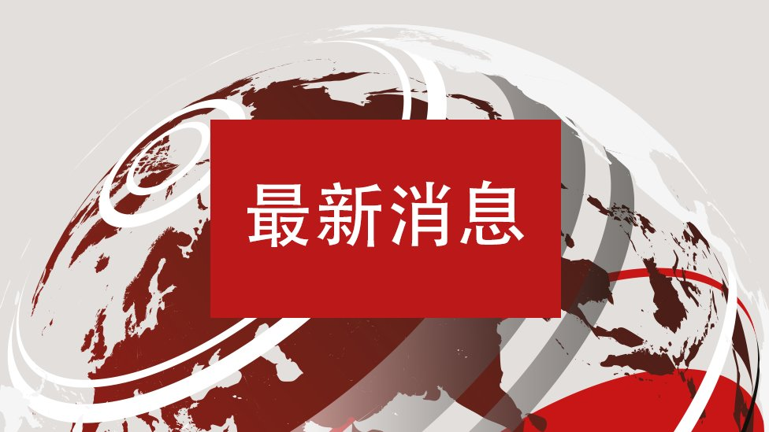
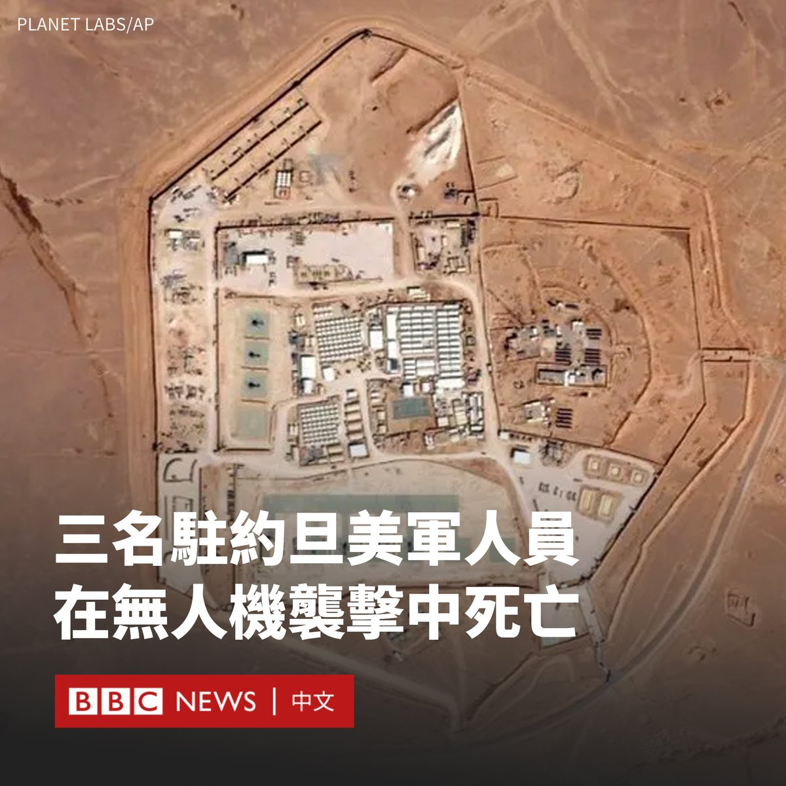
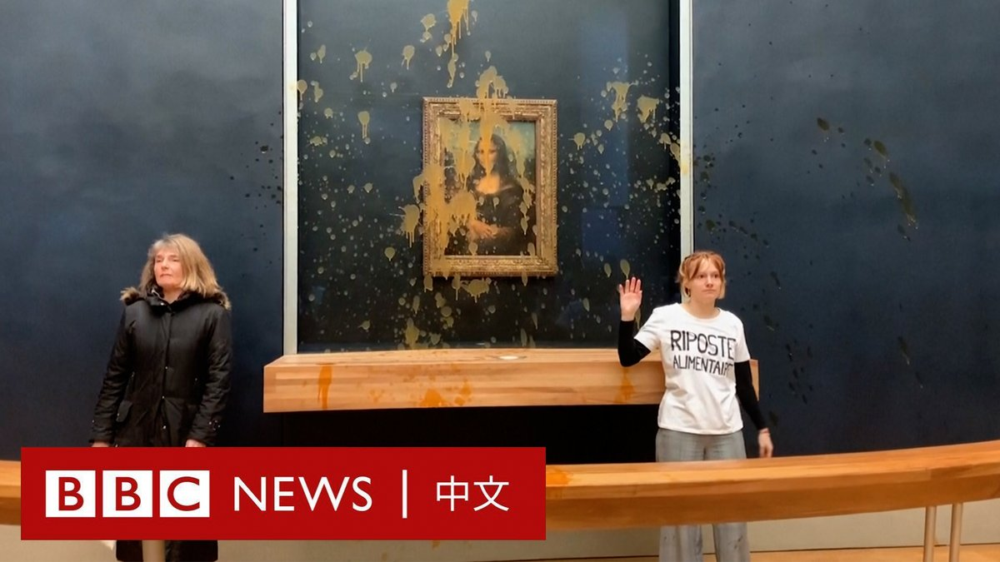

D英国广播公司BBC 北京时间 2024-01-29T15:35:24Z 1751871653041041823 中国官方公布的人口数据显示，该国人口连续第二年下降。中国的人口数量会就此萎缩下去吗，它将产生怎样的影响？https://t.co/M4DyB5Avah   D英国广播公司BBC 北京时间 2024-01-29T12:26:57Z 1751824225131004281 【最新消息】香港高等法院向中国恒大集团发出清盘令，中国恒大、恒大汽车和恒大物业股票盘中停牌。

负债2.4万亿元人民币的中国恒大两年多前已停止偿还债务，此后一直在与债权人进行重组谈判，但在经历多次延期后，这家中国房地产巨头未能与债权人达成重组协议。 https://t.co/57TclQxsft   D英国广播公司BBC 北京时间 2024-01-29T13:47:01Z 1751844374999453876 约旦与叙利亚边境附近的一个美军基地遭到无人机袭击，造成三名美国军人死亡，34人受伤。

这是自加沙战争爆发以来，首度有美军士兵在中东地区死亡。

美国总统拜登（Joe Biden）表示，这次袭击是由“伊朗支持的激进武装组织”实施的，并誓言将“追究所有责任人的责任”。

伊朗否认与这次袭击有任何牵连，称该言论“带有特定的政治目的，目的是扭转该地区的现实”。

美国军方表示，该地区的美军基地还遭遇过其他袭击，但在周日之前没有人员死亡。

美国官员表示，至少有34名军事人员正在接受可能的创伤性脑损伤评估，一些受伤士兵已实施医疗后送进行进一步治疗。

美国中央司令部和拜登表示，袭击发生在约旦东北部靠近叙利亚边境的一个基地。它后来被美方称为“22号塔”（Tower 22）。   D英国广播公司BBC 北京时间 2024-01-29T09:27:43Z 1751779121074712708 在法国卢浮宫，两名环保抗议者周日（1月28日）向受到玻璃保护的《蒙娜丽莎》（Mona Lisa）泼洒南瓜汤，要求获得“健康和可持续食品”的权利。

《蒙娜丽莎》是文艺复兴时期达芬奇创作的画作，也是世界上最著名的艺术作品之一。卢浮宫博物馆称，这幅作品被放置在玻璃罩后面，没有受到损坏。

现场影片显示，两名“泼汤”的女子在画作前发言：“什么更重要？艺术还是获得健康和可持续食物的权利？”、“你们的农业系统病入膏肓。我们的农民正在工作中死去。”

在两人泼洒液体后，博物馆工作人员在他们面前放上黑色挡板，并开始疏散访客。

该事件发生之际，法国农民正在全国各地举行抗议活动。一个名为“粮食反击”（Riposte Alimentaire）的组织声称对该行为负责，并称其目的是呼吁将食品纳入社会保障体系。

法国文化部长拉奇达·达蒂（Rachida Dati）谴责说，“没有任何理由”可以为攻击《蒙娜丽莎》而辩解。   