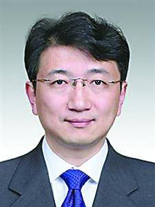
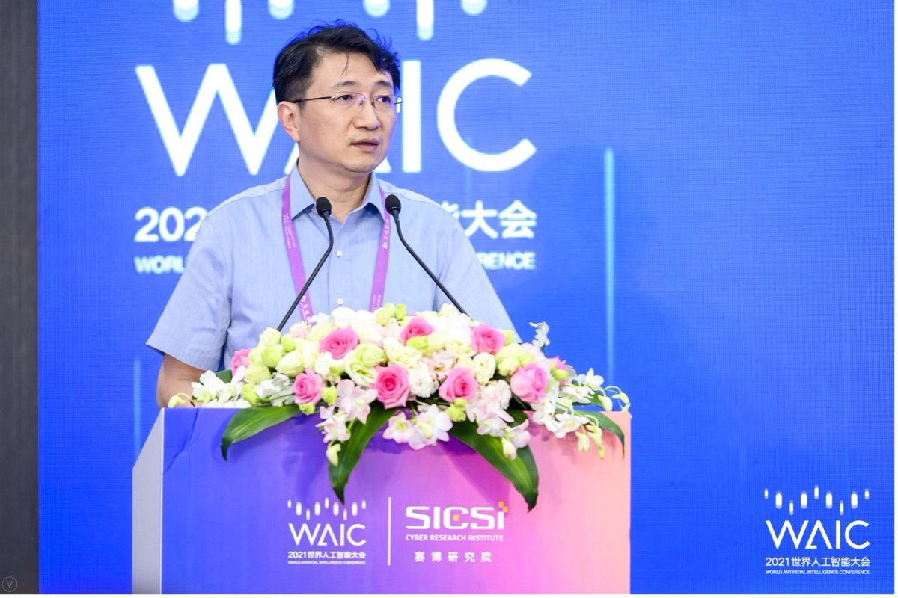
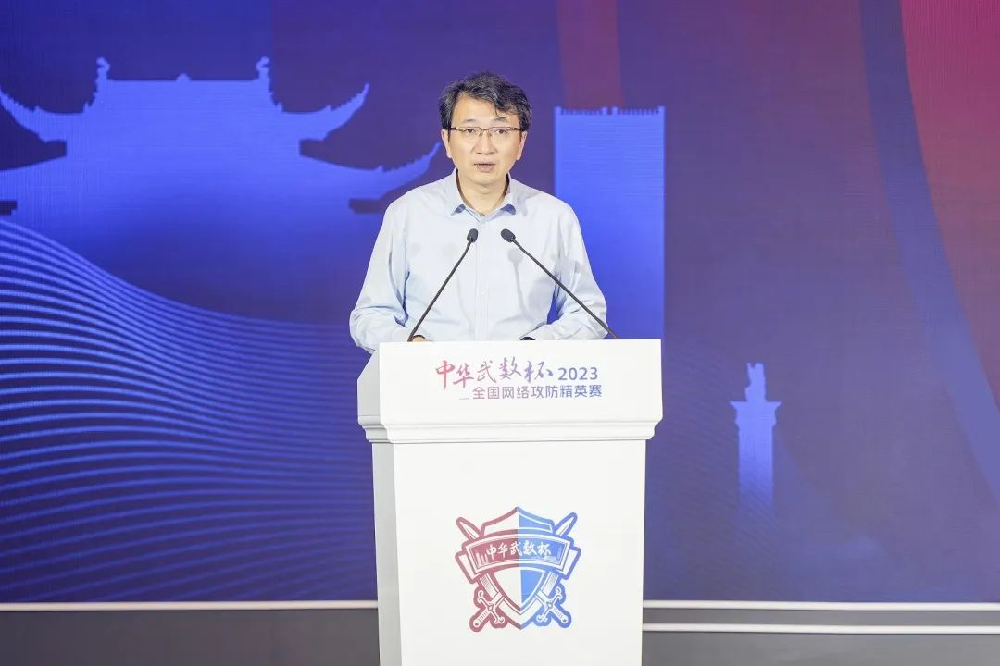

拆墙运动公号 北京时间 2024-01-29T05:10:57Z 1751714504285561252 【 #2259专案组 互联网防火墙第115号嫌犯 #杨海军】 
性别：男
出生日期：1973年3月出生
民族：汉族
上海市委对外宣传办公室副总工程师

现任中共上海市委对外宣传办公室（上海市人民政府新闻办公室、上海市互联网信息办公室）副总工程师、网络技术处处长、上海市城市运行管理中心兼职副主任。

官网：https://t.co/LZ1NK8udKm
详细资料见: #BanGFW拆墙运动（建墙罪犯录）：https://t.co/99FoCGJRnd

杨海军，男，1973年3月出生，汉族，籍贯浙江鄞县，全日制研究生，工学博士，2001年7月参加工作，2005年12月加入中国共产党。

人物履历

曾任中共上海市委对外宣传办公室（上海市人民政府新闻办公室、上海市互联网信息办公室）副总工程师、网络技术处处长。
2020年3月，中共上海市委对外宣传办公室（上海市人民政府新闻办公室、上海市互联网信息办公室）副总工程师、网络技术处处长，上海市城市运行管理中心兼职副主任。

任免信息

2020年3月26日，市人民政府决定：任命杨海军为上海市城市运行管理中心兼职副主任。

中共上海市委网络安全和信息化委员会
战略合作伙伴：1、中共恶人榜：#ccpevils           
 2、#zhinawiki   拆墙运动公号 北京时间 2024-01-29T05:44:27Z 1751722932114436275 RT @LinShengliang: 這個必有須轉，勿忘 #鐵鏈女   