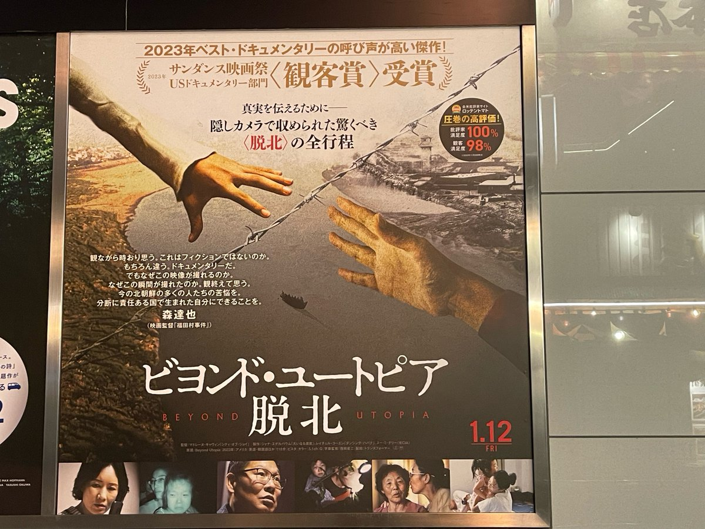
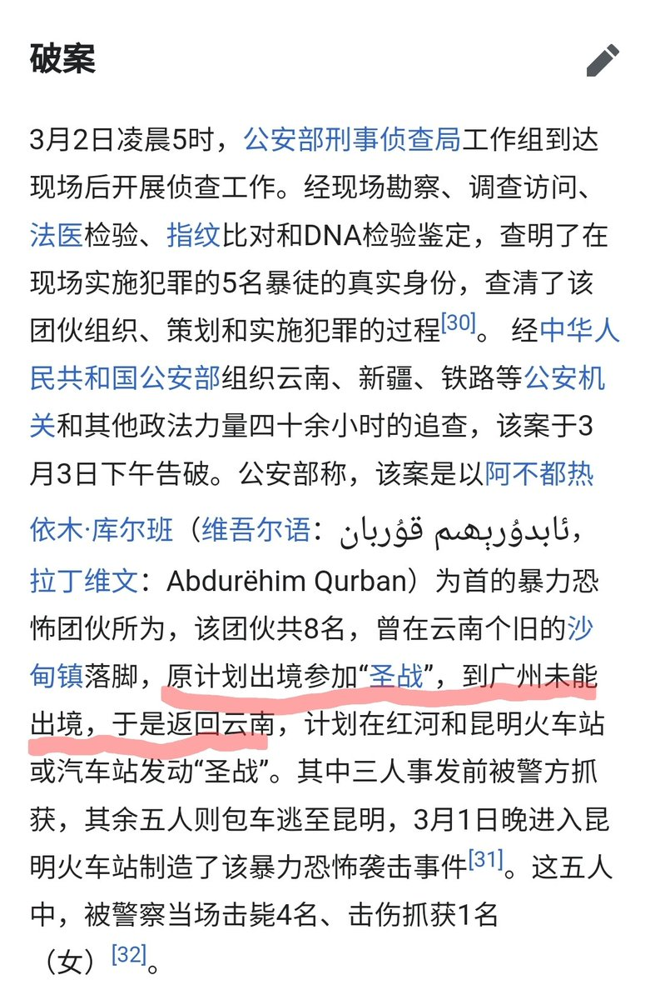

谁将十万横扫三江 北京时间 2024-01-29T19:11:59Z 1751926157942157794 关于脱北者的纪录片，一位脱北者的评价，含剧透

电影一开始就说，脱北最困难的并不是跨越鸭绿江或图们江离开朝鲜，而是逃出中国。

被中国警察抓住会被遣返回朝鲜，等于是死刑。越南和老挝也是如此，只有到了泰国他们才算安全。

他们首先在边境的深山里等待接应，在这期间被村民发现的话，有可能被举报、有可能被敲诈、有可能被心善的人放过、年轻女性有可能被拐卖去给人做媳妇或者被卖给卖淫组织⋯⋯

今年的1月23号，中国外交部发言人还说，中国没有脱北者一说

组织脱北的组织，是位于韩国的民间组织Underground Railroad。名字取自19世纪美国，帮助南方蓄奴州黑人逃亡去北方州的同名组织。但他们无法进入朝鲜和中国活动，只能负责斡旋。已脱北者找他们帮忙联系蛇头，通过蛇头联系在朝鲜的家人，朝鲜的家人同意出逃的话，再随蛇头逃亡。其中也有中国警察受贿并提供帮助。

纪录片里，这个韩国组织主要出面的人是一位牧师，他90年代跟着老师去东北传教，在那时遇到了脱北者。当年中国方面的管控没有现在这么严厉，脱北者可以在东北当黑户。他第一次和北朝鲜的人打交道，感到自己真的和他们是说同一种语言的同一民族，于是走上了帮助脱北者的道路。他的妻子也是脱北者。妻子说自己对他一见钟情，因为朝鲜男人都很瘦，而这位牧师看起来胖胖的，像伟大领袖金日成一样帅气。。。

中国官方表示如果他再入境中国的话，无法保证其人身安全；韩国官方也并不支持他们的活动。

脱北者比起想着要逃离朝鲜，比如说是无法生存了才不得不逃离。因为他们接受的教育是朝鲜是人间天堂，国外水深火热。所以并不那么积极地想润。

亲人脱北之后，留在朝鲜的亲族就会被监视、丢工作、被批斗、乃至被流放（被扔进荒山中自生自灭，等同于死刑）这时在韩国的亲人通过蛇头联系过来，他们才会想，反正留下也是死，不如试试去人间炼狱（韩国）看看：亲人在那边也还活着呢。

朝鲜内部无法跟拍，只能靠口述。有秘密摄像机拍摄到学校、生活、拷打的各种画面。
中国境内的路程也无法跟拍，但蛇头帮忙拍了一些画面；摄制组跟拍了他们在越南、老挝和泰国的路程，惊心动魄。

剧组打算拍两组脱北者的行程。
第一个是个十几岁男孩，他的妈妈多年前逃去了南韩。他想见到妈妈，劝说妈妈回朝鲜重新做人。他进入了中国，被蛇头接应到，在深山里拍了照片发给妈妈：这是妈妈第一次见孩子长大后的样子。

拍完照片2小时后，他被中国方面逮捕遣返。在那之后，朝鲜的蛇头有试图打听消息和贿赂，但无济于事。只知道他遭受了拷打，被送进监狱，最后孩子大概是死了。孩子的外婆一开始就拒绝离开朝鲜，但也被连坐流放。
外婆通过蛇头告诉女儿：自己年纪大了快要死了，想要再见一面。女儿哭：这辈子再也见不到了

另一组是一家五口。80岁的奶奶，50岁的夫妇，两个小女儿。
奶奶的另一个儿子逃去了韩国，所以他们家一直被监视，警察也时不时来搜刮财物。促成他们脱北的契机是，他们听说要被流放（死）了，才不得不匆匆逃亡。

对被监视的他们来说，逃离朝鲜的机会只有一次：秋天祭祖的节日。那一天所有人都上山祭祖，监视也松懈了。于是5人假装去祖坟祭拜，然后直接逃去了中国。
他们先是在山里藏身，被村民发现，但没有被举报，也没有被拐卖；之后从村民那里换了些衣服，再等受贿的警察接应，用警察的车去中转站。

在中国的时时刻刻他们都提心吊胆，无处不在的警察、监控对他们来说都是威胁。他们先是去了青岛，再从青岛穿越整个中国去广西，然后偷渡到越南（可能是海路，但纪录片为了安全考虑没有揭露偷渡手法。）

越南也不安全，被抓的话也会被遣返回朝鲜，但至少这里监控和警察都少了很多。
从越南去老挝则是要深夜穿越热带雨林，80岁老太太和两个小女孩体力有限；蛇头也不老实，故意绕圈子要敲诈更多钱。最终他们在热带雨林里爬了十个小时。
老挝到泰国的国境，是湄公河。他们走毒贩的路线，深夜用小船偷渡。过河时被发现的话会被警察当作是毒贩，可能会被开枪打死；即使不被发现，在一片漆黑的湄公河上乘小船这件事本身也足够危险：不久之前就有5个朝鲜人在这里淹死了。

牧师告诉他们：到泰国之后你们要做的第一件事就是，被警察发现！告诉村民你们是朝鲜人！别怕！这里的警察会保护你们！他们不是朝鲜，不是中国越南老挝，是泰国！警察不会送送你们回去的！不要怕警察！

一家人在越南老挝边境的藏身处停留歇息。那是村里的一座没装修的房子。很简陋。但大家像是住进了豪宅一样。

80岁的老太太被问到如何评价金正恩。她看着周围的“豪宅”，激动地哭了：金正恩元帅他那么年轻，就为了祖国和人民而尽心尽力……金正恩元帅那么英明，是我们，是我们朝鲜人民太蠢了吗……是我们对不起元帅，没能建设好国家，让我们生活得那么贫穷……如果祖国能发展就好了…………

周围日本观众都笑了起来。我哭了。
因为类似的话我实在听过好多遍。我妈也是这么说的：“中央的本意是好的，是下面执行错了。”

另一处我哭的地方是，解说朝鲜国内偷拍的素材。
拷打、枪决之类的画面，我都没有什么感触。贫穷的生活，我也不会难过到哭出来。
让我哭出来的是学校的场景。孩子们唱反美的歌曲，“感情充沛”地朗诵反美诗句，排练歌舞、一起举牌子组成大大的宣传图案……举图案的孩子就算拉裤子也不能离开自己的位置。
不只是孩子，成群结队的各种年龄的人在大街上为了节日而排练节目。

解说的人（美国人，用英语）：对我们外国人来说，这种大场面的表演很是壮观；但只有被迫参与其中的朝鲜人知道其中的痛苦。
我也经历过呢。我也知道。

这个纪录片的结局呢，是一家五口成功逃到了泰国。从泰国去往韩国：说着同样语言的那个国家，被说是人间炼狱的那个国家。
韩国政府虽然不支持Underground Railroad的活动，但立场上还是要帮助脱北者融入韩国生活的。
他们首先被送去学习班，学习这个世界的真相。美国人不是只知道杀人的禽兽，金正日也不是神……然后韩国会给他们提供住宅、医疗、教育。
80岁的老奶奶说，自己出来得也太晚了。如果能早几年润出来的话，她也一定要学着打扮得时髦漂亮；50岁的男人也是叹气，说自己已经50岁了，来到韩国虽然比在朝鲜好了太多，但这个年纪已经失去了太多机会。
奶奶的另一个儿子（早先脱北的人）则是直言，对朝鲜政府的所作所为的憎恨。
镜头给到两个小女孩：小孩子还是有无限希望的。
但是老奶奶也直言：想念邻居们。不知道他们过得怎么样。
儿媳：在我们说话的时候，他们还在挨饿。但我们什么都做不了。
之前在越南时，孩子也有提到朋友，和家里养的狗。狗没能带出来。
美国的脱北者活动家：对我们来说这很残酷。永远不知道真相的话，会不会更幸福？

纪录片的内容是2019年的事情。
疫情之后中国通往泰国的偷渡路被彻底阻断了。
不知道现在有没有恢复。

补充一些我还记得的内容。

朝鲜人偷渡4个国境的这段路程，共有五十多名属于不同偷渡组织的人协助。韩国组织的牧师说，偷渡组织并不是善人，他们只是为了钱才和朝鲜/韩国人做生意罢了。

朝鲜境内的蛇头是最神秘的，不知道他有什么神通广大才会干这行。在前面提到的少年被逮捕之后他也有试着找关系、行贿，虽然最终没能救回少年，但可以看出他是颇有些人脉和胆量的。

他和外界的联系方式，是在中朝边境蹭中国的信号。每次打电话只会说几句话就“很危险，所以挂了”
少年被遣返后，他和少年的母亲（在韩国）联系时，提到要准备行贿；母亲对摄制组说，她也怀疑是不是在骗她钱，但别无选择只能相信。但下次联系时，朝鲜蛇头很真实地说，这件事用钱解决不了了。也就是说他并没有打算骗韩国母亲的钱；
朝鲜蛇头最后一次和韩国母亲联系时，告诉她孩子没救了，还传达了外婆可能要被流放的情况，以及外婆的传话。母亲在电话这边哭了起来。蛇头听了一会，说：“我理解你，我也有亲人在监狱。很危险，所以挂了。”
这个蛇头和其他偷渡组织成员承担的风险完全不是一个量级。这个人究竟是谁？是有一定权力的人吗？他自己为何没有脱北呢？
可能这件事永远都不会揭晓了。拯救脱北者的所有人之中，功劳最大的应该就是这位神秘人了吧。

电影里没有提到的：

朝鲜境内像之前的中国一样，人员无法自由流动；所以脱北这件事，只是属于住在北方中朝边境附近的少数人的不幸中的幸运。
对居住在其他地方的大多数朝鲜人来说，脱北是更加不可能的。
我不知道Underground Railroad有没有为朝鲜人提供资金支持；但显然这么一个民间组织肯定负担不起所有人的脱北费用（付给蛇头的钱、行贿的钱、置办服装的钱⋯⋯）（朝鲜人靠自己的收入更是不可能）
实际上摄制组跟的两批脱北者，也都是有亲人在韩国的；亲人可以付钱给这些偷渡组织。

冒死从地狱逃脱的这条险途，也不过是地狱里少数幸运儿的特权。大多数人根本没有选择的余地。
另一点是，在越南还是老挝的时候，牧师有带着大家一起祈祷，教他们说阿门。他没有解释什么，只是说“等我说完之后，你们就说阿门”
就蛮唏嘘的。
对朝鲜人来说，世界观崩塌之后，大概也需要一个新的信仰/事业来支撑自己的内心。但牧师这样做多少是有些趁虚而入的意思了。
也罢，毕竟真的是牧师拯救了他们呢。（至少能在明面上能认领这份功劳的只有他。朝鲜蛇头那种人永远只能在暗处沉默）

网友评论：这个结局很是痛心，云南的边境在很长的一段时间都承担了偷渡出口的作用，这对中国帝国的意义重大，在中国各种被打压被迫害的人都从这个出口外流，可以说是缓解帝国统治压力的出口。如果把这个出口彻底堵上的话，其实问题更大。在2014年有一群维族人想从云南边境出去，没去成，最后灰心丧气回到昆明，到火车站见人就砍，这就是著名的2014昆明火车站暴恐事件。为什么要从云南出境，因为他们拿不到护照没有办法自由的出国。多数人都没有去理清背后的原因是因为他们原本就是一群受到压迫的人，从云南处境其实是脱离帝国奔向自由的，不让他们自由，那就一起毁灭吧。最后这个苦难的种子成了苦难的花，酿成了更多更多的苦难。   谁将十万横扫三江 北京时间 2024-01-29T19:15:30Z 1751927040272699880 RT @LauraHarth: 如果您在其他国家遭到中国当局锁定，请查看我们的操作指南，了解如何以及从何处进行举报。

https://t.co/vmazHsrKZL   谁将十万横扫三江 北京时间 2024-01-29T10:25:15Z 1751793599644352899 RT @Yura8964: 老中和朝鲜的友谊在韩战结束后就终结了，朝鲜的爹是苏联，而不是中国。
八月宗派事件后，中朝关系就开始下滑了，在中国发生文革时朝鲜更是坚定地嘲讽了毛泽东的愚蠢（百步笑五十步），文革后中国开始寻求改善与韩国的关系，1992中韩建交后七年间没有任何来往
如果…   谁将十万横扫三江 北京时间 2024-01-29T10:41:48Z 1751797764424601622 经常参加文革的朋友都知道，这是从五一六通知到清查五一六了。专制体制的裁决者通过政令的反复横跳，筛选不听话的人然后雪藏之，最终台面上就只剩下随时揣摩上意，随时听最新指示，毫无自我意识的自甘奴 https://t.co/YCGxh1gMSJ   谁将十万横扫三江 北京时间 2024-01-29T10:46:32Z 1751798955955110288 一部《韩非子》都只搞黑五类，唯有我大清朝搞黑九类 https://t.co/V1cy3s1emn   谁将十万横扫三江 北京时间 2024-01-29T10:57:44Z 1751801775710147060 江苏民企花100万“跨省”悬赏福州执法大队长陈曦的犯罪线索。
此前，江苏远通公司曾实名举报陈曦滥用职权连发20多份公函干扰企业生产经营，破坏营商环境，徇私舞弊阻碍省重点项目建设，行政不作为乱作为、满口胡言等“五宗罪”。

同时，陈曦还因辱骂江苏远通公司监事孙鹏“神经病”而被起诉至福州市长乐区人民法院，长乐法院将于2024年2月28日对该案进行公开开庭审理。   谁将十万横扫三江 北京时间 2024-01-29T09:53:19Z 1751785561541763565 一位盲人女孩拍摄了她第一视角出行走盲道的过程。 https://t.co/7rYfNYoMTF   