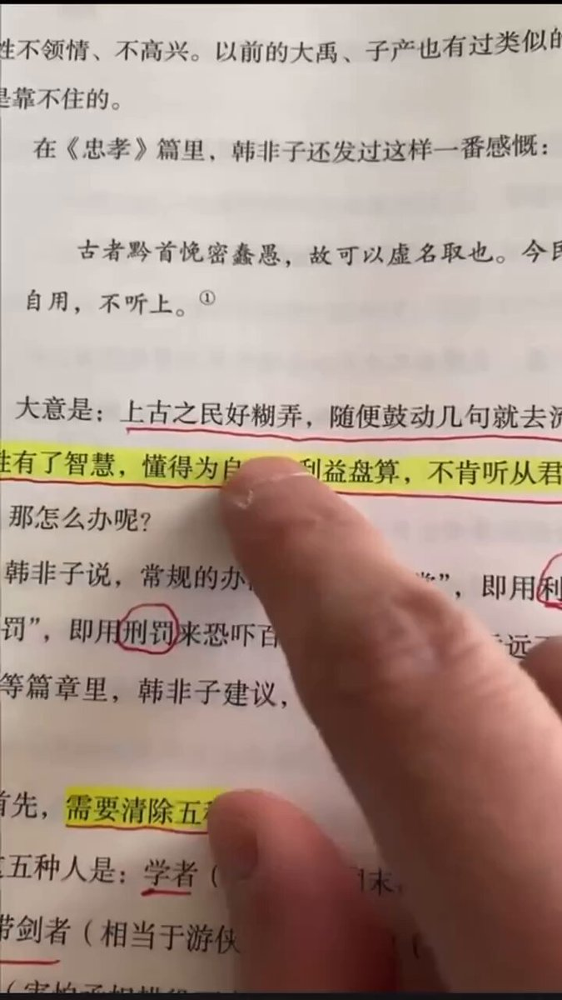
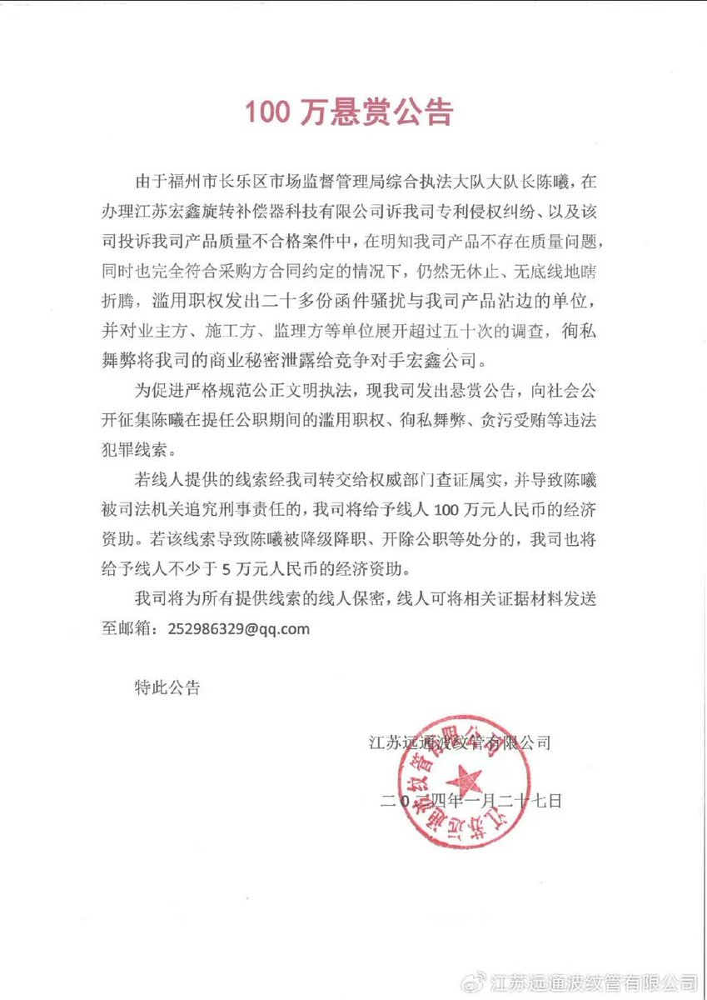

谁将十万横扫三江 北京时间 2024-01-29T10:41:48Z 1751797764424601622 经常参加文革的朋友都知道，这是从五一六通知到清查五一六了。专制体制的裁决者通过政令的反复横跳，筛选不听话的人然后雪藏之，最终台面上就只剩下随时揣摩上意，随时听最新指示，毫无自我意识的自甘奴 https://t.co/YCGxh1gMSJ   谁将十万横扫三江 北京时间 2024-01-29T10:46:32Z 1751798955955110288 一部《韩非子》都只搞黑五类，唯有我大清朝搞黑九类 https://t.co/V1cy3s1emn   谁将十万横扫三江 北京时间 2024-01-29T10:57:44Z 1751801775710147060 江苏民企花100万“跨省”悬赏福州执法大队长陈曦的犯罪线索。
此前，江苏远通公司曾实名举报陈曦滥用职权连发20多份公函干扰企业生产经营，破坏营商环境，徇私舞弊阻碍省重点项目建设，行政不作为乱作为、满口胡言等“五宗罪”。

同时，陈曦还因辱骂江苏远通公司监事孙鹏“神经病”而被起诉至福州市长乐区人民法院，长乐法院将于2024年2月28日对该案进行公开开庭审理。   谁将十万横扫三江 北京时间 2024-01-29T09:53:19Z 1751785561541763565 一位盲人女孩拍摄了她第一视角出行走盲道的过程。 https://t.co/7rYfNYoMTF   