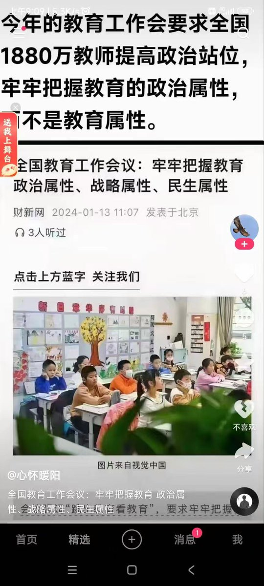
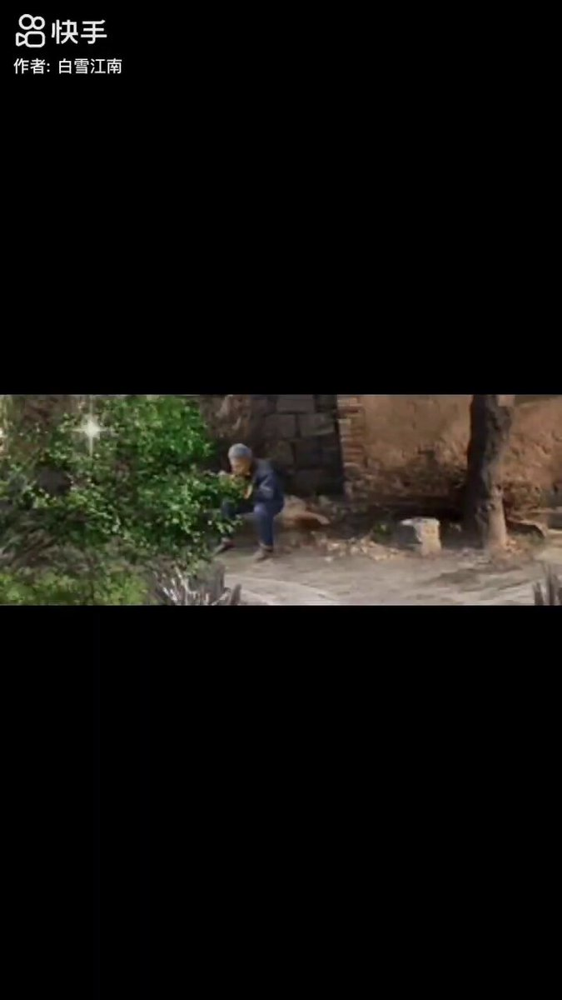
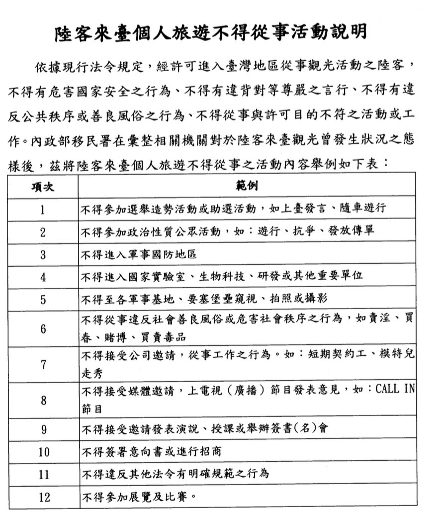
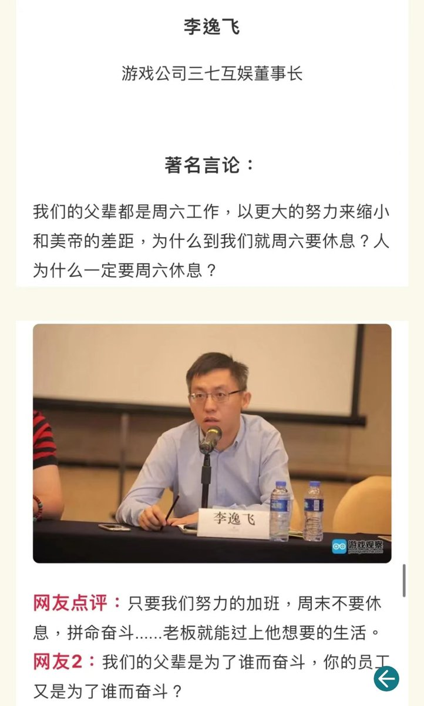

Petrichor 北京时间 2024-01-28T14:04:31Z 1751486390422950089 政教合一，必然造成民族智力衰退、创造力消失。搞政教合一，就是戕害民族的未来

政，即政治。教，就是教育，传授知识。
政教分离，才是正道。 https://t.co/mb2kADqxY6   Petrichor 北京时间 2024-01-28T03:45:19Z 1751330563632332854 这个是东北大馇味的伦敦车站钢琴家邂逅小粉红。还有河北沧州版的视频，我再找找，发出来。 https://t.co/HJDCyw3fIm   Petrichor 北京时间 2024-01-28T01:11:35Z 1751291876630544432 这个视频有意思，开始你以为他议论时政，看到最后才知道他在说历史。将古论今，古为今用。 https://t.co/dZV7GNuSGK   Petrichor 北京时间 2024-01-28T01:44:54Z 1751300263103635547 台湾这些规定，不仅实用与从大陆到访的客人，也适应于从其他国家来访的客人。例如，非中华民国公民的加拿大公民也不允许到台湾参加助选活动、也不能到电视台上做节目对选举发表言论，并收受费用。否则，也是外国势力干涉台湾民主选举。 https://t.co/wngXJVgC9t   Petrichor 北京时间 2024-01-28T02:05:42Z 1751305497146278059 在1994年以前，中国劳动法规定，每天工作时间八小时，每个星期要工作六天，只有一天休息，只能把所有的家务活都放在周日干。在中国加入“WTO”世贸组织谈判时，美国提出了一项要求：要想加入WTO，中国就必须实行“双休”。邓小平和江泽民等中央领导决定，从1995年5月1日，中国实行“双休”（周六周日休息）制度。主观为了贸易公平，客观上美国为中国人民争取到与世界各国人民一样的双休制度。   