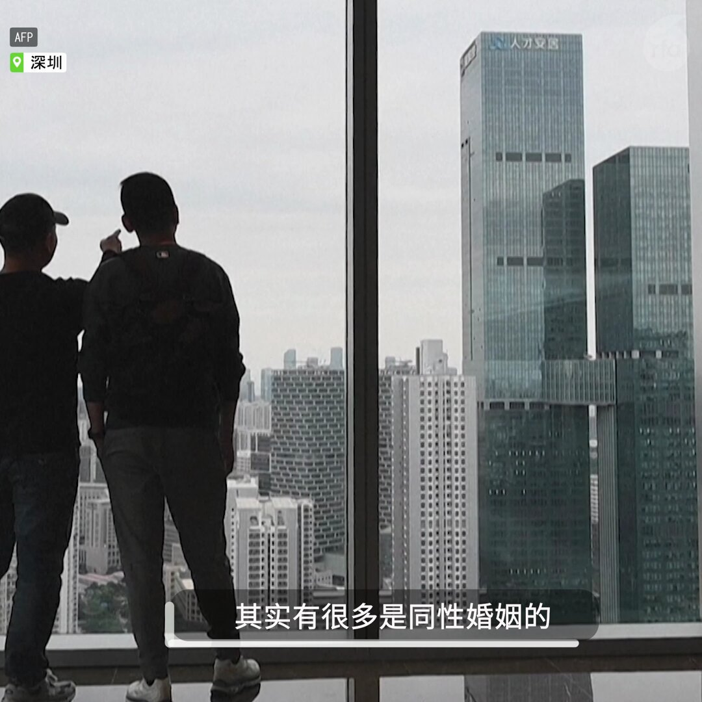

自由亚洲电台 北京时间 2024-01-28T10:50:33Z 1751437576907456882 RT @RFA_Chinese: 【“繁花”电视剧火热  官方传递何信息？】
【经济下行是“新常态” 习惯人生“繁花落尽”】
【失败是人际算计 跟国家政策无关】
曾在90年代初于上海滩“下海”的纽约城市大学政治学教授 #夏明 怎样看《#繁花》？
https://t.co/ChD…   自由亚洲电台 北京时间 2024-01-28T11:40:23Z 1751450121445822799 【夹在政治之间的性少数: “台陆配”同性伴侣如何看台海关系?】
尽管台湾在2023年已允许跨国同性婚姻，但由于当前政治气氛，至今仍不允许台湾人与大陆籍人士登记婚姻。“#台湾 伴侣权益推动联盟”为此游说，希望借助《两岸人民关系条例》推动被忽略的跨海峡 #同性婚姻 议题。有居住在深圳的“台陆配”#同志 表示，伴侣相处多年鲜有争吵，希望台海两岸也能够这样子。   自由亚洲电台 北京时间 2024-01-28T02:24:45Z 1751310291189555253 【或再增一国与台湾断交?】图瓦卢财政部长 #塞夫·潘恩纽 在其选区无竞争者的情况下赢得总理选战。潘恩纽竞选期间提出，希望重新审视与台湾和中国的外交关系，被视为 #图瓦卢 可能外交转向的信号。
详阅：
https://t.co/SrpX645jDz   自由亚洲电台 北京时间 2024-01-28T00:56:14Z 1751288015714930922 总部位于冲绳县 #那霸市(图) 的第11管区海上保安本部称,两艘中国海警船27日相继进入 #钓鱼岛“领海”，跟踪一艘日本渔船。
详阅：
https://t.co/VCYJ8OkPyK   自由亚洲电台 北京时间 2024-01-28T01:14:48Z 1751292687775375766 2023年第4季迄今，太阳能组件已降至不到1元每瓦特。#隆基绿能 发出警告：如果 #太阳能 产业链价格持续低位运行，那么技术不先进的企业可能会被迫 #停产，减产或者退出。
详阅：
https://t.co/81bRHMiSb2   自由亚洲电台 北京时间 2024-01-28T01:30:31Z 1751296639954833474 美国国家安全事务助理 #沙利文 和中国外长 #王毅 在泰国举行会晤的同时，台湾军方侦获33架次解放军军机，其中13架次逾越 #台湾 海峡中线。
详阅：
https://t.co/GqgPG9wN2F   自由亚洲电台 北京时间 2024-01-28T01:46:27Z 1751300649285726589 国务院首次发布《#银发经济 增进老人福祉的意见》。研究称，银发经济在2034年左右将达到19万亿，占消费28%。2023年中国人口降幅远高于2022年，央行学者 #蔡昉 建议当局跳出政策框架，通过促进就业和提高收入来鼓励生育。
详阅：
https://t.co/vtsXpIfynG   自由亚洲电台 北京时间 2024-01-28T02:04:11Z 1751305114856419625 中美高层将于下周在京举行会晤，以限制芬太尼流入美国。中国禁毒委员会副秘书长 #于海滨 向NBC表示，#芬太尼 问题源自美国民众对其需求。
详阅：
https://t.co/odxYtMwCfd   