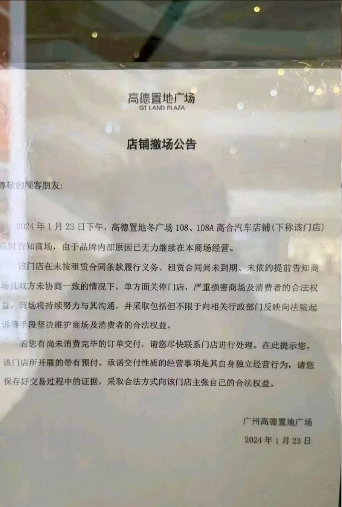
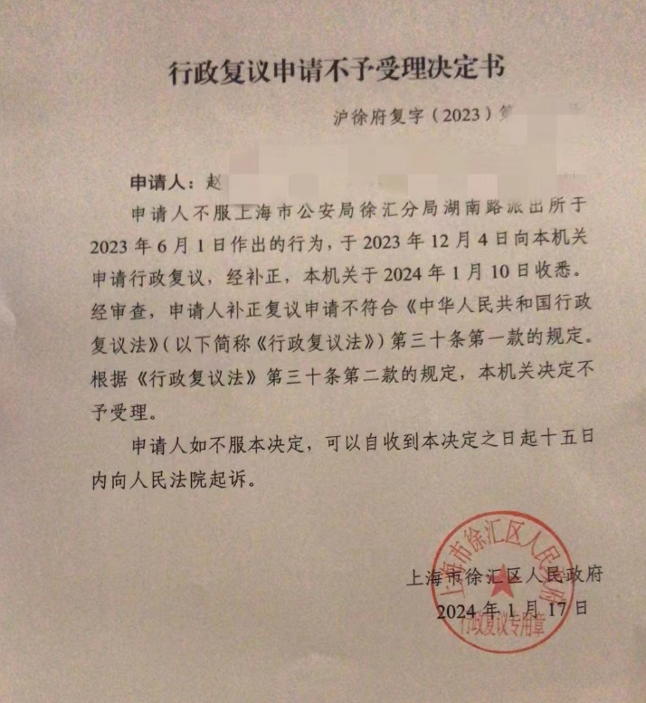

谁将十万横扫三江 北京时间 2024-01-28T20:29:26Z 1751583258398396563 高合汽车确实出问题了，广州高德置地的门店关门了，商场担心有未交付车辆的消费者闹事，赶紧发公告撇清关系 https://t.co/wuIM3jKEvq   谁将十万横扫三江 北京时间 2024-01-28T12:49:36Z 1751467536779243577 2023年6月1日，因为邻里纠纷，患有双向情感障碍的湖南女子赵琬陷入情绪失控毁坏邻居财物。她称，在自己刚洗完澡未着寸缕的情况下，派出所民警用面积不大的布片将她的身体包裹带走，后送入精神病医院半年，出院后的她对当时强烈的屈辱感与羞耻感仍记忆犹新，四处奔走，甚至准备提起行政诉讼，试图为自己要个说法，但行政复议申请徐汇区不予受理

依据病史资料及鉴定检查时自诉，赵琬“自2022年起多次至精神专科医院就诊，明确诊断为双相情感障碍，服用喹硫平、碳酸锂等药物稳定情绪，在服药期间情绪逐步趋于平稳，能正常上班，与同事关系尚可，与父母鲜少联系，然仍有反复的情绪低落……发病多继发于遭遇生活事件后……案发前因遭遇其他男子的性骚扰而与男友发生冲突，继而出现病情的反复……”   