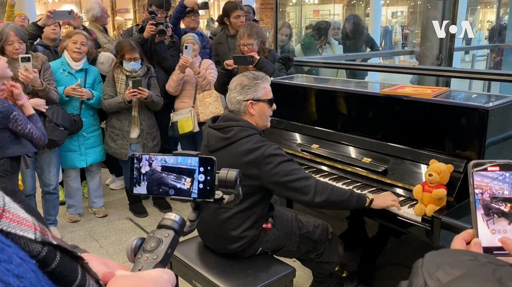

美国之音中文网 北京时间 2024-01-27T07:43:08Z 1751028027415302546 上周遭到海外中国小粉红骚扰的英国网红钢琴家卡瓦纳1月26日再度回到现场即兴演出。他这次弹琴特地带着小熊维尼玩偶，以彰显言论自由的重要性。

他说，那段中国小粉红要求删除的视频，让中共大为丢脸，让小粉红和中共完全失去可信度。

卡瓦纳还提到，他如此较真，也是因为中共干涉言论和表达自由，而且在事件发生后的最初两天，他还收到过威胁邮件，他出于安全担忧隐居了两天。

详细报道：https://t.co/QcsLhBOVn9   