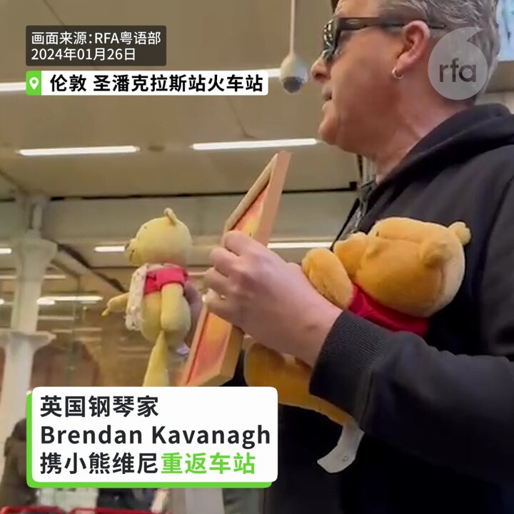
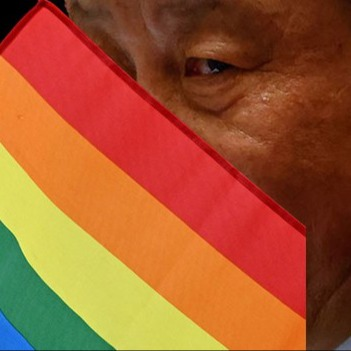

自由亚洲电台 北京时间 2024-01-27T05:47:27Z 1750998913308332440 港府表明今年内就有关国家安全作出指引的《#基本法》23条完成立法。据了解，当局计划最快在春节前展开公众谘询，不会采用没有官方既定立场的“#白纸草案”，而是改用已定框架的“#蓝纸草案”。香港亲北京阵营和反对派人士对此反应两极。

https://t.co/1g5vqVvCEP   自由亚洲电台 北京时间 2024-01-27T02:26:03Z 1750948229376573483 【英国钢琴家携维尼熊重返车站弹奏】
1月26日下午2时，英国钢琴家卡瓦纳（Brendan Kavanagh，又名Dr K）带着小熊维尼道具重返伦敦圣潘克拉斯站火车站。
Dr K透露，在大战“#小粉红”直播影片发布后收到不少恐吓电邮，并且中共正在施压YouTube删除直播视频。他并不畏惧，日后不打算踏足中国。 https://t.co/vaVL3UZ4J7   自由亚洲电台 北京时间 2024-01-27T02:53:46Z 1750955202088477150 加拿大刚刚宣布留学限制新规定。
加拿大留学顾问李仁说：“ 它影响比较大的群体就是过来读专科和本科的这种人群，对于研究生类别是不受影响的，对于中小学类别也是不受影响的。但对通过私立学校想读专科或本科的人影响是最大的。” https://t.co/5pBxKQmUhw   自由亚洲电台 北京时间 2024-01-27T03:01:34Z 1750957168650580051 台湾民主之路（二）：自由不是统治者的恩赐 https://t.co/znmv9GZhpN via @YouTube   自由亚洲电台 北京时间 2024-01-27T03:03:13Z 1750957582485701079 台湾民主之路（四）：大陆人的民主初恋 https://t.co/e2BOrXcH0Z via @YouTube   自由亚洲电台 北京时间 2024-01-27T03:10:44Z 1750959473412481033 专栏 | #夜话中南海：28年前的旧案：副国级领导人 #李沛瑶 如何会死在武警哨兵的刀下？ https://t.co/CE2SDYDzdV   自由亚洲电台 北京时间 2024-01-27T03:32:40Z 1750964993154027625 【白人夺冠日本小姐，中日包容度差距有多大?】
乌克兰出生的 #椎野 Karolina荣摘日本小姐桂冠, 获全球关注。和2015年日非混血的 #ArianaMiyamoto 代表日本参赛环球小姐不同, 椎野父母均为欧洲人, 没有大和民族血统。随着 #日本 进口劳工数量攀升，族裔多元化也随之加深。但同样面临老龄化的中国，在多元 #包容 上的态度大有不同。近日，多地民众因商家挂有疑似日式装饰而闹事，甚至报警。   自由亚洲电台 北京时间 2024-01-27T03:54:51Z 1750970574342414500 2018年，英国企业高管斯通斯（Ian J. Stones）在中国“被消失”的消息被美国媒体曝光后，本周四，中国外交部针对斯通斯一案进行了回复。 https://t.co/9MwT8nKyEu   自由亚洲电台 北京时间 2024-01-27T04:10:24Z 1750974491285750220 #华中农大 被举报教授再爆学术造假　18亿元天价喂猪奥秘何在？ https://t.co/UVdtZV5RpM   自由亚洲电台 北京时间 2024-01-27T01:32:53Z 1750934851107328327 欢迎收听播客 【习近平时代：与彩虹旗一同消失的 #中国性少数】
https://t.co/q3QLYQd5Mb https://t.co/TZBtDKfBWb   自由亚洲电台 北京时间 2024-01-27T01:34:55Z 1750935361117954176 #以色列 军方近期发现 #哈马斯 获得并且使用了大量的中国制造武器，以色列也正对哈马斯突破武器禁运获取装备的途径展开调查。那么，这些 #中国武器 是如何出现在 #哈以冲突 当中的呢？
https://t.co/igyn5C7sLU   