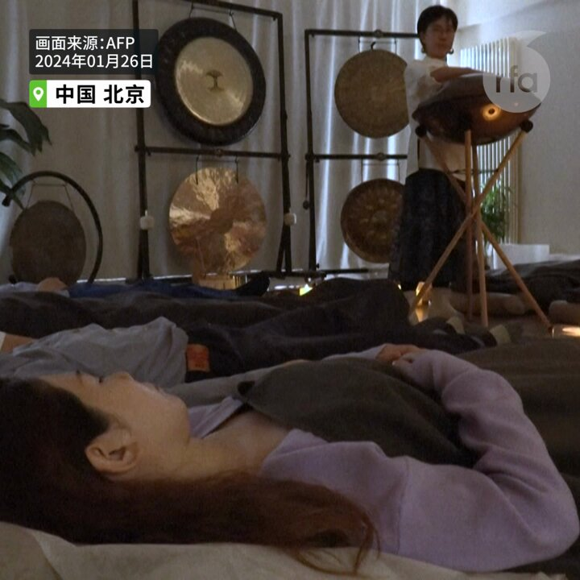
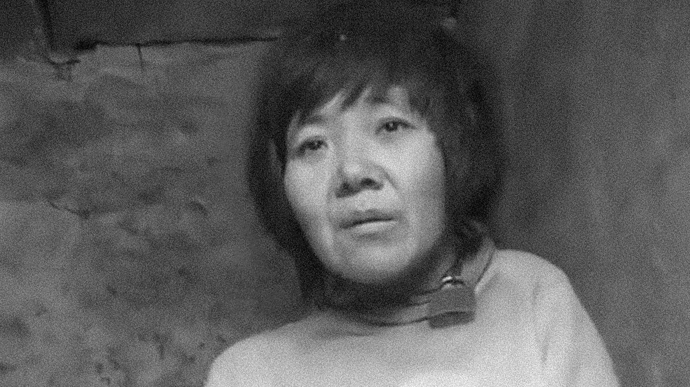
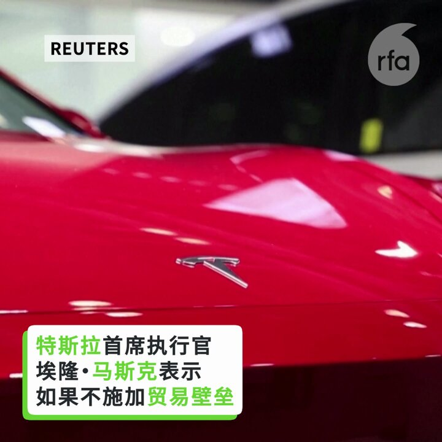
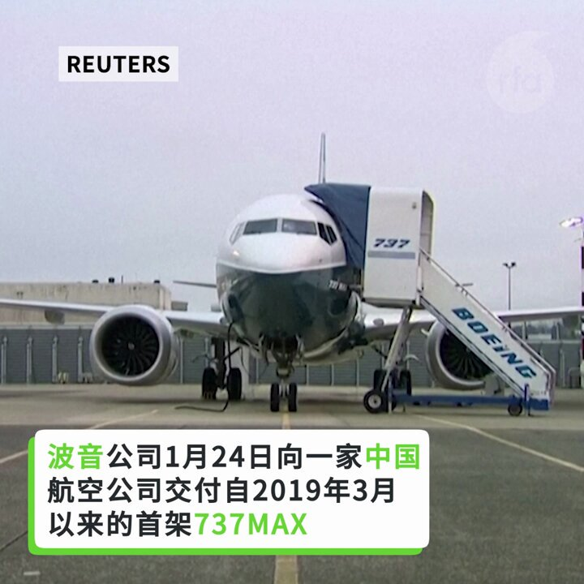
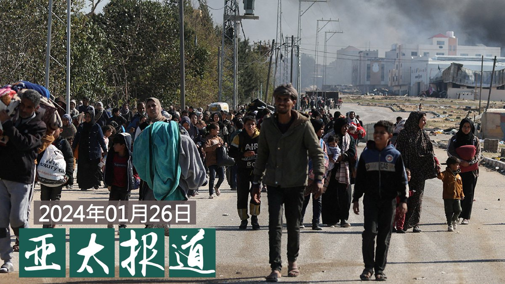
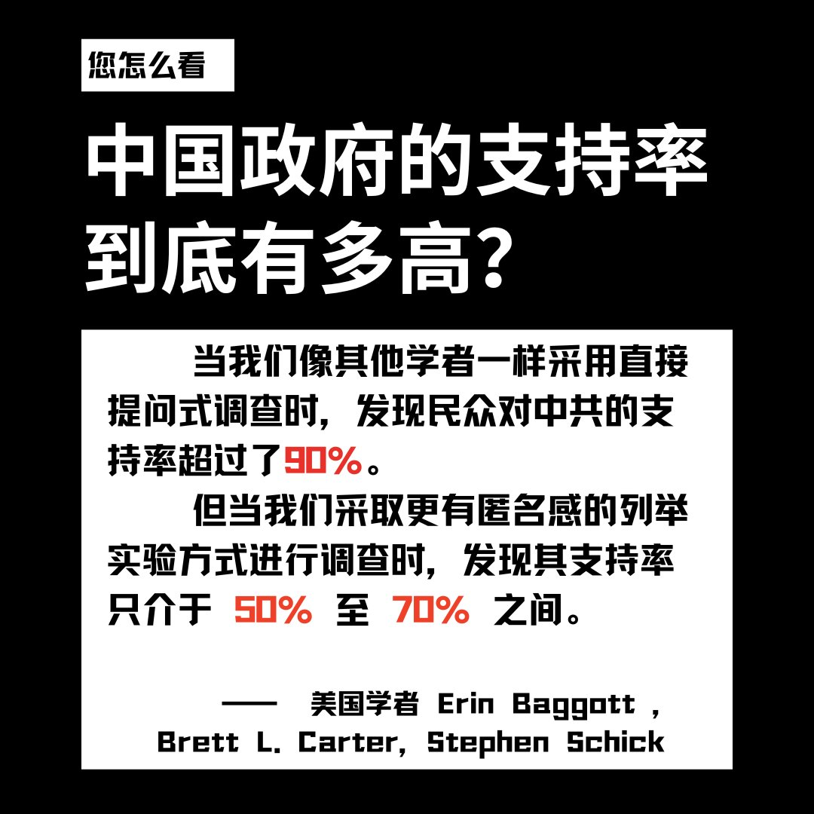

自由亚洲电台 北京时间 2024-01-27T22:53:46Z 1751257194446651698 RT @RFA_Chinese: 【中国3 亿人失眠 颂钵疗法听说过吗？】
据路透社报道，中国有 3 亿人患有 #失眠 症，失眠症是高压力文化的产物，导致许多年轻人选择“躺平”，用颂钵疗法睡觉释放压力。 https://t.co/731QPilobF   自由亚洲电台 北京时间 2024-01-27T22:53:54Z 1751257228940603761 RT @RFA_Chinese: 【中国政府的支持率到底有多高？】
近日，美国学者在《中国季刊》发文，建议学者们不要再用直接提问式调查来衡量中国公民的政治观点，因为他们在当代中国进行的两项调查实验的结果清楚表明，中国公民会因为害怕受到政府打压而隐藏自己对中共的反对。 https…   自由亚洲电台 北京时间 2024-01-27T22:54:00Z 1751257251535319045 RT @RFA_Chinese: 【白人夺冠日本小姐，中日包容度差距有多大?】
乌克兰出生的 #椎野 Karolina荣摘日本小姐桂冠, 获全球关注。和2015年日非混血的 #ArianaMiyamoto 代表日本参赛环球小姐不同, 椎野父母均为欧洲人, 没有大和民族血统。随着…   自由亚洲电台 北京时间 2024-01-27T22:54:16Z 1751257321492164840 RT @RFA_Chinese: 【英国钢琴家携维尼熊重返车站弹奏】
1月26日下午2时，英国钢琴家卡瓦纳（Brendan Kavanagh，又名Dr K）带着小熊维尼道具重返伦敦圣潘克拉斯站火车站。
Dr K透露，在大战“#小粉红”直播影片发布后收到不少恐吓电邮，并且中共正在…   自由亚洲电台 北京时间 2024-01-27T22:54:42Z 1751257430598549874 RT @RFA_Chinese: 【台湾夜市办“#科目三”大赛】
【引发“舞统台湾”焦虑】
台湾知名的宁夏观光夜市25日晚举办“科目三”舞蹈大赛，期间引发“舞统台湾”争议论战，主办单位依然照常举行。特别的是有近半数的参赛者是小学生，这首相当洗脑的“抖音神曲”攻陷台湾校园。 ht…   自由亚洲电台 北京时间 2024-01-27T22:55:07Z 1751257532419457306 RT @RFA_Chinese: 【张开宇: 我不能让美国变成另一个中国】
#上海封城，精品店老板 #张开宇 和他的猫几乎饿死。
去年 #润 到美国加州后，他用反共抗议医治自己的 #政治抑郁。
#APEC峰会，他在旧金山抗议后遭亲共的“红巾军”伏击。
为追凶，也为60多个被袭击…   自由亚洲电台 北京时间 2024-01-27T23:39:30Z 1751268701989396812 尼泊尔 #喜马拉雅航空 公司开通的 #加德满都 和拉萨之间的航班，是第一家获得飞往西藏许可的非中国航空公司。一份报告称，中国在尼泊尔境内的影响力渐增，使 #尼泊尔 对于2 万在境内的西藏难民来说，变得越发不安全。
详阅：
https://t.co/qrKw85yXch   自由亚洲电台 北京时间 2024-01-27T22:14:58Z 1751247429838524681 无法解决实时通讯问题，又没有人工智能技术的朝鲜，开发所谓的水下潜行核武器，实质意义不大。其真正能够对自由世界产生威胁的，是刚刚试射的洲际导弹。对一个国家来说，没有远程 #洲际导弹，就算你有再多的核弹头也没有用。
详阅：https://t.co/EfhgfSXSRW   自由亚洲电台 北京时间 2024-01-27T10:45:06Z 1751073820465574267 RT @RFA_Chinese: 【诚征受访人】近期中国开放多个国家到中国旅游免签证，外籍海外华人回国更方便了吗？还有什么能拦住您返乡探亲的步伐？如果您近期曾回国，遇到过什么不便，是如何克服的？欢迎分享回国攻略。请在评论区回帖或电邮 fankui@rfa.org，截止日期：1月…   自由亚洲电台 北京时间 2024-01-27T12:33:42Z 1751101149808144805 RT @RFA_Chinese: 十四亿人救不了你，大国走向全面奴役。
收集网络残存记忆，记住你就是救自己。
#铁链女 专页：
https://t.co/1HbF2iwxzp https://t.co/Enz6eHsPV0   自由亚洲电台 北京时间 2024-01-27T12:45:49Z 1751104199910162701 RT @RFA_Chinese: 【英国钢琴家携维尼熊重返车站弹奏】
1月26日下午2时，英国钢琴家卡瓦纳（Brendan Kavanagh，又名Dr K）带着小熊维尼道具重返伦敦圣潘克拉斯站火车站。
Dr K透露，在大战“#小粉红”直播影片发布后收到不少恐吓电邮，并且中共正在…   自由亚洲电台 北京时间 2024-01-27T12:54:28Z 1751106375596261437 评论｜王丹 @wangdan1989：#王志安 现象彰显了中国与文明世界的差距 https://t.co/qBAluP6PGY   自由亚洲电台 北京时间 2024-01-27T12:56:08Z 1751106793550368778 专栏 | #周嘉有话说：文化与文明
#周孝正  https://t.co/w3dOyw8PI5   自由亚洲电台 北京时间 2024-01-27T13:15:42Z 1751111719261204810 周四《华尔街日报》报道：一名英国高管在中国失踪了5年。
周五中国外交部声明：这名英国人去年被判刑五年。
细思极恐：如果不是《华尔街日报》不指名道姓追问，就没人知道这名英国商人的下落了？还有多少外国人在中国“被消失”？
https://t.co/9MwT8nKyEu   自由亚洲电台 北京时间 2024-01-27T06:21:55Z 1751007585585840220 【马斯克：如果没有贸易壁垒，中国车企摧毁西方对手】
#马斯克 表示，如果不施加 #贸易壁垒，中国汽车制造商正在“摧毁”西方竞争对手。
网友说：如果没有贸易保护，中国汽车业早完了！
#您怎么看？ https://t.co/YmUJUJm7pJ   自由亚洲电台 北京时间 2024-01-27T11:35:36Z 1751086529890410579 RT @RFA_Chinese: #铁链女事件二周年  在当局高调打击人口拐卖的背后，当事人被强制隔离，至今仍然状况不明。那么，这位当年牵动了十几亿人心灵良知的“#铁链女”，她真的被遗忘了吗？ https://t.co/BZQNdhdqwT   自由亚洲电台 北京时间 2024-01-27T06:57:58Z 1751016657529586054 RT @RFA_Chinese: 【英国钢琴家携维尼熊重返车站弹奏】
1月26日下午2时，英国钢琴家卡瓦纳（Brendan Kavanagh，又名Dr K）带着小熊维尼道具重返伦敦圣潘克拉斯站火车站。
Dr K透露，在大战“#小粉红”直播影片发布后收到不少恐吓电邮，并且中共正在…   自由亚洲电台 北京时间 2024-01-27T07:04:03Z 1751018191432651019 正当江苏连云港的高中生 #张宝山 的死因引起全国网民关注和质疑之际，两年多前一名11岁男学生因遭班主任羞辱而跳楼自杀的新闻本周五登上了微博热搜。https://t.co/q5Gt1Ebrr6   自由亚洲电台 北京时间 2024-01-27T09:11:48Z 1751050339179217209 RT @RFA_Chinese: 【诚征受访人】近期中国开放多个国家到中国旅游免签证，外籍海外华人回国更方便了吗？还有什么能拦住您返乡探亲的步伐？如果您近期曾回国，遇到过什么不便，是如何克服的？欢迎分享回国攻略。请在评论区回帖或电邮 fankui@rfa.org，截止日期：1月…   自由亚洲电台 北京时间 2024-01-27T10:06:20Z 1751064063608508444 #铁链女事件二周年  在当局高调打击人口拐卖的背后，当事人被强制隔离，至今仍然状况不明。那么，这位当年牵动了十几亿人心灵良知的“#铁链女”，她真的被遗忘了吗？ https://t.co/BZQNdhdqwT   自由亚洲电台 北京时间 2024-01-27T06:26:44Z 1751008797701832727 【波音公司向中国交付737MAX】
1月24日，#波音 公司向一家中国航空公司交付自2019年3月以来的首架737MAX，结束了中国对波音长达四年的进口冻结。 https://t.co/4Z5K7N6eF2   自由亚洲电台 北京时间 2024-01-27T07:00:51Z 1751017384671162799 【#雷政富  出狱，冲上微博热搜】
#不雅视频
https://t.co/7Dqeh4aaO5   自由亚洲电台 北京时间 2024-01-27T07:05:57Z 1751018666810823027 纽约时报：中国攻击或取得 #台积电 都会导致世界经济萧条 https://t.co/ObK4J3eIuv   自由亚洲电台 北京时间 2024-01-27T07:12:11Z 1751020236113916015 去年10月，著名科幻文学奖“#雨果奖”（Hugo Award）首次于中国举办。近期有消息披露，去年雨果奖刻意排除了多名知名作家，这使得外界质疑该奖项是否受到了中国当局的干涉与审查。https://t.co/pB5rBPYBPG   自由亚洲电台 北京时间 2024-01-27T08:56:12Z 1751046415176921297 RT @RFA_Chinese: 【“繁花”电视剧火热  官方传递何信息？】
【经济下行是“新常态” 习惯人生“繁花落尽”】
【失败是人际算计 跟国家政策无关】
曾在90年代初于上海滩“下海”的纽约城市大学政治学教授 #夏明 怎样看《#繁花》？
https://t.co/ChD…   自由亚洲电台 北京时间 2024-01-27T08:56:29Z 1751046484529713287 RT @RFA_Chinese: 去年10月，著名科幻文学奖“#雨果奖”（Hugo Award）首次于中国举办。近期有消息披露，去年雨果奖刻意排除了多名知名作家，这使得外界质疑该奖项是否受到了中国当局的干涉与审查。https://t.co/pB5rBPYBPG   自由亚洲电台 北京时间 2024-01-27T09:09:34Z 1751049777393934816 欢迎收听和订阅播客【＃亚太报道】 https://t.co/MjLNSvVeAE
中国叫停12省市基建项目；#A股2800点 魂魄股民；#雨伞运动 影片在香港“无法观看”；台湾夜市“#科目三”大赛引发“#舞统”争议；#哈马斯 为何使用大量 #中国武器？ https://t.co/aXMcBiD7WF   自由亚洲电台 北京时间 2024-01-27T09:11:59Z 1751050383898644646 RT @RFA_Chinese: 【张开宇: 我不能让美国变成另一个中国】
#上海封城，精品店老板 #张开宇 和他的猫几乎饿死。
去年 #润 到美国加州后，他用反共抗议医治自己的 #政治抑郁。
#APEC峰会，他在旧金山抗议后遭亲共的“红巾军”伏击。
为追凶，也为60多个被袭击…   自由亚洲电台 北京时间 2024-01-27T02:45:07Z 1750953028377846150 因“煽动颠覆国家政权”入狱的上海异议人士 #陈建芳，去年10月刑满后一直遭当局软禁。受到严密监控的陈建芳就连踏出家门口也成为奢望，与坐牢有何分别？
有访民向当局发公开信声援陈建芳后，疑似对外失去联系。
https://t.co/mNTgDMGUXD   自由亚洲电台 北京时间 2024-01-27T03:02:29Z 1750957398213132526 台湾民主之路 (三): 社会运动的狂飙年代 https://t.co/yFn55SLfC6 via @YouTube   自由亚洲电台 北京时间 2024-01-27T04:54:29Z 1750985584943022586 【中国政府的支持率到底有多高？】
近日，美国学者在《中国季刊》发文，建议学者们不要再用直接提问式调查来衡量中国公民的政治观点，因为他们在当代中国进行的两项调查实验的结果清楚表明，中国公民会因为害怕受到政府打压而隐藏自己对中共的反对。 https://t.co/SlCJtDeqOy   自由亚洲电台 北京时间 2024-01-27T05:00:10Z 1750987013602385947 美国物流平台亚马逊（Amazon）周五在全球推出一部由好莱坞女星妮可•基德曼（Nicole Kidman）主演的新剧，该剧部分内容在香港拍摄，却疑因重现“#雨伞运动”画面而导致在香港当地无法观看。有分析认为，这很可能又是一桩企业自我审查的案例。
https://t.co/cfFXEtzlkF   自由亚洲电台 北京时间 2024-01-27T05:35:01Z 1750995783032377792 【中国3 亿人失眠 颂钵疗法听说过吗？】
据路透社报道，中国有 3 亿人患有 #失眠 症，失眠症是高压力文化的产物，导致许多年轻人选择“躺平”，用颂钵疗法睡觉释放压力。 https://t.co/731QPilobF   自由亚洲电台 北京时间 2024-01-27T05:47:27Z 1750998913308332440 港府表明今年内就有关国家安全作出指引的《#基本法》23条完成立法。据了解，当局计划最快在春节前展开公众谘询，不会采用没有官方既定立场的“#白纸草案”，而是改用已定框架的“#蓝纸草案”。香港亲北京阵营和反对派人士对此反应两极。

https://t.co/1g5vqVvCEP   自由亚洲电台 北京时间 2024-01-27T02:26:03Z 1750948229376573483 【英国钢琴家携维尼熊重返车站弹奏】
1月26日下午2时，英国钢琴家卡瓦纳（Brendan Kavanagh，又名Dr K）带着小熊维尼道具重返伦敦圣潘克拉斯站火车站。
Dr K透露，在大战“#小粉红”直播影片发布后收到不少恐吓电邮，并且中共正在施压YouTube删除直播视频。他并不畏惧，日后不打算踏足中国。 https://t.co/vaVL3UZ4J7   自由亚洲电台 北京时间 2024-01-27T02:53:46Z 1750955202088477150 加拿大刚刚宣布留学限制新规定。
加拿大留学顾问李仁说：“ 它影响比较大的群体就是过来读专科和本科的这种人群，对于研究生类别是不受影响的，对于中小学类别也是不受影响的。但对通过私立学校想读专科或本科的人影响是最大的。” https://t.co/5pBxKQmUhw   自由亚洲电台 北京时间 2024-01-27T03:01:34Z 1750957168650580051 台湾民主之路（二）：自由不是统治者的恩赐 https://t.co/znmv9GZhpN via @YouTube   自由亚洲电台 北京时间 2024-01-27T03:03:13Z 1750957582485701079 台湾民主之路（四）：大陆人的民主初恋 https://t.co/e2BOrXcH0Z via @YouTube   自由亚洲电台 北京时间 2024-01-27T03:10:44Z 1750959473412481033 专栏 | #夜话中南海：28年前的旧案：副国级领导人 #李沛瑶 如何会死在武警哨兵的刀下？ https://t.co/CE2SDYDzdV   自由亚洲电台 北京时间 2024-01-27T03:32:40Z 1750964993154027625 【白人夺冠日本小姐，中日包容度差距有多大?】
乌克兰出生的 #椎野 Karolina荣摘日本小姐桂冠, 获全球关注。和2015年日非混血的 #ArianaMiyamoto 代表日本参赛环球小姐不同, 椎野父母均为欧洲人, 没有大和民族血统。随着 #日本 进口劳工数量攀升，族裔多元化也随之加深。但同样面临老龄化的中国，在多元 #包容 上的态度大有不同。近日，多地民众因商家挂有疑似日式装饰而闹事，甚至报警。   自由亚洲电台 北京时间 2024-01-27T03:54:51Z 1750970574342414500 2018年，英国企业高管斯通斯（Ian J. Stones）在中国“被消失”的消息被美国媒体曝光后，本周四，中国外交部针对斯通斯一案进行了回复。 https://t.co/9MwT8nKyEu   自由亚洲电台 北京时间 2024-01-27T04:10:24Z 1750974491285750220 #华中农大 被举报教授再爆学术造假　18亿元天价喂猪奥秘何在？ https://t.co/UVdtZV5RpM   自由亚洲电台 北京时间 2024-01-27T01:32:53Z 1750934851107328327 欢迎收听播客 【习近平时代：与彩虹旗一同消失的 #中国性少数】
https://t.co/q3QLYQd5Mb https://t.co/TZBtDKfBWb   自由亚洲电台 北京时间 2024-01-27T01:34:55Z 1750935361117954176 #以色列 军方近期发现 #哈马斯 获得并且使用了大量的中国制造武器，以色列也正对哈马斯突破武器禁运获取装备的途径展开调查。那么，这些 #中国武器 是如何出现在 #哈以冲突 当中的呢？
https://t.co/igyn5C7sLU   