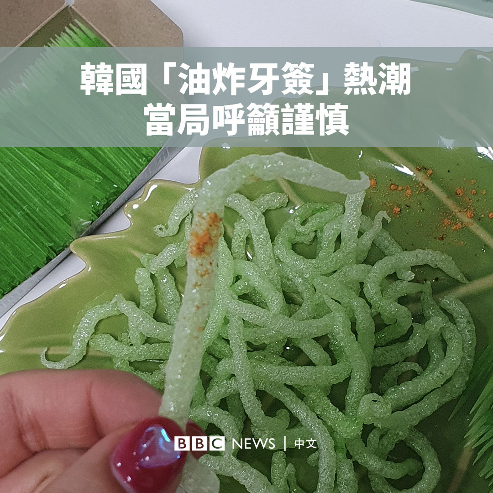
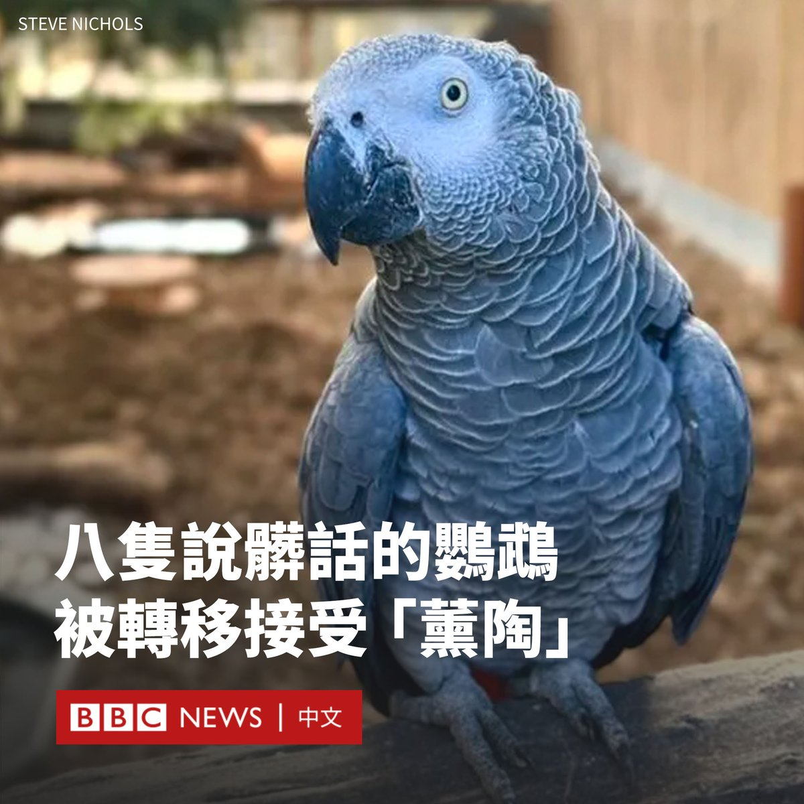
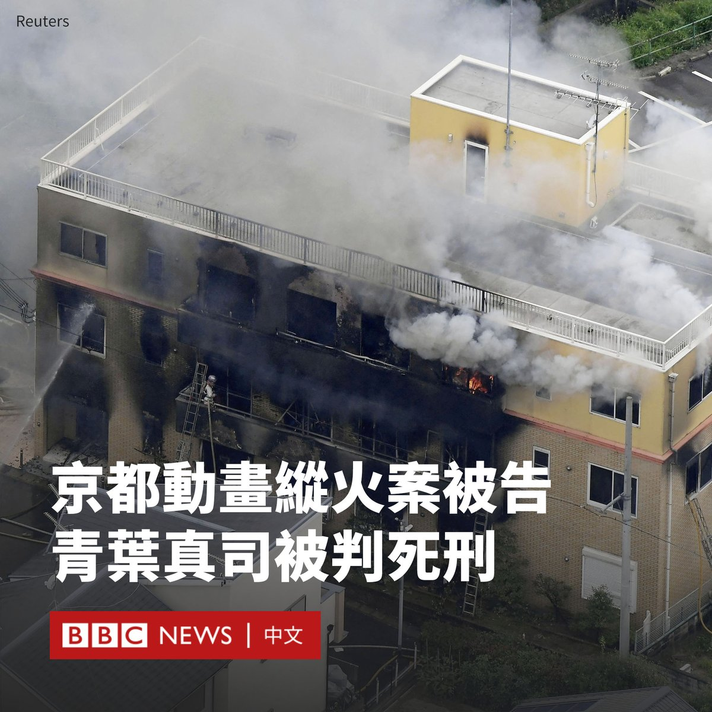

D英国广播公司BBC 北京时间 2024-01-26T21:26:37Z 1750872873600966892 艾米和阿诺是一对双胞胎，但她们刚出生就被从母亲身边带走，卖给了不同的家庭。多年后，一次偶然的机会，她们在电视选秀节目和TikTok短片中发现了彼此。

当她们深入了解自己的过去时，她们意识到在格鲁吉亚有成千上万的婴儿被从医院偷走并贩卖。现在，她们想知道答案。 https://t.co/z141AXoUHW   D英国广播公司BBC 北京时间 2024-01-26T19:36:38Z 1750845195262853531 在美国，一名被判刑的谋杀犯即将成为该国首位使用氮气窒息处决的人。在日本，另一名男子因为酿成36人死亡的京都动画纵火案而被判处绞刑。

根据国际特赦组织的最新数据，截至2022年有55个国家仍施行死刑，其中有9个国家仅用在极其严重的罪行，如多次谋杀或战争罪。https://t.co/m5b1wOrcWx   D英国广播公司BBC 北京时间 2024-01-26T16:40:36Z 1750800895355306266 联合国正在面临严峻的挑战，尤其是在解决冲突方面。从乌克兰战争到加沙危机使这些挑战达到了冷战以来前所未有的程度。https://t.co/1hDLEBUHu6   D英国广播公司BBC 北京时间 2024-01-26T17:57:13Z 1750820175811916056 泡一杯完美口感的茶饮的秘诀是加点盐？你同意吗？🍵

当美国化学教授米歇尔·弗兰茨（Michelle Francl）发布了她的研究成果后，在热爱茶的英国引起了轰动。

争议之大，甚至掀起了一场“外交风暴”。美国驻英国大使馆为此发布声明称：“往英国国饮里加盐这种不可思议的想法，绝不是美国官方政策，而且永远不会是。”

英国皇家化学学会周三（1月24日）出版了弗兰茨的新书《浸泡：茶的化学》（Steeped: The Chemistry of Tea），该书借鉴了几个世纪以来的茶知识和现代化学分析。

弗兰茨认为，加入少许食盐可以减弱茶水的苦涩，尤其是久泡的茶叶，因为其可以阻止受体对苦味的感知。

弗兰茨呼吁英国的茶饮爱好者在对她的研究进行评判之前保持开放的心态，这并不是一个新想法——中国八世纪的唐代著作中便提及煮茶加盐的方法。弗兰茨教授分析了这些手稿。

她的建议还包括：通过添加柠檬汁，可以去除有时出现在茶水表面的难看的浮渣；使用矮胖的杯子来使茶更保温；在泡茶前预热茶杯和牛奶；在倒茶后才倒入牛奶等。

她还强调，永远不要用微波炉烧水，“这样不太健康，味道也不那么好”。用微波炉泡茶在英国听起来可能有点陌生，但据称在美国“非常普遍”。

在关于泡茶的方式引发大西洋两岸的辩论后，美国大使馆表示将不会听从弗兰茨的建议，而是坚持其所称的“正确方法”——用微波炉泡茶，而英国内阁办公厅则回应说：“茶只能用水壶泡”。   D英国广播公司BBC 北京时间 2024-01-26T15:16:27Z 1750779719006745074 韩国社交媒体最近掀起牙签吃播热潮，许多人将以淀粉为原料的环保牙签油炸后食用。

但当局警告称，这种产品的食用安全性有待验证，呼吁民众不要食用。 https://t.co/5MWaIjY0x5   D英国广播公司BBC 北京时间 2024-01-26T13:13:28Z 1750748768860066142 在英国林肯郡野生动物园，一群顽皮的鹦鹉因为经常对游客说脏话而闻名，园方不得不采取措施来阻止它们的这种行为。

最初，有五只2020年入住该园的非洲灰鹦鹉学会了说脏话，后来这一行为又“传染”给另外三只鹦鹉。

动物园先让这些鹦鹉“停职”了几个月，看看这能否帮助它们停止咒骂，但并没有奏效。

后来，饲养员不得不在笼外张贴免责标语——“我们不对您听到的声音负责”。

饲养员现在将它们转移到另外近100只不说脏话的鹦鹉笼子里，希望它们接受正常的鹦鹉“熏陶”。

该公园的总经理史蒂夫·尼科尔斯（Steve Nichols）表示，他认为该策略可能会奏效，但也有可能“收获100只会骂人的鹦鹉”。

与鹦鹉相处了大约35年的尼科尔斯说：“一旦它（脏话）出现在它们的词汇表中，它通常就会永远存在。”但他认为这些鸟可能会“模仿其他声音”，从而减少它们咒骂的频率。

鹦鹉是聪明的鸟类，可以学习和复制各种不同的声音，比如汽车警报和其他动物的叫声，以及人类的话。

林肯郡野生动物园是英国最大的鹦鹉栖息地，大约有2000只鹦鹉。   D英国广播公司BBC 北京时间 2024-01-26T11:53:04Z 1750728535722131641 胡塞武装对红海航运的袭击凸显也门武装派别在中东内外的影响。但西方国家也在也门内战中扮演了复杂角色。

在BBC阿拉伯语频道的一项调查中，受阿联酋雇佣在也门实施暗杀行动的美国雇佣兵首次在镜头前直言不讳，向BBC讲述了他们的致命行动。 https://t.co/595tZgGEgi   D英国广播公司BBC 北京时间 2024-01-26T09:10:17Z 1750687570978295968 2019年京都动画纵火案被告青叶真司周四（1月25日）被法院判处死刑。该事件造成36人死亡，数十人受伤。

该事件是日本近几十年来最严重的纵火案之一，死者大多是年轻艺术家，震惊了动漫界。

45岁的青叶真司表示认罪，而他的律师以“精神上无行为能力”为由要求从轻处罚，但遭法官驳回。

京都地方法院的首席法官说：“我认定被告在作案时并非精神失常或虚弱”，指被告清楚自己在做什么。

“本案造成36人死亡，其性质是极为严重与悲惨的。”日本放送协会（NHK）引述法官的话说。“遇难者的恐惧和痛苦难以言述”。

2019年7月，青叶真司在工作日冲入工作室，向一楼泼洒汽油并点火，同时反复高喊“去死吧”。大火引燃了工作室内包括画稿在内的易燃品，并迅速产生大量浓烟。

随着火势蔓延，许多动画制作人员被困在工作室的上层，不幸遇难。

这起事件震惊了日本社会，但审判因青叶真司的身体状况多次延宕。

检察官要求判处青叶真司死刑，指其因认为京都动画盗用自己的作品，遂萌生犯案念头，并不是受到妄想的影响。

青叶真司在2023年9月认罪，他指不知道会有多少人被困在大楼里。

他说：“我觉得我别无选择，只能这么做”、“我感到非常抱歉，我也感到一种负罪感”。

青叶真司本人在火灾中全身90%以上被烧伤，在康复后才被拘捕。   