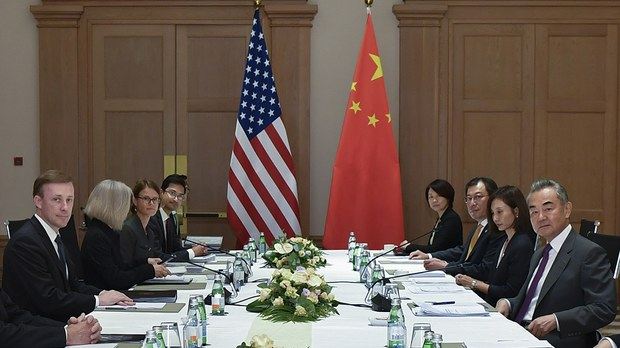
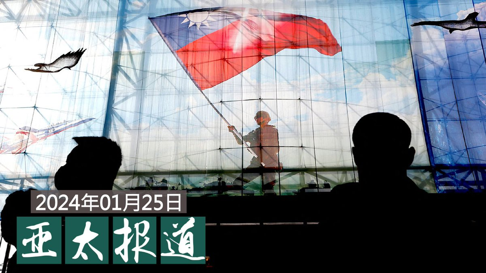
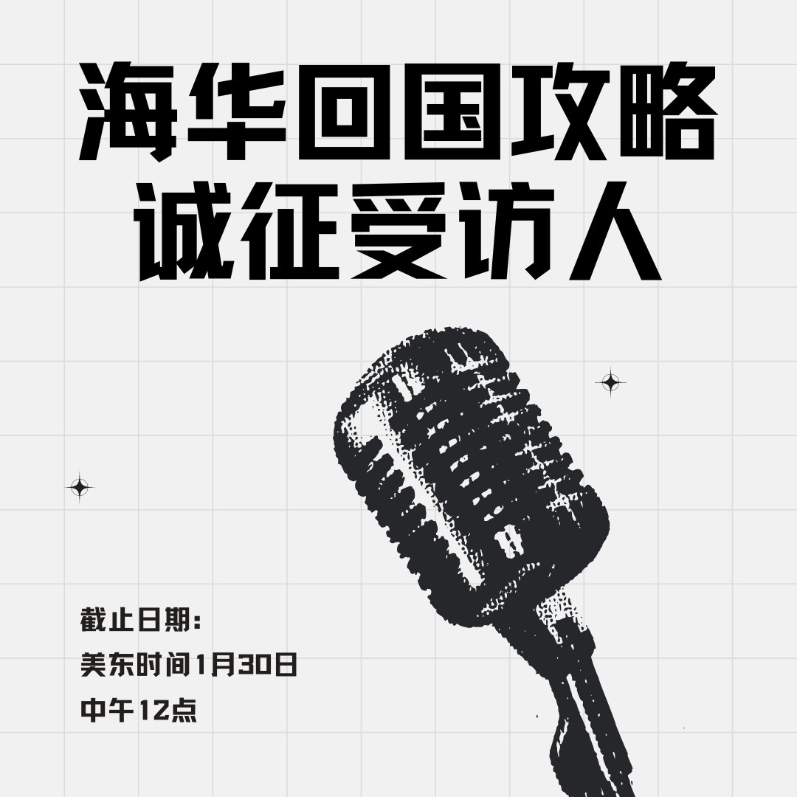

自由亚洲电台 北京时间 2024-01-26T08:15:59Z 1750673906300854651 #事实查核 @asiafactcheckcn｜美国防部长在乌克兰遇袭身亡？
https://t.co/u6PADqmkAh   自由亚洲电台 北京时间 2024-01-26T10:00:47Z 1750700280143020069 【沙利文将在曼谷和王毅举行新一轮会晤】
中共中央政治局委员、外交部长王毅将于1月26日至29日访问泰国。王毅将在曼谷同美国总统国家安全事务助理沙利文举行新一轮会晤。
预料双方将讨论也门叛军胡塞攻击红海航运情事，台湾问题也是焦点。
图为2023年九月沙利文与王毅在马耳他会面 https://t.co/arpDPT0LMf  #沙利文 #王毅   自由亚洲电台 北京时间 2024-01-26T10:12:16Z 1750703166411210886 RT @RFA_Chinese: 【张开宇: 我不能让美国变成另一个中国】
#上海封城，精品店老板 #张开宇 和他的猫几乎饿死。
去年 #润 到美国加州后，他用反共抗议医治自己的 #政治抑郁。
#APEC峰会，他在旧金山抗议后遭亲共的“红巾军”伏击。
为追凶，也为60多个被袭击…   自由亚洲电台 北京时间 2024-01-26T06:29:51Z 1750647195450397124 欢迎收听和订阅播客【＃亚太报道】 https://t.co/MjLNSvVMqc
中国央行“＃双降”措施能救经济吗？；关注习近平时代消失的 ＃中国性少数群体；美国、立陶宛国会代表团访台；中国对台施压意欲何为？；香港特首 ＃李家超 要求完成 ＃23条立法。 https://t.co/Fgid599bWy   自由亚洲电台 北京时间 2024-01-26T06:32:59Z 1750647982910066814 香港前支联会副主席 ＃邹幸彤 煽惑他人参与六四集会案经上诉后，由香港终审法院推翻此前由香港高等法院裁定的无罪判决，恢复了2022年1月初她最早被西九龙裁判法院法官裁定的“煽惑他人明知而参与未经批准集结”罪名。
https://t.co/aNrwoZqMn9   自由亚洲电台 北京时间 2024-01-26T08:34:01Z 1750678444080324924 评论 | 蔡霞 @realcaixia：非暴力抗争与中国政治的和平转型 https://t.co/Ucxay2bRYi   自由亚洲电台 北京时间 2024-01-26T05:21:10Z 1750629910631027173 【#您怎么看】据中国外交部发布的消息，1月25日，中国和新加坡政府签署《中华人民共和国政府与新加坡共和国政府关于互免持普通护照人员签证协定》，规定从2024年2月9日农历除夕起，双方持普通护照人员可免签入境对方国家停留不超过30日。入境对方国家从事工作、新闻报道等须事先批准的活动以及拟在对方国家停留超过30日的，须在入境对方国家前办妥相应签证。
您认为，中国护照含金量增加了吗？   自由亚洲电台 北京时间 2024-01-26T05:28:11Z 1750631674424234157 【诚征受访人】近期中国开放多个国家到中国旅游免签证，外籍海外华人回国更方便了吗？还有什么能拦住您返乡探亲的步伐？如果您近期曾回国，遇到过什么不便，是如何克服的？欢迎分享回国攻略。请在评论区回帖或电邮 fankui@rfa.org，截止日期：1月30日中午12点。 https://t.co/L9iIfjRTgb   自由亚洲电台 北京时间 2024-01-26T05:38:21Z 1750634235554353195 据路透社报道，2022年10月在波士顿跟踪、威胁当地参加抵制中国政府活动的中国留学生的 ＃吴啸雷（Wu Xiaolei）本周四（1月25日）在当地一家法院被陪审团认定为有罪，其罪名包括网络骚扰和威胁罪。
https://t.co/CjGbPowMTL   自由亚洲电台 北京时间 2024-01-26T05:55:21Z 1750638511500481011 周三（1月24日）发生在　＃江西新余火灾　已经导致39人死亡。据中国官媒新华社等媒体报道，初步调查显示，火灾是因为起火建筑地下一层冷库装修的施工工人违规动火施工引发火情，火势太大无法及时扑灭，牵连到二楼参加培训的学生和住宿旅客。
https://t.co/OyYmfK6aVG   自由亚洲电台 北京时间 2024-01-26T04:09:12Z 1750611799366619632 专栏 | ＃军事无禁区: 击落俄A-50预警机－乌克兰反攻的转折点？
https://t.co/54E3VcWmUC   自由亚洲电台 北京时间 2024-01-26T00:29:35Z 1750556532214042826 #李家超 说完成《#基本法》23条立法后，全力拼经济，推动盛事经济，让香港“人气变成财气”，
经济学者司令表示，李家超的说法是转移视线，避而不谈 #香港金融中心 地位不保，与《国安法》影响香港金融自由度有关。
https://t.co/572OPzWhmb   自由亚洲电台 北京时间 2024-01-26T01:50:12Z 1750576821068845305 RT @asiafactcheckcn: 【传播观察】
【李在明遇刺的阴谋论为中国制造？ 】

今年初，在韩国共同民主党主席 #李在明 遭刺伤后，中国大V司马南以分析韩国国内政治竞争为切入点，包括李在明的政治发迹路、他与现任总统 #尹锡悦 之间的竞争等，试图塑造李在明因反美、日…   自由亚洲电台 北京时间 2024-01-26T01:50:25Z 1750576872847523901 RT @asiafactcheckcn: 【查核回顾】
【中共找假校长打击台巴邦交？ 】

本篇回顾去年九月的查核。中媒《大公报》刊文，指巴拉圭电视台调查发现，由台湾出资援建的台湾巴拉圭科技大学一直没有开建，校长受访时直言，援建工程已经名存实亡。

❌经查，受访者并非台巴科大校…   自由亚洲电台 北京时间 2024-01-26T02:17:19Z 1750583641615241295 #台湾大选 后，首个欧洲访团和第一个美国国会访团先后抵达台湾，并会晤总统 #蔡英文 和下任总统 #赖清德。有评论指出，台湾的外交和国际地位已产生“质变”。
https://t.co/1Fa52xww5w   自由亚洲电台 北京时间 2024-01-26T00:04:29Z 1750550212983365902 专栏 | #报导者时间：下班后的“社区守护者”──#民防训练团 如何由下而上参与全民国防
https://t.co/VqWGygBKyj   