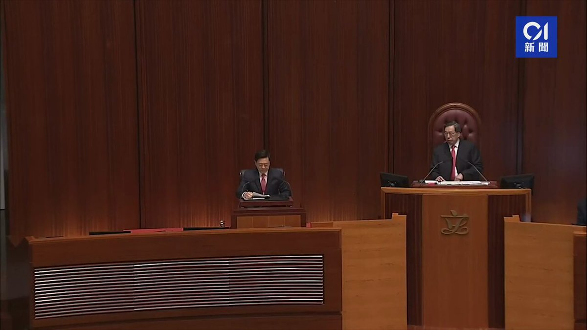
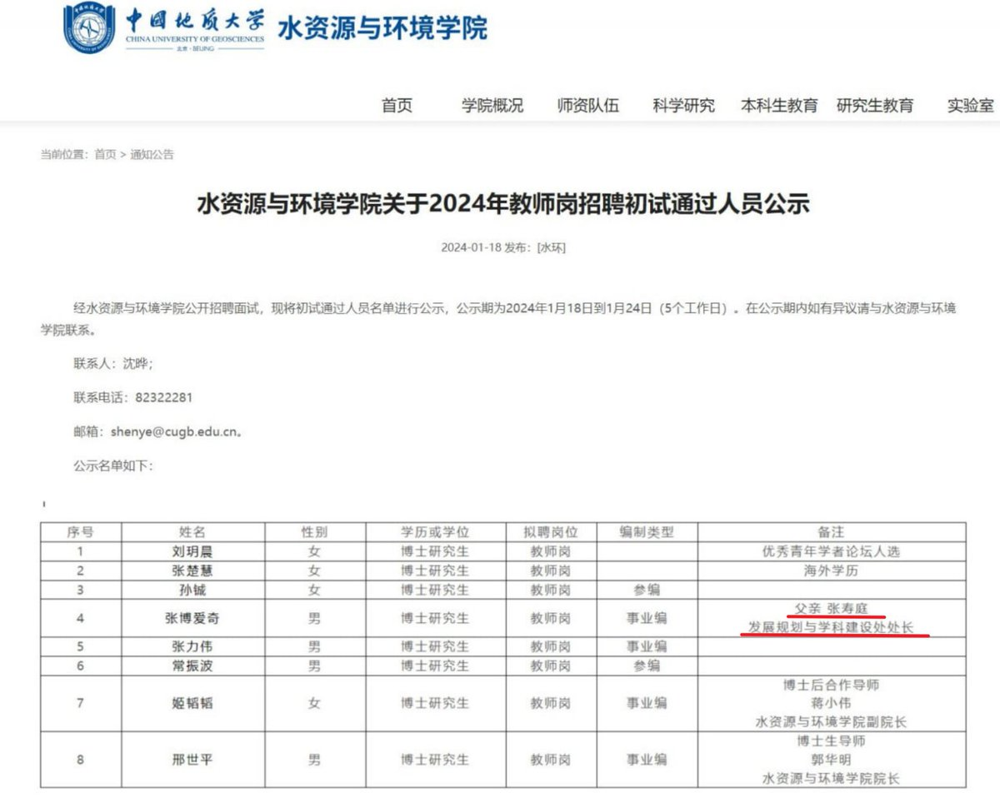
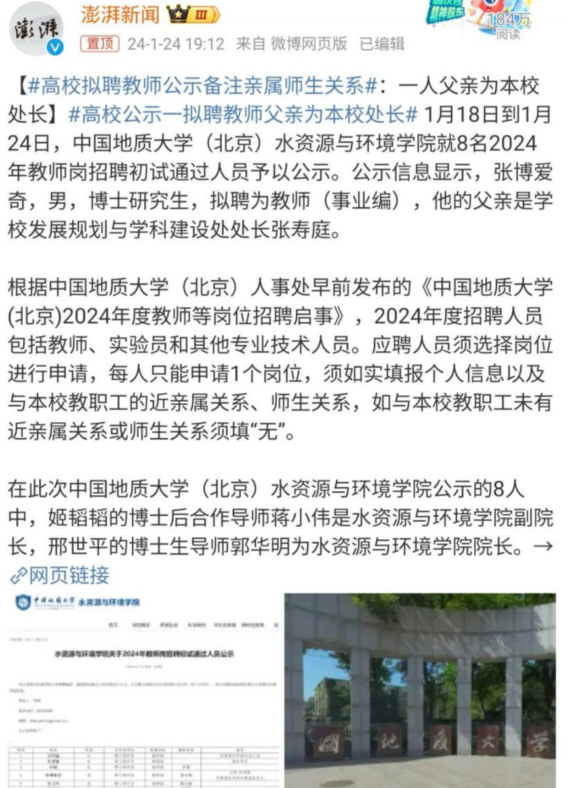
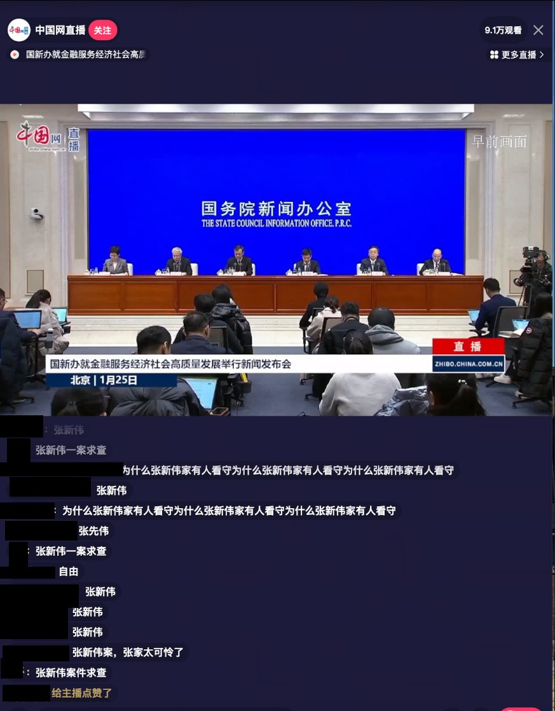
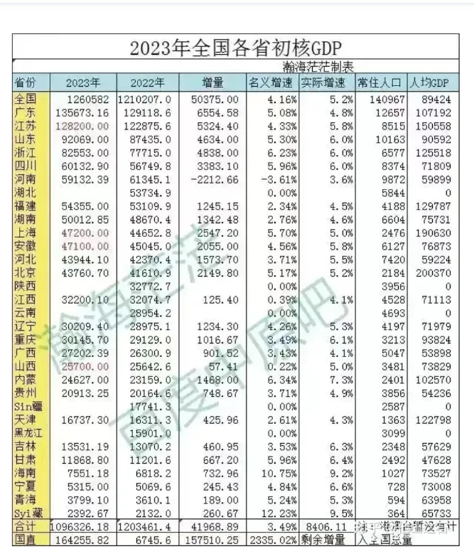
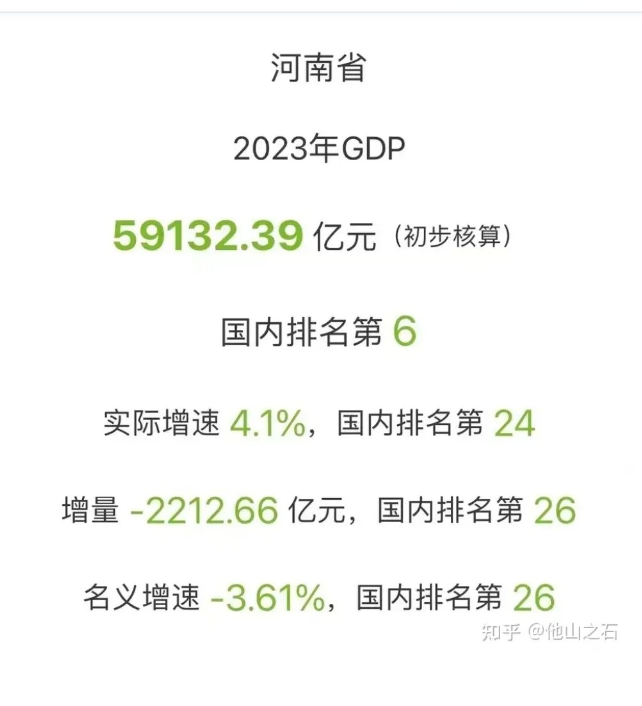
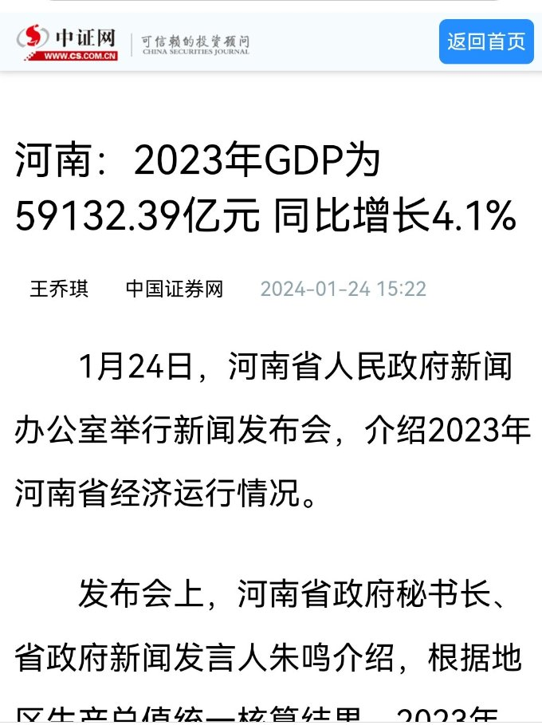
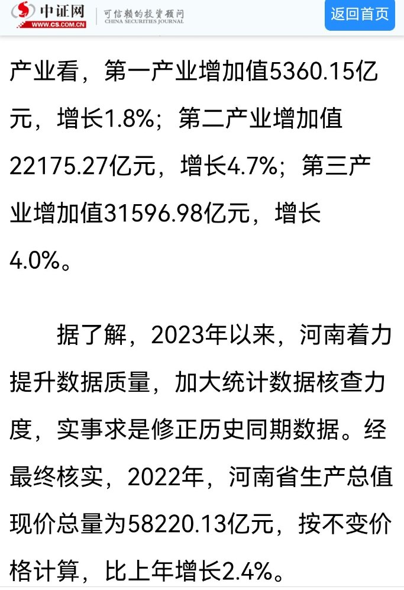
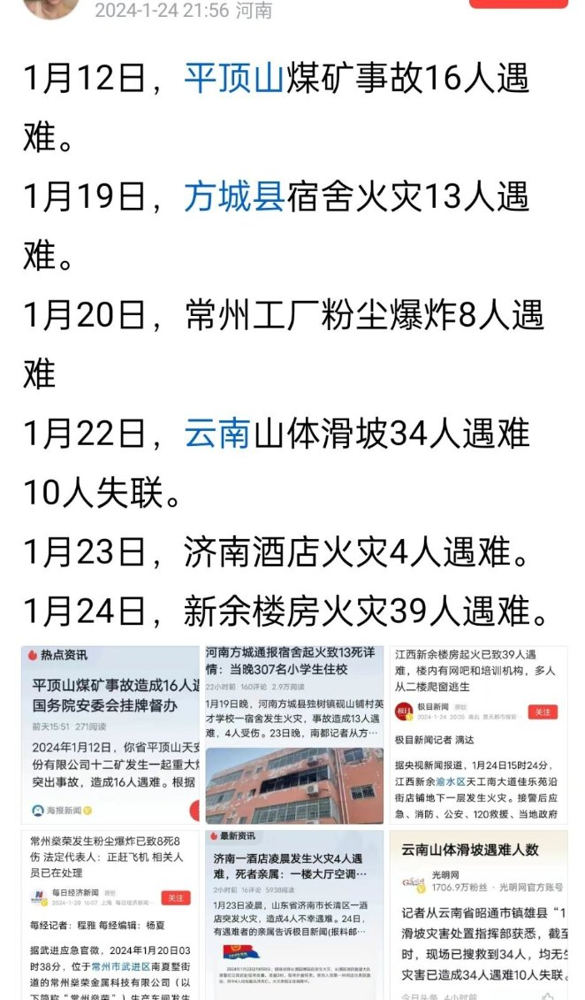

A李老师不是你老师 北京时间 2024-01-25T19:02:57Z 1750474332361376049 1月25日，香港特别行政区行政长官李家超表示，留意到敌对势力试图利用文宣工作在互联网大肆抹黑、歪曲事实，特区政府会设立“应变反驳队”针对社交媒体作出反击。李家超表示，香港经历过2019年“黑暴”后已经真正醒觉。2019年后，见到当危害国家安全的风险在眼前发生的伤痛和艰难，令大家明白，香港纵然是君子，但也要防小人、要防敌对力量、防间谍活动。香港必须防范敌对势力试图在港取得其最大利益，要保障香港利益和经济发展。   A李老师不是你老师 北京时间 2024-01-25T19:34:15Z 1750482208886751534 1月18日，中国地质大学水资源与环境学院就8名教师岗招聘初试通过人员予以公示时，多人资料备注了亲属师生关系。
其中张博爱奇的资料中备注他的父亲是学校发展规划与科学建设处处长张寿廷。
姬稻稻的博士后合作导师蒋小伟是水资源与环境学院副院长
邢世平的博士生导师郭华明为水资源与环境学院院长。 https://t.co/1NSS4q1sMY   A李老师不是你老师 北京时间 2024-01-25T19:45:01Z 1750484916863696964 1月25日，国务院新闻发布会上，网民齐刷张新伟 https://t.co/fZR1Yw8IFE   A李老师不是你老师 北京时间 2024-01-25T20:18:39Z 1750493380310642745 1月23日，网传唐山玉田镇派出所副所长被激怒捅人。视频中，男青年不断强调身边的是“玉田镇派出所副所长”，“不让我说话”。随后一旁的中年人突然发怒并使用疑似尖锐物品捅击其腹部，并继而攻击赶来劝架的女子。画面中可以看见男子的羽绒服被扎破，嘴角疑似有血迹。双方扭打至马路中央，随后几人躲进车内报警。
据投稿人称，视频中两位被捅的一男一女此前与第三人发生交通事故，期间因不服派出所处理，导致两人被扣押。事后两人找副所长理论时发生了视频中的一幕。   A李老师不是你老师 北京时间 2024-01-25T17:35:05Z 1750452220703756663 2023年全国GDP数据出炉后，这几天各省2023年度GDP数据相继公布。
有网友已经整理出2023年度全国各省初核GDP排名。广东省继续排名第一，河南省首次被四川省超越，蝉联18年的全国第五退居为全国第六。
比较引人关注的是河南省2023年GDP相关情况：2023年GDP:59132.39亿元（初步核算），国内排名第6位；实际增速4.1%，国内排名第24；增量-2212.66亿元，国内排名第26；名义增速-3.61%，国内排名第26。 2023年度河南公布的GDP数据为59132.39亿元，2022年河南公布的GDP初核数据是61345.05亿元，以此计算，2023年实际上负增长。河南下调了2022年终核GDP数据近3000亿，实现了2023年GDP正增长。
在1月24日河南省人民政府新闻办公室举行的新闻发布会上，河南省政府秘书长，省政府新闻发言人朱鸣介绍了河南省2023年经济运行情况，并解释说，2023年以来，河南着力提升数据质量，加大统计数据核查力度，实事求是修正历史同期数据。经最终核实，2022年，河南省生产总值现价总量为58220.13。修正后的数据，较2022年初核数据减少近3000亿元。   A李老师不是你老师 北京时间 2024-01-25T18:05:28Z 1750459863308628174 1月25日，湖南省宁乡翡翠湖国际广场，几名工人在电梯口讨薪。
期间，一名警察因为工人抱怨人民警察（方言没听懂）而与其发生争执。 https://t.co/yeq94CVHZd   A李老师不是你老师 北京时间 2024-01-25T06:55:46Z 1750291331472142813 RT @hrichina: 特别感谢中国彩虹观察、中国拉拉协会和中国跨性别之声联合撰写此份报告，感谢对中国人权的信任！经过核查，最终确认在普遍定期审议中共有11个国家向中国政府提出了关于LGBTQ（性少数）的建议，大部分集中在现有法律框架下与SOGIESC（性取向、性别认同、性…   A李老师不是你老师 北京时间 2024-01-25T07:00:05Z 1750292414147817936 RT @FreeforHKpeople: 1/26-2/1，我将以纯粹个人的身份在纽约时代广场绝食七天声援铁链女，希望大家支持。I’m going to do a hunger strike for 7 days at Times Square to ask the world…   A李老师不是你老师 北京时间 2024-01-25T07:56:02Z 1750306497853079758 1月12日，平顶山煤矿事故16人遇难。
1月19日，方城县宿舍火灾13人遇难。
1月20日，常州工厂粉尘爆炸8人遇难
1月20日晚山东菏泽一废弃粮库发生爆炸，目前新闻仍然停留在“伤亡情况核实中”。
1月22日，云南山体滑坡34人遇难10人失联。
1月23日，济南酒店火灾4人遇难。
1月24日，新余楼房火灾39人遇难。 https://t.co/V1mw7kDgyC   A李老师不是你老师 北京时间 2024-01-25T03:08:15Z 1750234072784179322 不止是张宝山村被警方封控，1月24日晚，连云港市灌云县跃进门等处也有警察把守，只许出不许进 https://t.co/jipbQSXG7A   